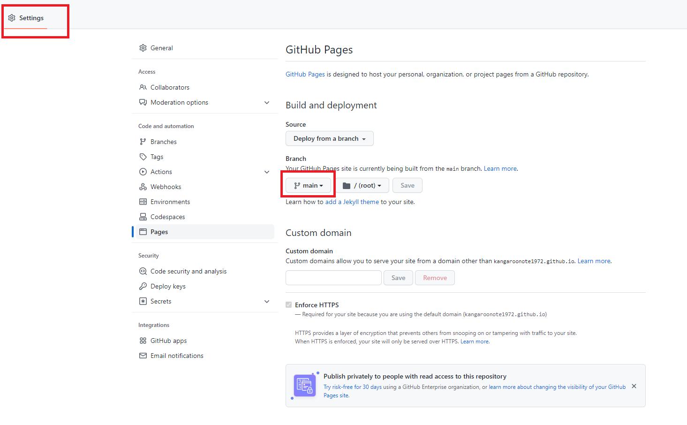

# ディレクトリ
[今日の想定](./想定/main.md)  
[サイクルチャートキャプチャ](./サイクル/main.html)  

---
# Web公開方法
- url : https://kangaroonote1972.github.io/chart-cycle/
- Github Pagesを利用。リポジトリは `public` にする必要がある。`private` での利用は有償。
- 以下の設定を行う：none -> main に変更

