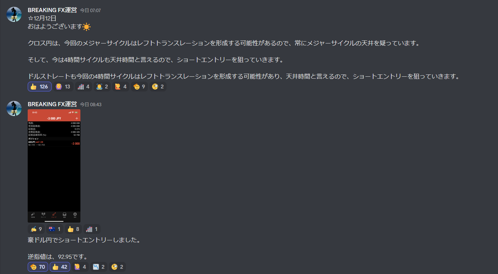
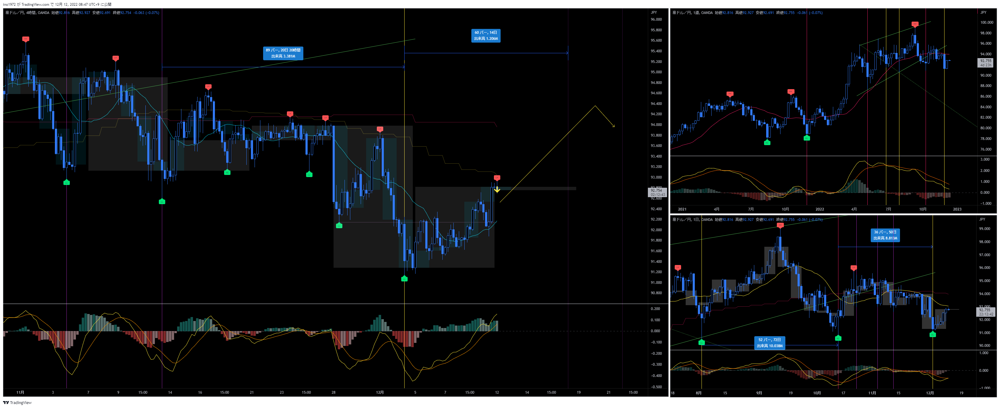
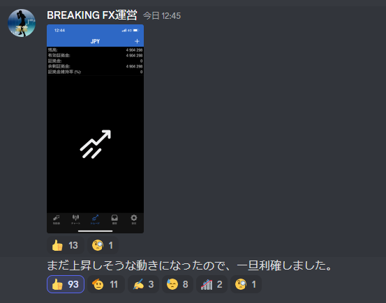
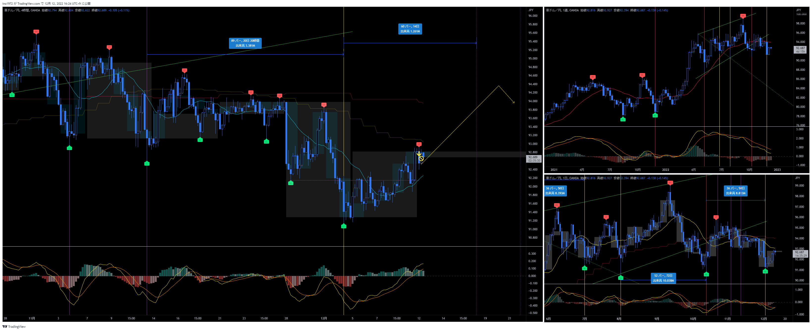

# 通貨：AUDJPY
- エントリー日：2022/12/12
- 決済日
  - 2022/12/12：1,000
- ポジション
  - Short
  - ロット：1,000

# 確認事項
- 突っ込みエントリー(Yes)、違う(No)：No
- MACDは中心から離れているか？：Yes
- MACDはクロスしそうか？：No
- MACDダイバージェンス：無
- 上げ下げ渋り：無
- 日足のヒゲは？：無
- 20SMAとの位置関係
  - ４Ｈ
    - MAの向き        ：上向き
    - ローソク足の位置：上側
  - 日足
    - MAの向き        ：下向き
    - ローソク足の位置：下側
  - 週足
    - MAの向き        ：水平
    - ローソク足の位置：下側
- サイクル
  - ４Ｈ：第一。トランスレーションはどちらも有り得る
  - 日足：第二。トランスレーションはどちらも有り得る
  - 週足：第一。LTの可能性が高い
- ダウ
  - ４Ｈ：上昇トレンド
  - 日足：上昇トレンド
  - 週足：上昇トレンド
- エントリーの日の経済指標：無

# エントリー
## 根拠
- アッシュサロンの指示
- 個人的には4HCトップはまだ先との想定だが、短期的に下落は有り得ると判断し、指示に従った。
- このままボトムに向けて下落してくれればOKだし。そうでなければ建値で撤退。

## 懸念点／エントリーとは逆の視点
- 4HCトップはまだ先の可能性が高いと見ている

# 決済

# その後

