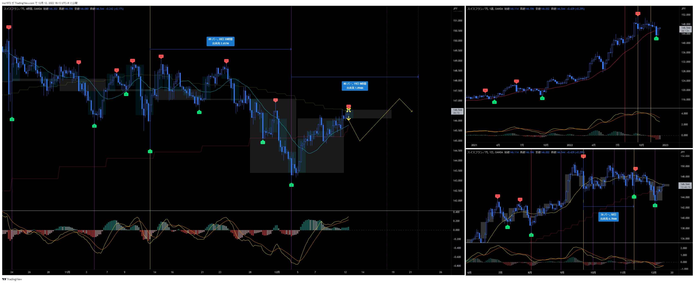

# 通貨：CHFJPY
- エントリー日：2022/12/12
- 決済日
  - 2022/12/xx：1,000
- ポジション
  - Long Short
  - ロット：1,000

# 確認事項
- 突っ込みエントリー(Yes)、違う(No)：No
- MACDは中心から離れているか？     ：Yes
- MACDはクロスしそうか？           ：どちらとも言えない
- MACDダイバージェンス             ：無
- 上げ下げ渋り                     ：上げ渋りっぽい動き
- 日足のヒゲは？                   ：無
- 20SMAとの位置関係
  - ４Ｈ
    - MAの向き        ：上向き
    - ローソク足の位置：下側
  - 日足
    - MAの向き        ：下向き
    - ローソク足の位置：下側
  - 週足
    - MAの向き        ：上向き
    - ローソク足の位置：上側
- サイクル
  - ４Ｈ：第二を想定。第二の場合、第一がLTを確定しているので、今回もLT想定。しかし、直近安値がMC開始の可能性もある。
  - 日足：LT確定 or 直近安値でMC開始
  - 週足：LTになりそうだが、シナリオ確定の情報は無い
- ダウ
  - ４Ｈ：下落トレンド
  - 日足：下落トレンド
  - 週足：上昇トレンド崩壊
- エントリーの日の経済指標：無

# エントリー

# 決済

# その後

