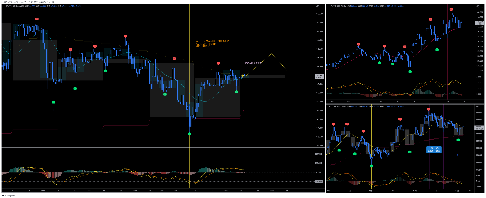
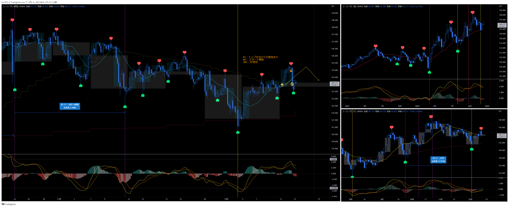

# 通貨：EURJPY
- エントリー日：2022/12/12
- 決済日
  - 2022/12/13：1,000
- ポジション
  - Long
  - ロット：1,000
- 損切りポイント：12/09の安値

# 確認事項
- 突っ込みエントリー(Yes)、違う(No)：No
- MACDは中心から離れているか？     ：Yes
- MACDはクロスしそうか？           ：デッドクロスしている
- MACDダイバージェンス             ：無
- 上げ下げ渋り                     ：無
- 日足のヒゲは？                   ：無
- 20SMAとの位置関係
  - ４Ｈ
    - MAの向き        ：上向き
    - ローソク足の位置：上側
  - 日足
    - MAの向き        ：下向き→水平
    - ローソク足の位置：下側
  - 週足
    - MAの向き        ：上向き
    - ローソク足の位置：上側
- サイクル
  - ４Ｈ：第一。RTの可能性が高い
  - 日足：サイクル開始して間もないので上昇中
  - 週足：PC天井をつけた可能性あり。高値を更新できなければLT想定
- ダウ
  - ４Ｈ：下落トレンド
  - 日足：下落トレンド
  - 週足：上昇トレンド
- エントリーの日の経済指標：無

# エントリー
## 根拠
- 直近安値がMCボトムと見ているので、現在第一4HC。RTになる想定
- １つのサイクル内で、上昇の波は２波を形成することが多い。現在２波目の開始直前と見ている。

## 懸念点／エントリーとは逆の視点
- CHFJPY、CADJPYが前回の4HCでMCとPCのLTを確定させた可能性がある

## 反省点
- 特に無し
- サイクル理論ではエントリータイミングではないが、自分の検証作業で２波形成されやすい傾向があると分かったので、それを根拠にしている。

# 決済
## 決済計画
- 4HC天井までホールド。
- 20SMAを実体で割り込むまで。

## 根拠
- 今回の4HC、もしくは次の4HCがMCトップの想定のため

## 決済実施
- 含み益が十分伸びたので、逆指値を建値に移動
- 米CPIの指標で急落。指値にヒットした。
- 結果は微損

## 反省点
- 結果は利益の取り逃がしだったが、現在は練習中で握力を鍛えている最中。決済内容に問題は無いと判断。

# その後

