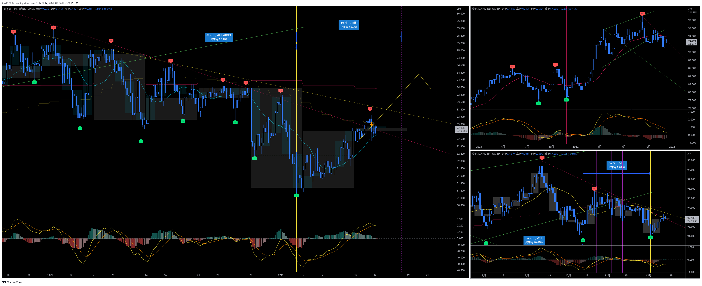
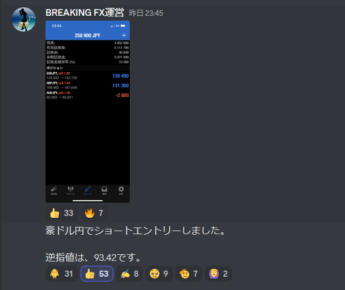
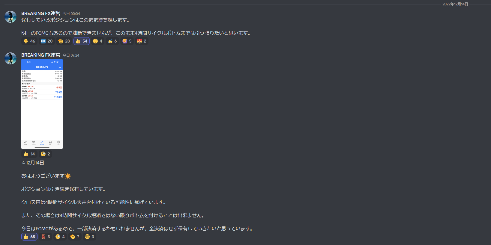

# 通貨：AUDJPY
- エントリー日：2022/12/13
- ポジション
  - Short
  - ロット：1,000
- 損切りライン：直近高値
- 決済日
  - 2022/12/xx：1,000

# 確認事項
- 突っ込みエントリー(Yes)、違う(No)：No
- MACDは中心から離れているか？     ：Yes
- MACDはクロスしそうか？           ：Yes
- MACDダイバージェンス             ：無
- 上げ下げ渋り                     ：無
- 日足のヒゲは？                   ：下がれば上ヒゲ
- 20SMAとの位置関係
  - ４Ｈ
    - MAの向き        ：上
    - ローソク足の位置：上側
  - 日足
    - MAの向き        ：下
    - ローソク足の位置：下側
  - 週足
    - MAの向き        ：水平
    - ローソク足の位置：下側
- サイクル
  - ４Ｈ：第一4HC。アッシュは今回4HCがMC天井と想定していた
  - 日足：第二MC。トランスレーションはどちらも有り得る。アッシュは今回のMCがRTを想定していた
  - 週足：トランスレーションはどちらも有り得る
- ダウ
  - ４Ｈ：上昇トレンド
  - 日足：下落トレンド崩壊
  - 週足：上昇トレンド
- エントリーの日の経済指標：無

# エントリー
- 米CPIの結果後にエントリー

# 決済
## 決済計画
- 

## 根拠
- 

## どんな気持ちか
- 

## 反省点
- 

# その後

