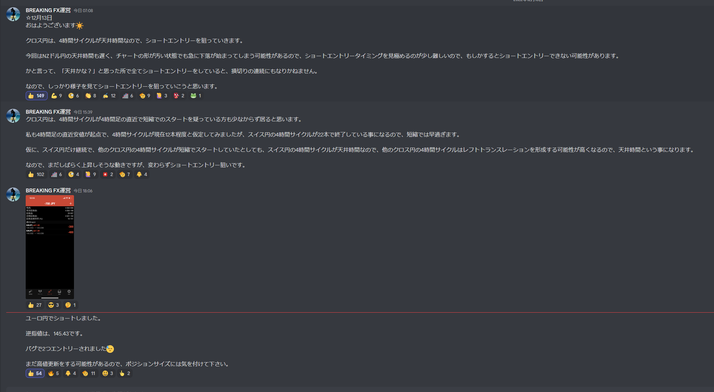
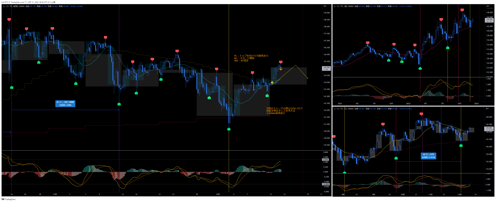
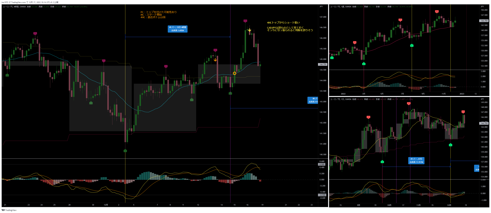
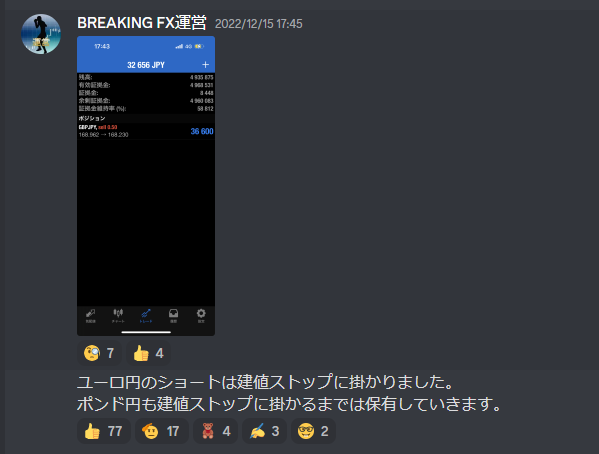
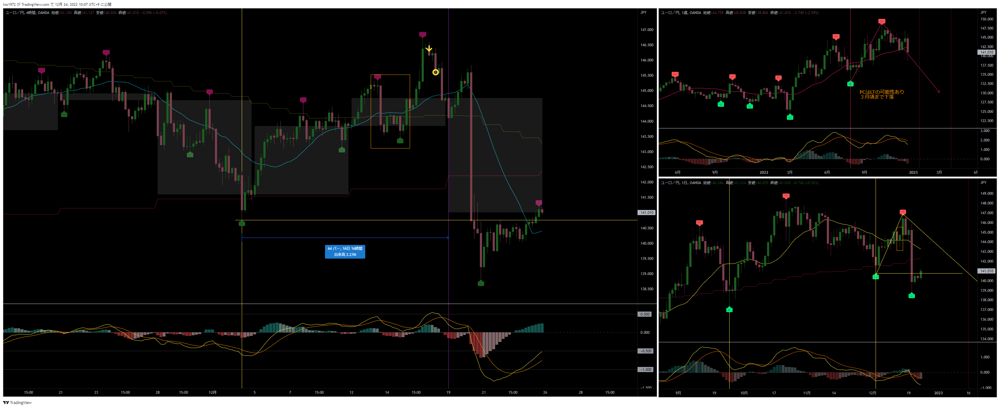

[今月の一覧](../main.md)
# 通貨：EURJPY　オレンジの矢印
- エントリー日：2022/12/13
- ポジション
  - Short
  - ロット：1,000
- 損切りライン：直近高値
- 決済日
  - 2022/12/15：1,000

# 確認事項
- 突っ込みエントリー(Yes)、違う(No)：No
- MACDは中心から離れているか？     ：Yes
- MACDはクロスしそうか？           ：No
- MACDダイバージェンス             ：無
- 上げ下げ渋り                     ：無
- 日足のヒゲは？                   ：無
- 20SMAとの位置関係
  - ４Ｈ
    - MAの向き        ：上
    - ローソク足の位置：上側
  - 日足
    - MAの向き        ：下→水平
    - ローソク足の位置：上側
  - 週足
    - MAの向き        ：上
    - ローソク足の位置：上側
- サイクル
  - ４Ｈ：第一4HC。RTの可能性が高い
  - 日足：第二MC。トランスレーションはどちらも有り得る
  - 週足：トランスレーションはどちらも有り得る
- ダウ
  - ４Ｈ：上昇トレンド
  - 日足：下落トレンド崩壊
  - 週足：上昇トレンド
- エントリーの日の経済指標：有[米CPI]

# エントリー

# 決済

- サロンでは建値にストップを置いていたが、私は４時間足の波の節目に利確ラインを移動しておいた。夜中にラインにヒット。

# その後

