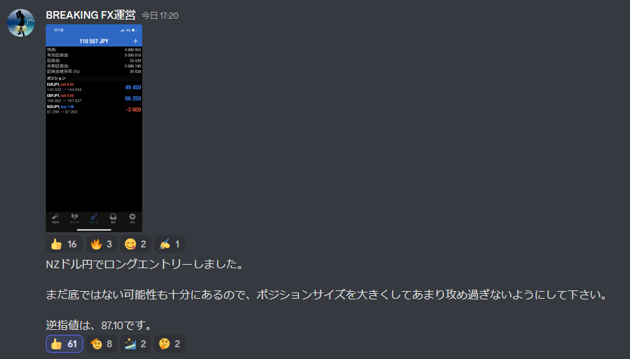
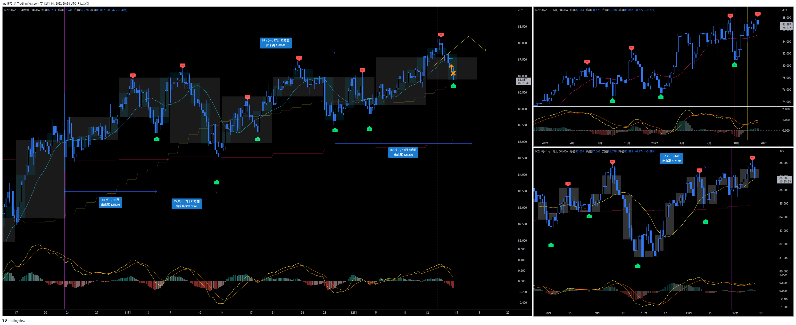
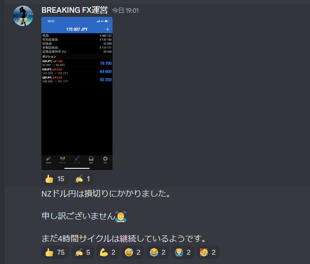
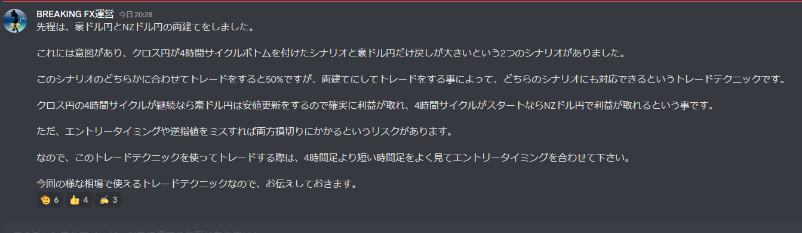

# 通貨：NZDJPY
- エントリー日：2022/12/xx
- ポジション
  - Long Short
  - ロット：1,000
- 損切りライン：
- 決済日
  - 2022/12/xx：1,000
  - 2022/12/xx：1,000

# 確認事項
- 突っ込みエントリー(Yes)、違う(No)：Yes No
- MACDは中心から離れているか？     ：Yes No
- MACDはクロスしそうか？           ：Yes No
- MACDダイバージェンス             ：有 無
- 上げ下げ渋り                     ：有 無
- 日足のヒゲは？                   ：有 無
- 20SMAとの位置関係
  - ４Ｈ
    - MAの向き        ：
    - ローソク足の位置：上側
  - 日足
    - MAの向き        ：
    - ローソク足の位置：上側
  - 週足
    - MAの向き        ：
    - ローソク足の位置：上側
- サイクル
  - ４Ｈ：
  - 日足：
  - 週足：
- ダウ
  - ４Ｈ：上昇トレンド崩壊
  - 日足：上昇トレンド崩壊
  - 週足：上昇トレンド崩壊
- エントリーの日の経済指標：無 有[雇用統計]

# エントリー

# 決済

# その後

# 両建て

