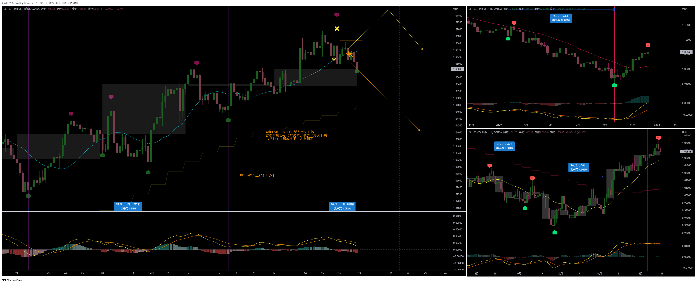
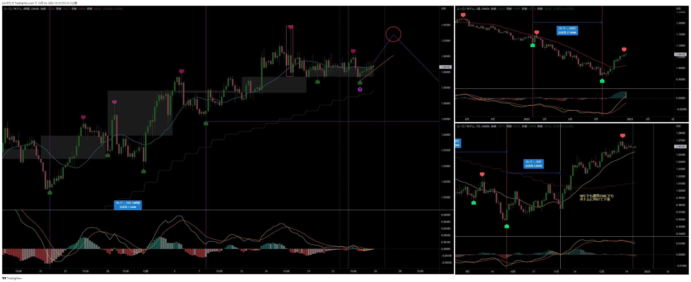

[今月の一覧](../main.md)
# 通貨：EURUSD　黄色矢印が今回のエントリー
- エントリー日：2022/12/15
- ポジション
  - Short
  - ロット：1,000
- 損切りライン：直近高値
- 決済日
  - 2022/12/15：1,000

# 確認事項
- 突っ込みエントリー(Yes)、違う(No)：少し突っ込み気味
- MACDは中心から離れているか？     ：Yes
- MACDはクロスしそうか？           ：Yes
- MACDダイバージェンス             ：無
- 上げ下げ渋り                     ：無
- 日足のヒゲは？                   ：無
- 20SMAとの位置関係
  - ４Ｈ
    - MAの向き        ：上
    - ローソク足の位置：上側
  - 日足
    - MAの向き        ：上
    - ローソク足の位置：上側
  - 週足
    - MAの向き        ：上
    - ローソク足の位置：上側
- エントリーの日の経済指標：有[EU:欧州中央銀行(ECB)政策金利、US:11月小売売上高]

# エントリー
## 根拠
- AUDUSD, NZDUSDが大きく下落。LTを形成しそうだった。（土曜日の現時点でLT未確定）
- MACDがクロス
- 第三4HC
- 直近高値が33本目。ここが高値なら、本数的にはLT
- YoutuberのYuuのエントリー配信
  - この直前に同じポジションを取って、チキン利確している

## 懸念点／エントリーとは逆の視点
- 今回の4HCがLTになるという確定情報は無い

## どんな気持ちか
- 直近に同じエントリーをし、損切り幅も大きいので、自信が無くなって微益撤退していた
- Yuuの珍しいエントリー配信を見て「やっぱり」と思い、前回より悪いレートにも関わらず、焦ってエントリーした
  - チャンスを逃したくないという焦りで、とにかくエントリーという感じだった

## 反省点
- 確実性を求めるなら、損切り幅が広がるのを覚悟で20SMAを実体で割るのを確認してからエントリーでも良かった
  - エントリーの際、積極的なエントリー（損切り幅小さい）なのか、確実性を取ったエントリー（損切り幅大きい）なのか認識しておくこと
    チャートにその旨、書いておいておく　→　エントリーチェックリストに追加

# 決済
## 決済計画
- LT確定ライン

## 根拠
- AUD、NZDがLT確定しそうなので

## 決済実施
- 損切り：予定通り

## どんな気持ちか
- AUD, NZDが下げ止まり、少し上げただけでビビる

## 反省点
- １回目
  - ちょっとした値動きにいちいちビビって、すぐに自信が無くなる
  - 考えたり、疑問を持つのはエントリーの前と決済後。ポジションを持ったら疑問を持たない。エントリー前に疑問を解消しておくこと。
    - もしくは、疑問点はあるが不確実性を相手にしているので、疑問点は有りつつエントリーしているということを認識しておくこと
- ２回目
  - 予定通りなので問題なし

# その後

