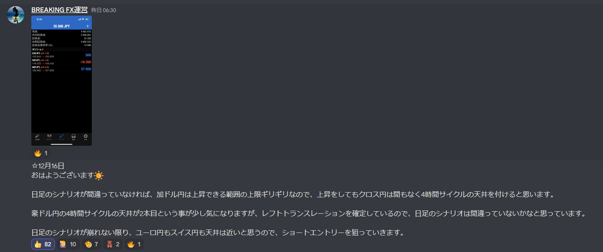
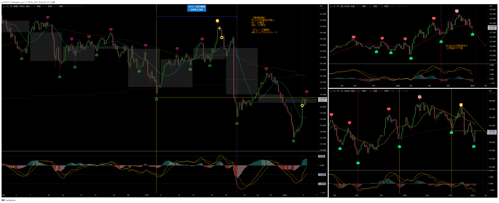

[今月の一覧](../main.md)
# 通貨 : EURJPY
- エントリー日 : 2022/12/16
- ポジション
  - Short
  - ロット : 2,000
- 損切りライン : 直近高値
- 決済日
  - 2022/12/16 : 1,000 : 利確
  - 2023/01/04 : 1,000 : 利確

# 確認事項
- 突っ込みエントリー(Yes)、違う(No) : No
- MACDは中心から離れているか？      : Yes
- MACDはクロスしそうか？            : No
- MACDダイバージェンス              : 無
- 上げ下げ渋り                      : 有
- 日足のヒゲは？                    : 無
- 20SMAとの位置関係
  - ４Ｈ
    - MAの向き         : 上
    - ローソク足の位置 : 上側
  - 日足
    - MAの向き         : 水平
    - ローソク足の位置 : 上側
  - 週足
    - MAの向き         : 上
    - ローソク足の位置 : 上側
- エントリーの日の経済指標 : 無 有[EU : 11月消費者物価指数]

# エントリー

# 決済１
- 利益確保の分割決済
- 残りの玉は決済のラインを建値に移動

# 決済２
- トレイリングストップにヒット

# その後

