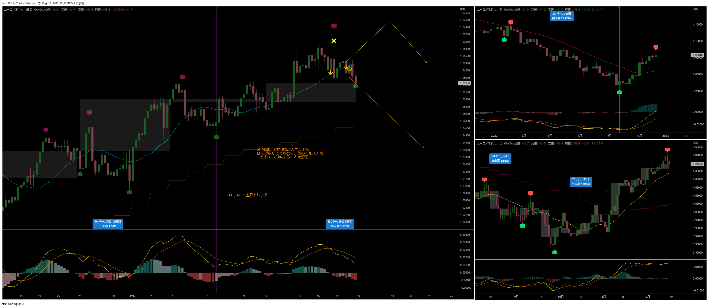
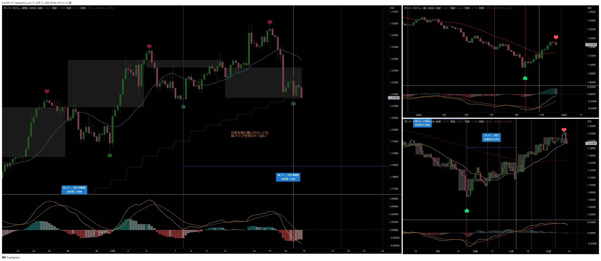
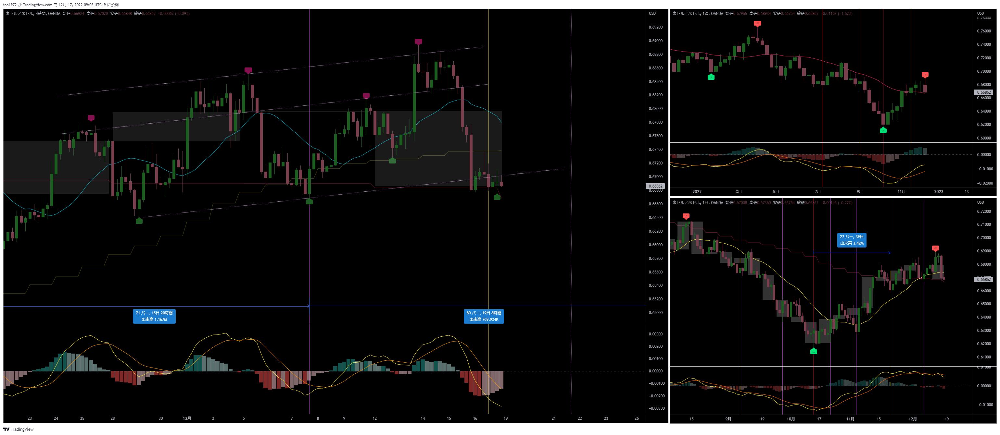
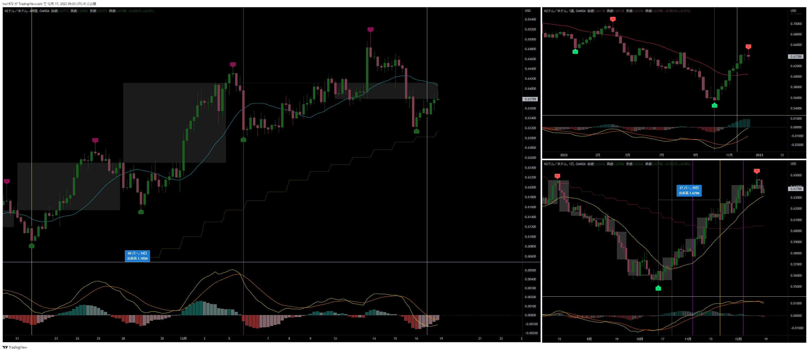

# 通貨：EURUSD　オレンジの矢印が今回のトレード
- エントリー日：2022/12/16
- ポジション
  - Short
  - ロット：1,000
- 損切りライン：チャート画像のオレンジ水平線
- 決済日
  - 2022/12/16：1,000

# 確認事項
- 突っ込みエントリー(Yes)、違う(No)：No
- MACDは中心から離れているか？     ：Yes
- MACDはクロスしそうか？           ：クロスしている
- MACDダイバージェンス             ：無
- 上げ下げ渋り                     ：無
- 日足のヒゲは？                   ：無
- 20SMAとの位置関係
  - ４Ｈ
    - MAの向き        ：上
    - ローソク足の位置：ライン上
  - 日足
    - MAの向き        ：上
    - ローソク足の位置：上側
  - 週足
    - MAの向き        ：上
    - ローソク足の位置：上側
- エントリーの日の経済指標：有[EU : 11月消費者物価指数]

# エントリー

## 根拠
- 他のドルストが再度下落開始。LT確定しそうだった。

## 懸念点／エントリーとは逆の視点
- 他のドルストもLTは確定していない

## どんな気持ちか
- サイクル理論通りだと、損切り幅が広すぎる。
- 理論通りではないと、損切りにかかった時に後悔するのが目に見えている。
- 自信が無くなってくる。

## 反省点
- 直近で20SMAを割った後、少し戻してMAを割ったタイミングでエントリーしたのはバッチリ
- エントリーした後、損切りラインをどうしようか悩み初め、下位足の節目など、よりキツいラインを探したりしていた
  - エントリーした後に、メンタルがブレる

# 決済
## 決済計画
- 今回4HCの起点。LTを想定しているので。

## 決済実施
- チキン利確。建値付近まで戻してきたのを見て、ビビって撤退

## どんな気持ちか
- 後悔
- リスクを取っているのに、ちゃんとした利益を確保しなければ、損切りの分、損失が蓄積していく
- 細かく損切りし、大きな利益を取るのがこの手法。利益を伸ばせないことに対して、ネガティブな感情が湧いてくる
  - こんなんじゃ専業になれないぞ
  - こんなことしていたら、損した分を取り返せない

## 反省点
- 損切りラインはサイクル理論通りで無くても良い。損切りラインを決めたら、覚悟を決めること。

# その後

