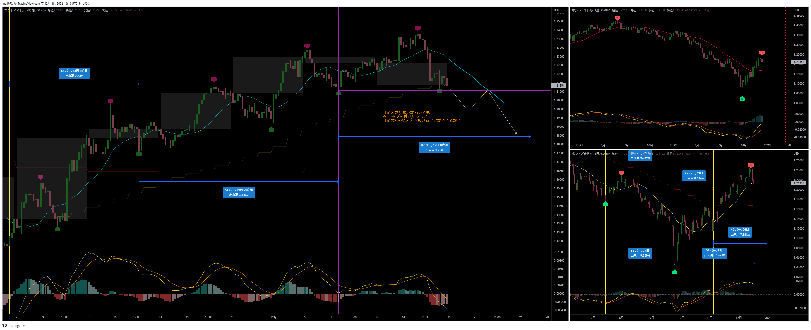
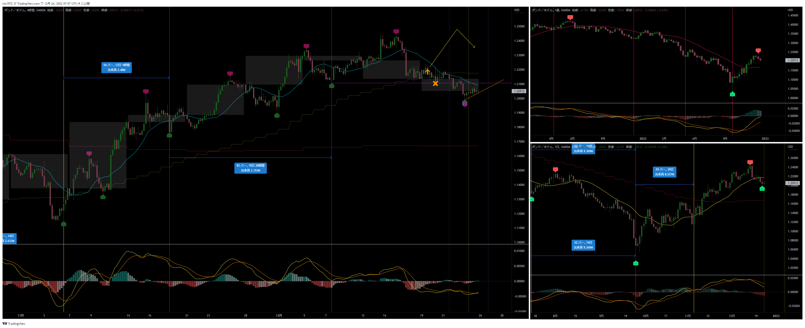
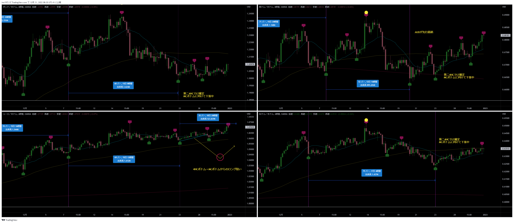

[今月の一覧](../main.md)

# 通貨 : GBPUSD
- エントリー日 : ポジション : ロット
  - 2022/12/19 : Long : 1,000
- 損切りライン : 直近安値
- 決済日 : ロット : 結果
  - 2022/12/20 : 1,000 : 損切

# 確認事項
- 突っ込みエントリー(Yes)、違う(No) : No
- MACDは中心から離れているか？      : Yes
- MACDはクロスしそうか？            : Yes
- MACDダイバージェンス(Yes=有/No=無): No
- 高安値、切上げ下げ(Yes=有/No=無)  : No ダウ上昇トレンド崩壊
- 上げ下げ渋り(Yes=有/No=無)        : Yes 下げ渋りと判断したが、上げ渋りだった
- 日足ピンバー？                    : No
- 20SMAとの位置関係
  - ４Ｈ
    - MAの向き         : 下
    - ローソク足の位置 : 下側
  - 日足
    - MAの向き         : 上
    - ローソク足の位置 : 上側
  - 週足
    - MAの向き         : 並行
    - ローソク足の位置 : 上側
- エントリーの日の経済指標 : 無

# チャート
- 事前の想定

- 実際のエントリー

# エントリー
## 根拠
- PC、MC、4HC上昇トレンド
- Youtuberゆうキングが上昇と言っていた
- MACDが下側でゴールデンクロスしそうだった

## どんな気持ちか
- 自分の事前分析とゆうキングの見方が違っていたので、彼の意見を取り入れた
- 気持ちはブレブレ。自信がない。
- 頭に靄がかかっているような、自分が何をしているのか分からない状態。

## 反省点
- 自分の分析を信じずに、Youtuberを信じた。せめてエントリーを見送れば良かった。
- 自分の分析通りのエントリーではないため、根拠が無いし、メンタルもブレブレ。
  - 予想通り動いてもチキン利確していたと思われる。
- そもそもゆうキングの手法ではエントリーしない場所でエントリーした。
  - ゆうキングの手法とは違うと認識した上でトレードを行うべきだった。
  - 根拠が曖昧になってしまった。

# 決済
## 決済計画
- 4HCボトムで決済

## 決済実施
- 予定通り：損切りラインにヒットした

## どんな気持ちか
- 自分の分析を信じなかったことへの後悔

## 反省点
- 損切りは予定通り。問題なし。

# その後

