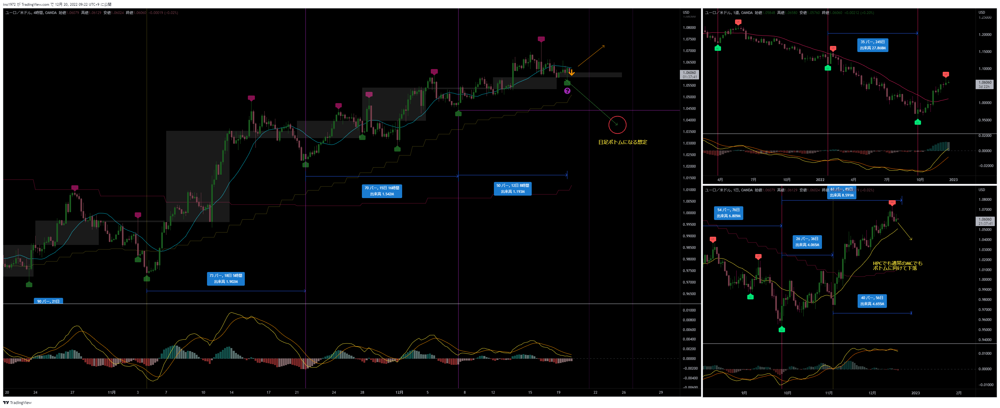
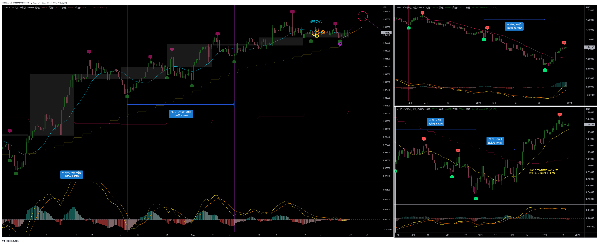
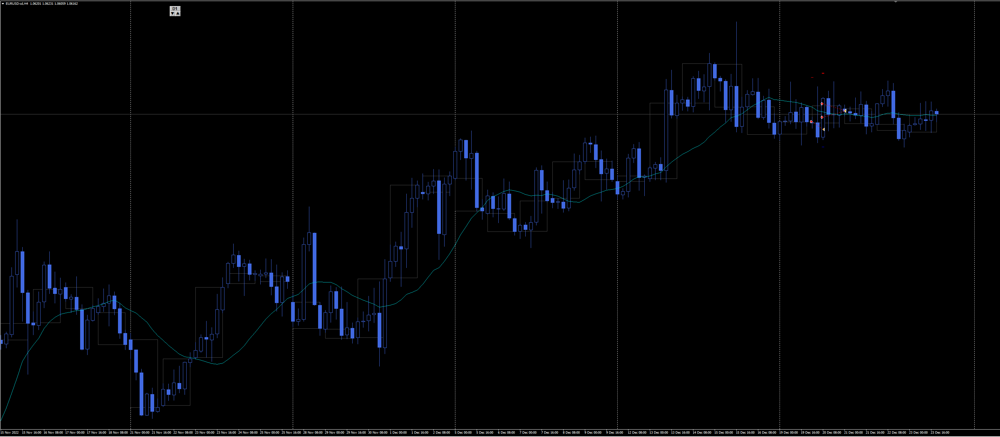
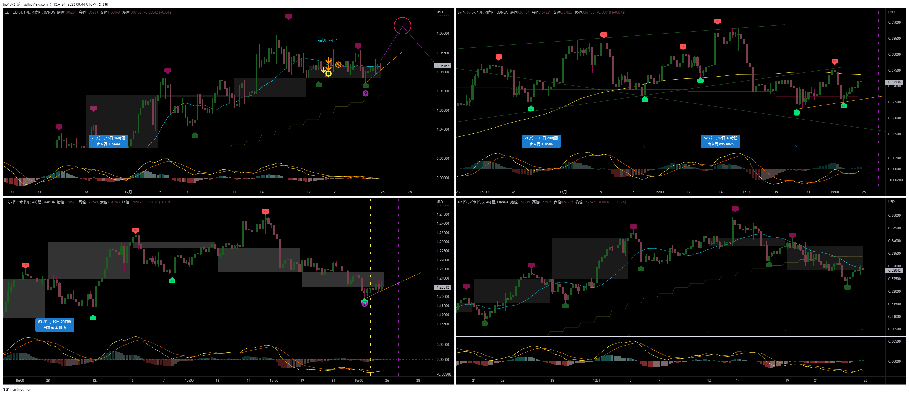

[今月の一覧](../main.md)

# 通貨 : EURUSD
- エントリー日 : ポジション : ロット
  - 2022/12/20 : Short : 1,000
  - 2022/12/20 : Short : 1,000
  - 2022/12/20 : Short : 1,000
- 損切りライン : チャート参照
- 決済日
  - 2022/12/20 : 1,000 : 利確
  - 2022/12/21 : 1,000 : 損切
  - 2022/12/21 : 1,000 : 利確

# 確認事項
- 突っ込みエントリー(Yes)、違う(No) : No
- MACDは中心から離れているか？      : No
- MACDはクロスしそうか？            : No
- MACDダイバージェンス(Yes=有/No=無): No
- 高安値、切上げ下げ(Yes=有/No=無)  : Yes
- 上げ下げ渋り(Yes=有/No=無)        : No
- 日足ピンバー？                    : No
- 20SMAとの位置関係
  - ４Ｈ
    - MAの向き         : 下
    - ローソク足の位置 : 下側
  - 日足
    - MAの向き         : 上
    - ローソク足の位置 : 上側
  - 週足
    - MAの向き         : 上
    - ローソク足の位置 : 上側
- エントリーの日の経済指標 : 無

# チャート
- 事前の想定

- エントリー

- 他の通貨

# エントリー
## 根拠
- 他のドルストが4HCの起点割れをしたので、EURUSDも遅れて起点を割ると想定した

## 懸念点／エントリーとは逆の視点
- サイクル内高値付近までの戻し、もしくは高値更新する可能性
  - その場合、他の通貨は4HCの起点を割れたところがサイクルボトムになる

## どんな気持ちか
- サイクルトップを損切りにすると、損切り幅が大きいので、直近高値に損切りラインを置いた
  - サイクル理論通りの損切りラインではないので、狩られるかもと不安
- 負けたくないという気持ちが強い
  - 負けると嫌な気分になるので、それを避けたい

## 反省点
- 特になし

# 決済
## 決済計画
- 4HCボトム（LT確定）までホールド

## 決済実施
- １回目、チキン決済
- ２回目、レンジに巻き込まれたと判断し、逃げた

## どんな気持ちか
- 思い通りのトレードができず、モヤモヤ

## 反省点
- １回目のチキン利確は結果オーライだが、事前の計画が甘いので、チャートを見て不安になり、とっさに切ってしまっている
- ２回目のレンジに巻き込まれたので逃げたのは良い判断

# その後

