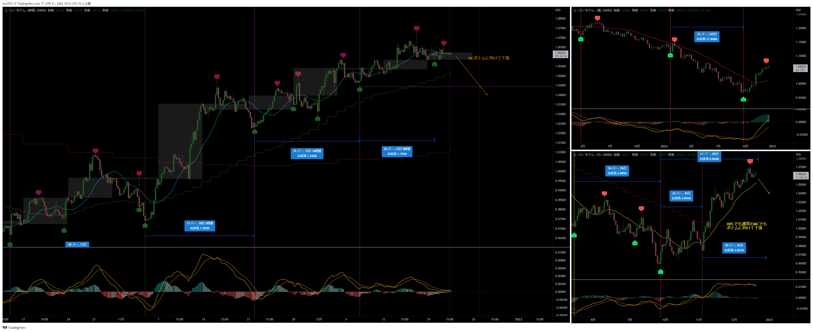
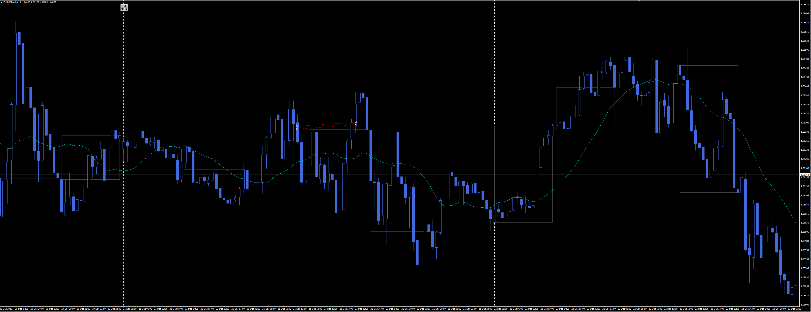
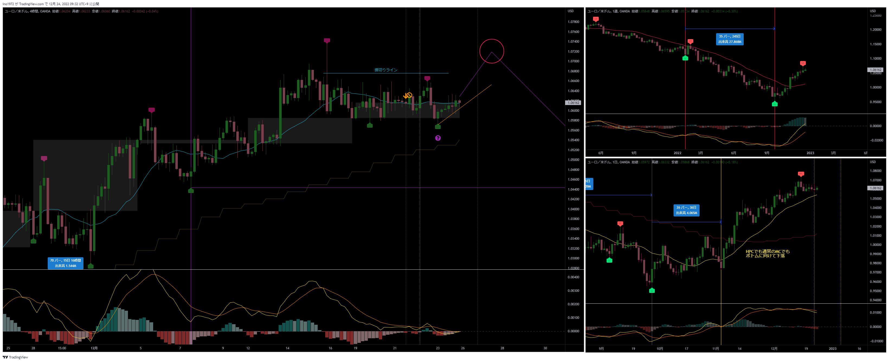

[今月の一覧](../main.md)

# 通貨 : EURUSD
- エントリー日 : ポジション : ロット
  - 2022/12/21 : Short : 1,000
- 損切りライン : 下記チャート参照
- 決済日 : ポジション : ロット
  - 2022/12/21 : 1,000 : 建値（微損）

# 確認事項
- 突っ込みエントリー(Yes)、違う(No) : No
- MACDは中心から離れているか？      : No
- MACDはクロスしそうか？            : No
- MACDダイバージェンス(Yes=有/No=無): No
- 高安値、切上げ下げ(Yes=有/No=無)  : No
- 上げ下げ渋り(Yes=有/No=無)        : No
- 日足ピンバー？                    : No
  - 【４Ｈ】MAの向き / ローソク足の位置 : やや下落 / 上側
  - 【日足】MAの向き / ローソク足の位置 : 上 / 上側
  - 【週足】MAの向き / ローソク足の位置 : やや上昇 / 上側
- エントリーの日の経済指標 : 無

# チャート
- 事前の想定

- エントリー

# エントリー
## 根拠
- 他の通貨が4HCでLTを確定→MCボトムに向け下落中
- 当通貨もそれにつられ、4HCでLTを確定し、そのままMCボトムに向けて下落すると想定した

## 懸念点／エントリーとは逆の視点
- FX Youtuberゆうキングはドルストに対して曖昧な発言
  - クロス円に注力しており、ドルストはあまり本格的に分析をしていない

## どんな気持ちか
- （いつものように）自信がない

## 反省点
- 特になし

# 決済
## 決済計画
- 4HCボトム、できればMCボトムまで引っ張る

## 決済実施
- チキン決済（微損）

## どんな気持ちか
- 思うようなトレードができないもどかしさ

## 反省点
- レンジなのでポジションに固執しなかったのは良かったが、下落していたら後悔してたはず

# その後

