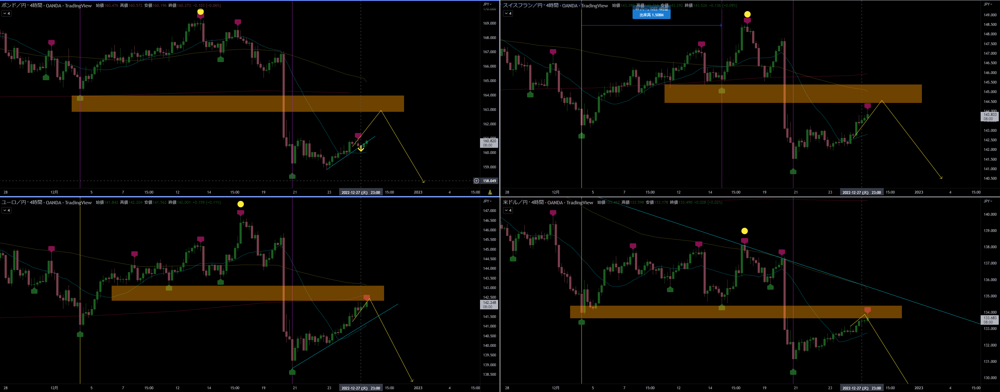
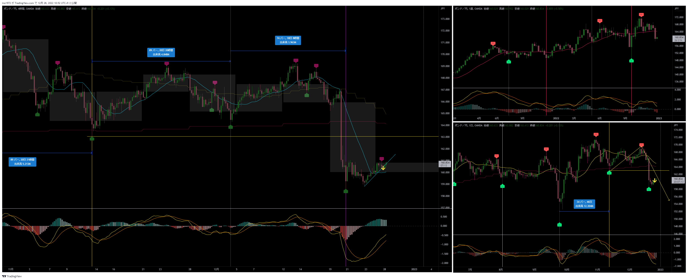
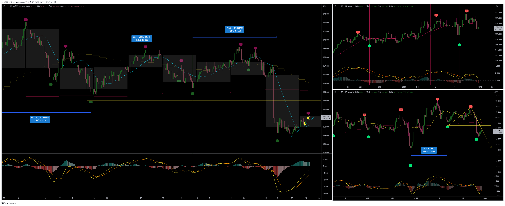

[今月の一覧](../main.md)

# 通貨 : GBPJPY
- エントリー日 : ポジション : ロット
  - 2022/12/27 : Short : 2,000
- 損切りライン : 直近高値
- 決済日 : ポジション : ロット
  - 2022/12/xx : 1,000 : 利確 損切 建値
  - 2022/12/xx : 1,000 : 利確 損切 建値

# 確認事項
- 突っ込みエントリー(Yes)、違う(No) : No
- MACDは中心から離れているか？      : No ショート狙いだが、中央より下
- MACDはクロスしそうか？            : No
- MACDダイバージェンス(Yes=有/No=無): No
- 高安値、切上げ下げ(Yes=有/No=無)  : No
- 上げ下げ渋り(Yes=有/No=無)        : Yes
- 日足ピンバー？                    : No 下がればピンバー
- 20SMAとの位置関係
  - 【４Ｈ】MAの向き / ローソク足の位置 : 水平 / 上側
  - 【日足】MAの向き / ローソク足の位置 : 下 / 下側
  - 【週足】MAの向き / ローソク足の位置 : 水平 / 下側
- エントリーの日の経済指標 : 無

# エントリー

## 根拠
- 戻り売りを狙っていた
- 切上げラインを割ってきたのでエントリー

## 懸念点／エントリーとは逆の視点
- まだ戻しがあるかもしれない

## どんな気持ちか
- そこそこ根拠もあるので問題ない。損切りにあったらしょうがない。

## 反省点
- 確実性を求めるなら４時間足が確定してからにすれば良かった
- 実際、実体で割らずに上昇し始めている
  - 結果的にエントリーした足でラインは実体で割った
- 取り逃しを恐れてエントリーを焦った
  - 他の通貨が下落し始めてから遅行している銘柄でエントリーでも良かった

# 決済
## 決済計画
- １玉は損切り幅と同じ価格で利確
- 残りの１玉で利を伸ばす。できれば、PCボトム割れまで。

## 決済実施
- 損切りラインにヒット。予定い通り。

## どんな気持ちか
- エントリーがイマイチだったのでしょうがない。しかし、悔しい。

## 反省点
- 予定通りの損切りだったので、問題なし。
- せめて当初の損切り位置でエントリーできれば良かった。

# その後

