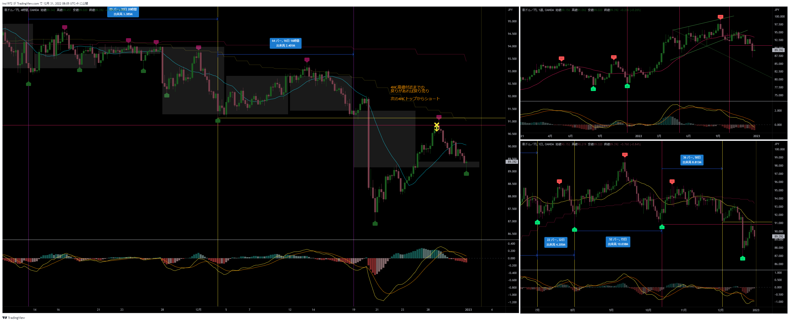
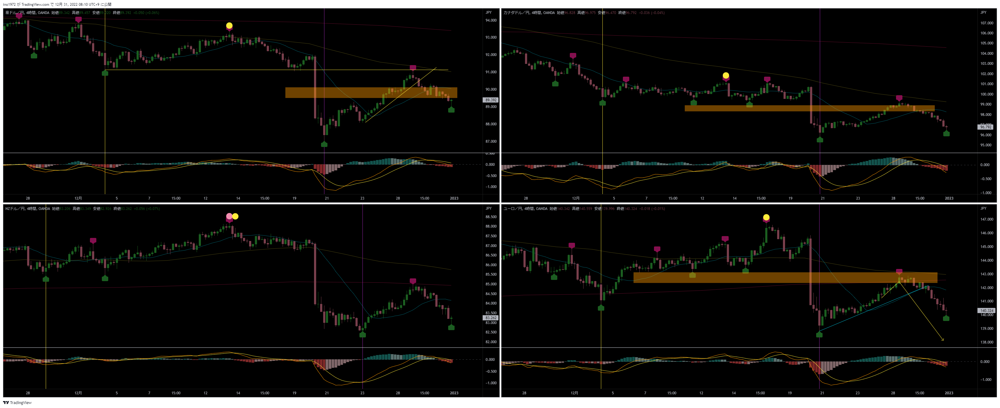
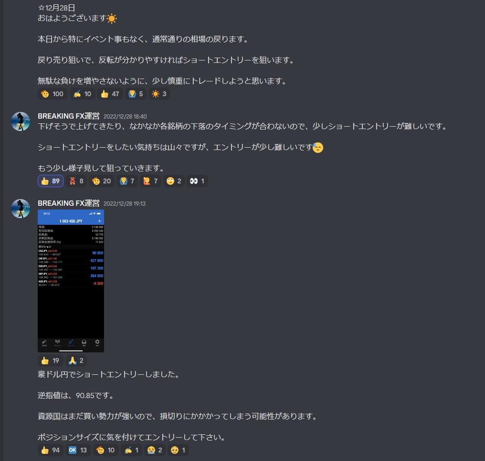
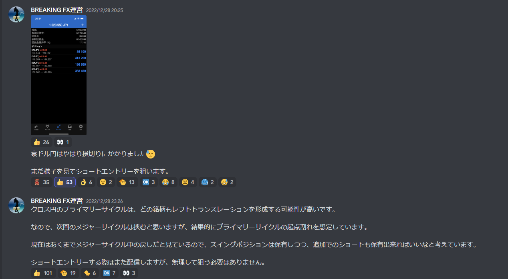

[今月の一覧](../main.md)

# 通貨 : AUDJPY
- エントリー日 : ポジション : ロット
  - 2022/12/28 : Short : 1,000
- 損切りライン : 直前のローソク足高値
- 決済日 : ポジション : ロット
  - 2022/12/28 : 1,000 : 損切

# 確認事項
- 突っ込みエントリー(Yes)、違う(No) : No
- MACDは中心から離れているか？      : Yes
- MACDはクロスしそうか？            : No
- MACDダイバージェンス(Yes=有/No=無): No
- 高安値、切上げ下げ(Yes=有/No=無)  : No
- 上げ下げ渋り(Yes=有/No=無)        : No
- 日足ピンバー？                    : No
- 20SMAとの位置関係
  - 【４Ｈ】MAの向き / ローソク足の位置 : 上 / 上
  - 【日足】MAの向き / ローソク足の位置 : 下 / 下
  - 【週足】MAの向き / ローソク足の位置 : 下 / 下
- エントリーの日の経済指標 : 無

# エントリー／決済

# その後

