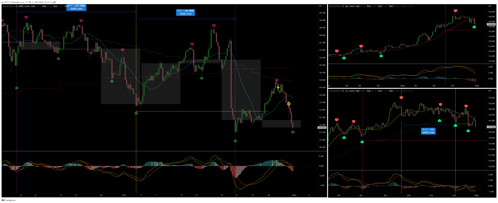
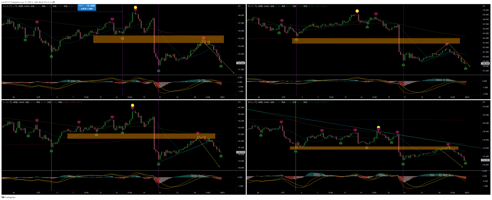
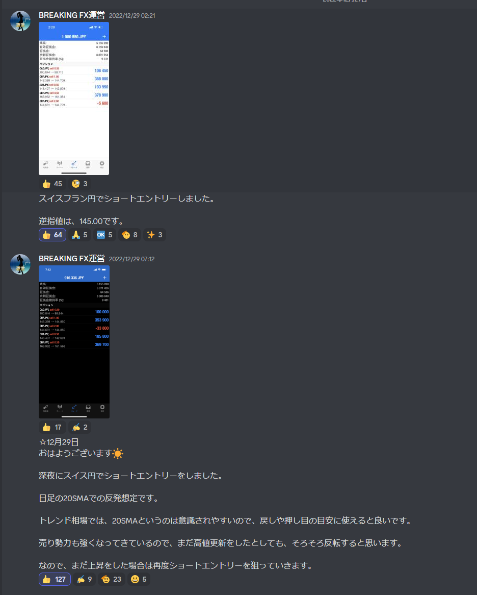
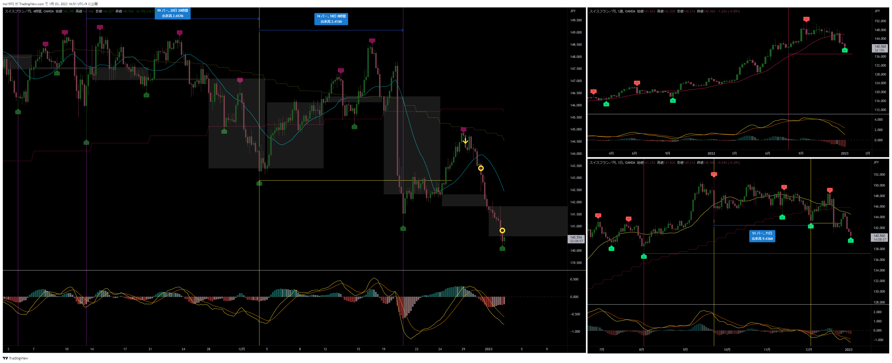

[今月の一覧](../main.md)

# 通貨 : CHFJPY
- エントリー日 : ポジション : ロット
  - 2022/12/29 : Short : 2,000
- 損切りライン : 
- 決済日 : ポジション : ロット
  - 2022/12/30 : 1,000 : 利確
  - 2023/01/03 : 1,000 : 利確

# 確認事項
- 突っ込みエントリー(Yes)、違う(No) : No
- MACDは中心から離れているか？      : Yes
- MACDはクロスしそうか？            : No
- MACDダイバージェンス(Yes=有/No=無): No
- 高安値、切上げ下げ(Yes=有/No=無)  : No
- 上げ下げ渋り(Yes=有/No=無)        : No
- 日足ピンバー？                    : No
- 20SMAとの位置関係
  - 【４Ｈ】MAの向き / ローソク足の位置 : 上 / 上
  - 【日足】MAの向き / ローソク足の位置 : 下 / 下
  - 【週足】MAの向き / ローソク足の位置 : 上 / 下
- エントリーの日の経済指標 : 無

# エントリー

# 決済

## 決済１
- 年末最終日なので、万が一のクラッシュでも被害を抑えるために半分利確した

### どんな気持ちか
- スイスで年越しは少し恐い

### 反省点
- リスクヘッジの利確なので問題ない

## 決済２
- エントリーの起点は紫線だが、利確の起点はその前の安値とした
- 利確の起点から60本を超え、エントリーの起点を割ったので、一旦反発があると想定
- 4HCの１波が取れたと判断して利確した

# その後

