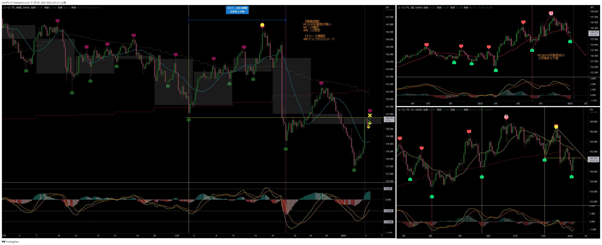
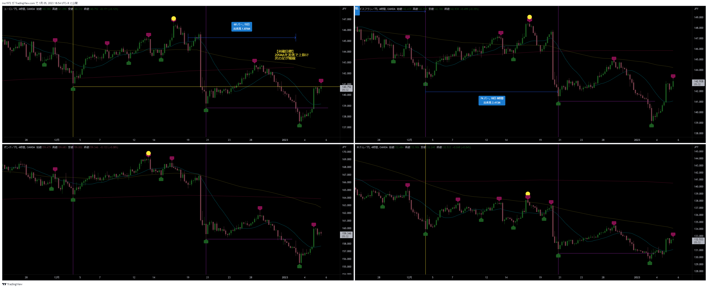
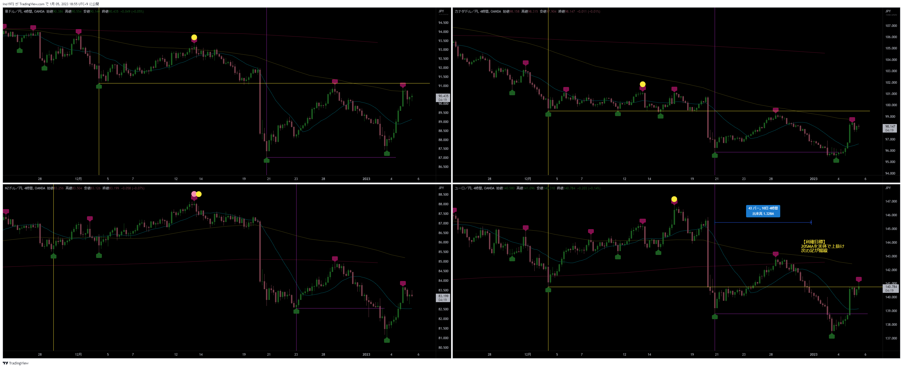

[今月の一覧](../main.md)

# 通貨 : EURJPY
- エントリー日 : ポジション : ロット
  - 2023/01/05 : Short : 1,000
  - 2023/01/05 : Short : 1,000
- 損切りライン : 直近高値
- 決済日 : ポジション : ロット
  - 2023/01/05 : 2,000 : 損切

# 確認事項
- 確実性重視(損切り幅大) or 積極性重視(損切り幅小)：積極性
- 突っ込みエントリー(Yes)、違う(No) : Yes No
- MACDは中心から離れているか？      : Yes No
- MACDはクロスしそうか？            : Yes No
- MACDダイバージェンス(Yes=有/No=無): Yes No
- 高安値、切上げ下げ(Yes=有/No=無)  : Yes No
- 上げ下げ渋り(Yes=有/No=無)        : Yes No
- 日足ピンバー？                    : Yes No
- 20SMAとの位置関係
  - 【４Ｈ】MAの向き / ローソク足の位置 : 上 / 下
  - 【日足】MAの向き / ローソク足の位置 : 上 / 下
  - 【週足】MAの向き / ローソク足の位置 : 上 / 下
- エントリーの日の経済指標 : 無 有[US : 雇用統計]

# エントリー
## 根拠
- 

## 懸念点／エントリーとは逆の視点
- 

## どんな気持ちか
- 

## 反省点
- 

# 決済
## 決済計画
- 

## 決済実施
- 

## どんな気持ちか
- 

## 反省点
- 

# その後

