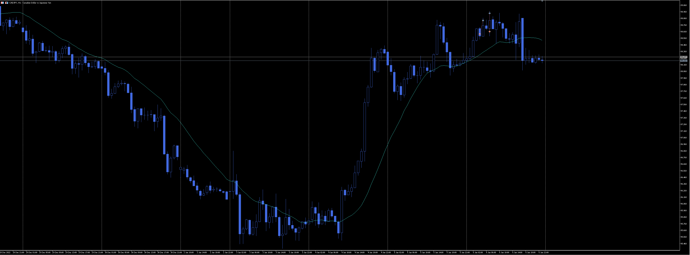
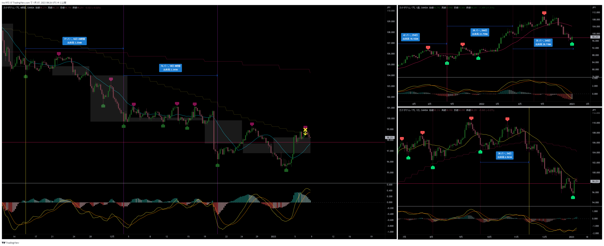
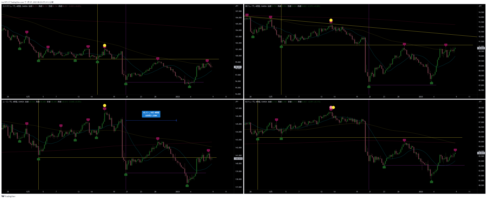

[今月の一覧](../main.md)

# 通貨 : CADJPY
- エントリー日 : ポジション : ロット
  - 2013/01/06 : Short : 1,000
  - 2013/01/06 : Short : 1,000
- 損切りライン : 直近高値
- 決済日 : ポジション : ロット
  - 2013/01/06 : 1,000 : 損切
  - 2013/01/06 : 1,000 : 損切

# 確認事項
- 確実性重視(損切り幅大) or 積極性重視(損切り幅小)：積極性(損切り幅小)
- 突っ込みエントリー(Yes)、違う(No) : No
- MACDは中心から離れているか？      : Yes
- MACDはクロスしそうか？            : No
- MACDダイバージェンス(Yes=有/No=無): No
- 高安値、切上げ下げ(Yes=有/No=無)  : 安値切り下げ、下がれば高値切り下げ
- 上げ下げ渋り(Yes=有/No=無)        : Yes
- 日足ピンバー？                    : No
- 20SMAとの位置関係
  - 【４Ｈ】MAの向き / ローソク足の位置 : 上 / 上
  - 【日足】MAの向き / ローソク足の位置 : 下 / 下
  - 【週足】MAの向き / ローソク足の位置 : 下 / 下
- エントリーの日の経済指標 : 無 有[US : ISM非製造業景況指数、失業率]

# エントリー
## 根拠
- １回目：アッシュサロンの指示
- ２回目：エントリーし直し

## 懸念点／エントリーとは逆の視点
- 戻しの途中の可能性も十分考えられる
- アッシュのエントリーは機会損失を逃さないよう、積極的にエントリー。その代わり損切り幅を小さくする。

## どんな気持ちか
- 期待半分、損失覚悟半分

## 反省点
- １回目：特になし
- ２回目
  - １回目は上昇してきたので、損切りラインにかかる前に手動で損切りした。サロンの指示は無し。
  - ２回目は損切りラインを超えずに下落してきたので、慌てて入り直した

# 決済
## 決済計画
- 4HCボトムで決済

## 決済実施
- １回目：自己裁量
- ２回目：予定通り

## どんな気持ちか
- １回目を裁量で損切りしたのに、値動きを見てすぐに入り直し、結局狩られた。間抜け。

## 反省点
- 値動きを見てポジションを動かしてもろくなことにならない。
- 分かっているのにやってしまう。今回は大丈夫だとか思っているのか？

# その後

