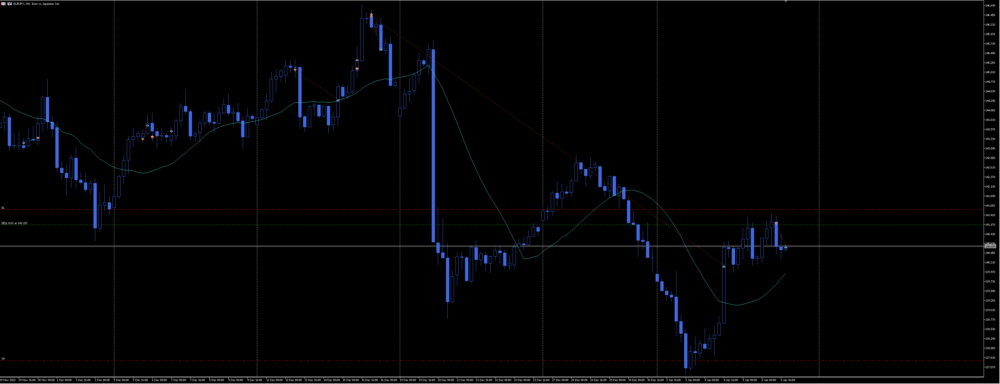
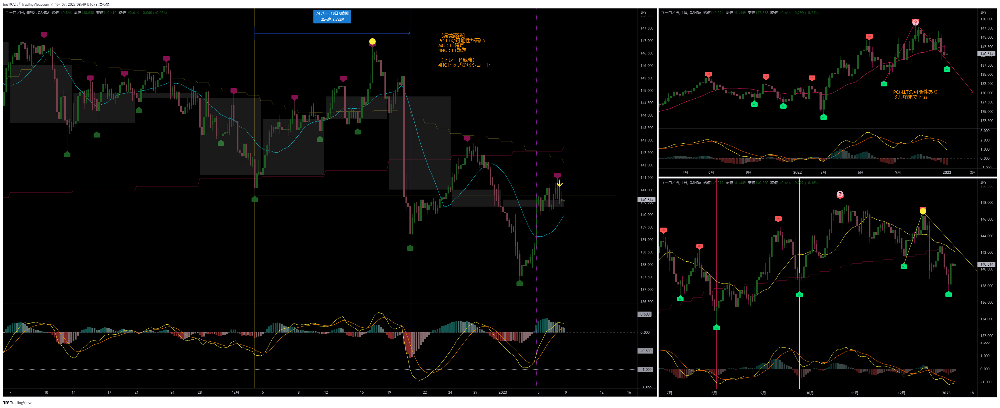
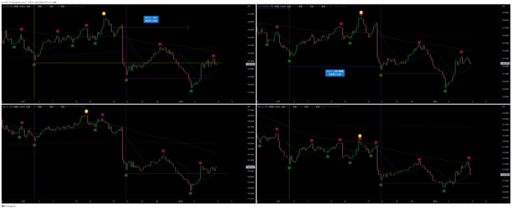
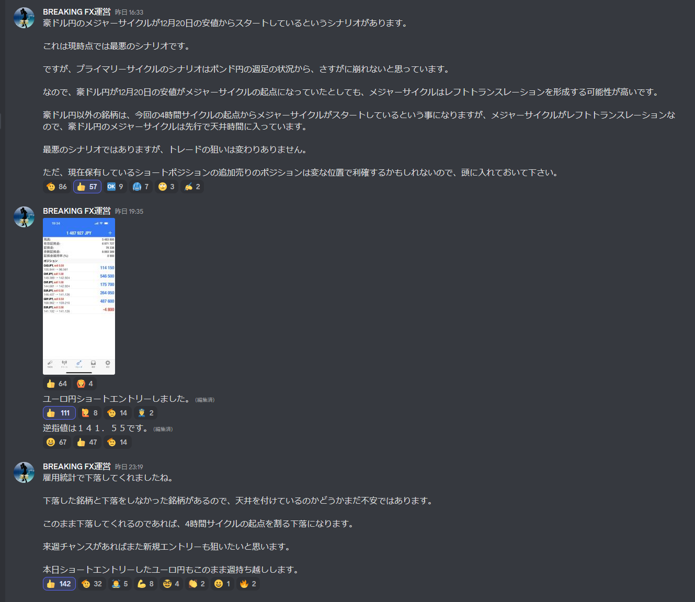

[今月の一覧](../main.md)

# 通貨 : EURJPY
- エントリー日 : ポジション : ロット
  - 2013/01/06 : Short : 2,000
- 損切りライン : 直近高値
- 決済日 : ポジション : ロット
  - 2013/01/07 : 1,000 : 利確
  - 2013/01/xx : 1,000 : 利確 損切 建値

# 確認事項
- 確実性重視(損切り幅大) or 積極性重視(損切り幅小)：積極性(損切り幅小)
- 突っ込みエントリー(Yes)、違う(No) : No
- MACDは中心から離れているか？      : Yes
- MACDはクロスしそうか？            : Yes
- MACDダイバージェンス(Yes=有/No=無): No
- 高安値、切上げ下げ                : 安値切り下げ、下がれば高値切り下げ
- 上げ下げ渋り(Yes=有/No=無)        : Yes
- 日足ピンバー？                    : 少し上ヒゲ
- 20SMAとの位置関係
  - ４時間足：上昇中のMAに対し、ローソク足が上にいる。MAの下抜け期待。
  - 日足：MA下落。過去に何度か日足のMAがローソクの頭を抑えつけるような形になっている。
- エントリーの日の経済指標 : 無 有[US : ISM非製造業景況指数、失業率]

# エントリー
## 根拠
- アッシュサロンの指示

## 懸念点／エントリーとは逆の視点
- 直近安値でMCスタートとすると、MCがLT想定だったとしても第一4HCはRTになる可能性が高い

## どんな気持ちか
- 機会損失を避けるための積極エントリー。その代わり損切り幅を小さくしている。という理解。

## 反省点
- 特に無し。

# 決済
## 決済計画
- 半分は4HCボトムまでホールド。
- 残りは引っ張る。

## 決済実施
- １回目：週末だったので、１玉は利益確保。これで損切りにかかっても損はしない。

## どんな気持ちか
- １回目：勢いよく下落してくれたら、ホールドしていたかもしれないが、週末ということもあり、利確はまあまあの判断だった。

## 反省点
- 

# その後

