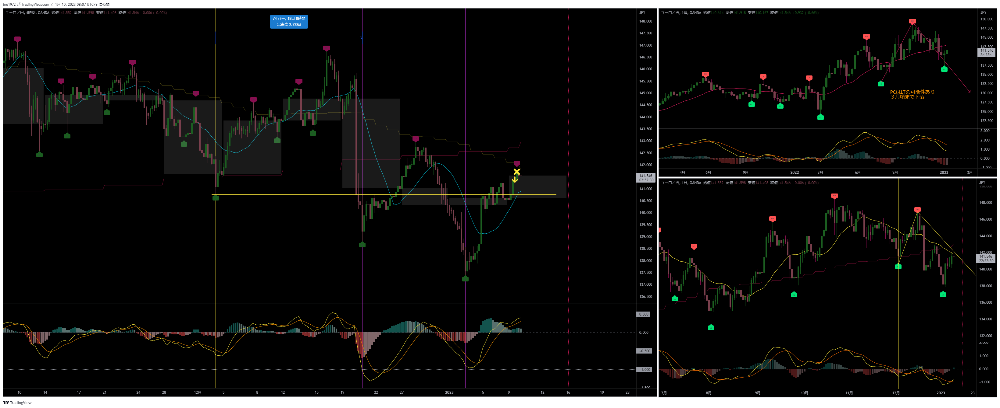

[今月の一覧](../main.md)

# 通貨 : EURJPY
- エントリー日 : ポジション : ロット
  - 2013/01/xx : Long : 1,000
- 損切りライン : 
- 決済日 : ポジション : ロット
  - 2013/01/xx : 1,000 : 利確 損切 建値
  - 2013/01/xx : 1,000 : 利確 損切 建値

# 確認事項
- 確実性重視(損切り幅大) or 積極性重視(損切り幅小)：確実性(損切り幅中)　積極性
- 突っ込みエントリー(Yes)、違う(No) : Yes No
- MACDは中心から離れているか？      : Yes No
- MACDはクロスしそうか？            : Yes No
- MACDダイバージェンス(Yes=有/No=無): Yes No
- 高安値、切上げ下げ                : 安値切り下げ、下がれば高値切り下げ
- 上げ下げ渋り(Yes=有/No=無)        : Yes No
- 日足ピンバー？                    : Yes No
- 20SMAとの位置関係
  - 
- エントリーの日の経済指標 : 無 有[US : 雇用統計]

# エントリー
## 根拠
- 

## 懸念点／エントリーとは逆の視点
- 

## どんな気持ちか
- 

## 反省点
- 

# 決済
## 決済計画
- 

## 決済実施
- 

## どんな気持ちか
- 

## 反省点
- 

# その後

