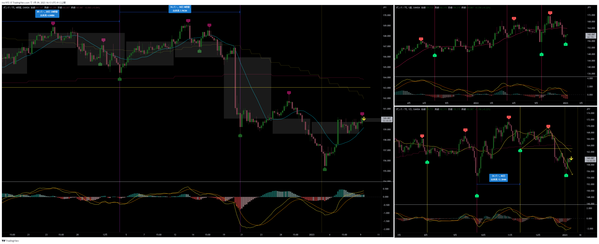
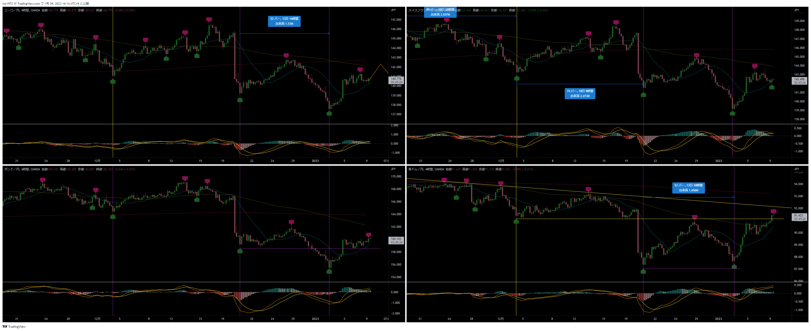
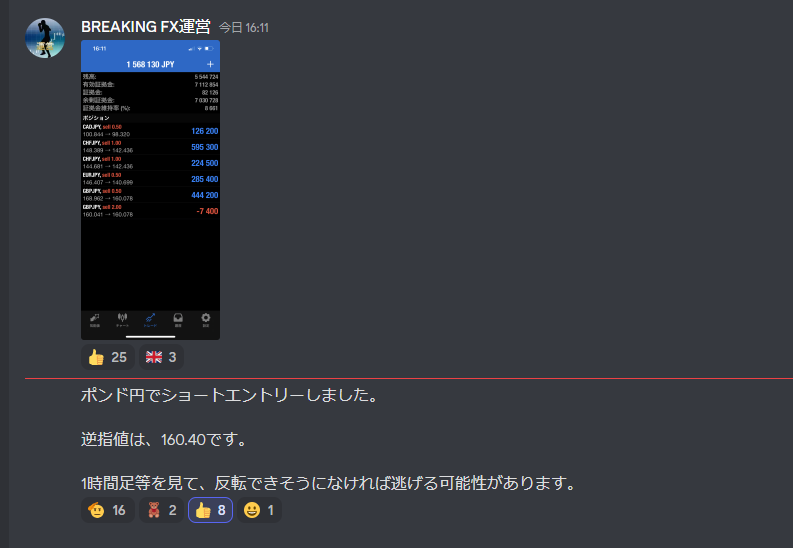
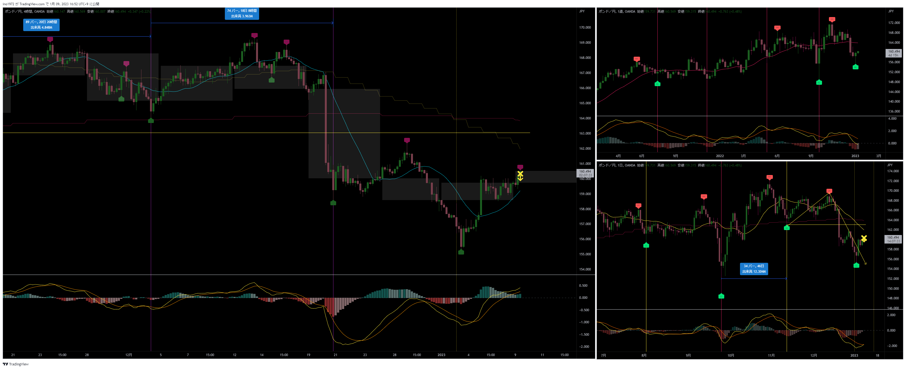
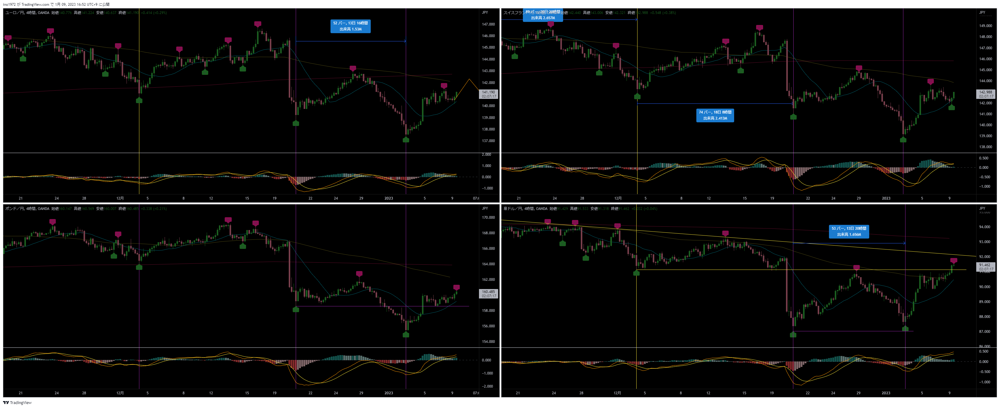
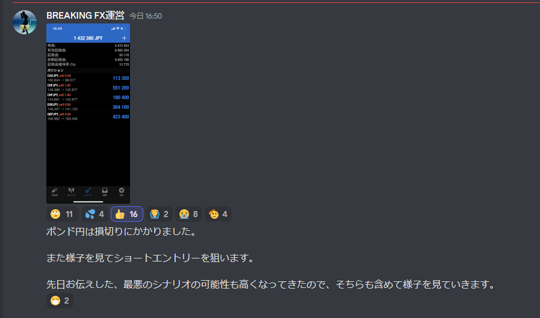

[今月の一覧](../main.md)

# 通貨 : GBPJPY
- エントリー日 : ポジション : ロット
  - 2013/01/09 : Short : 2,000
- 損切りライン : 直近高値
- 決済日 : ポジション : ロット
  - 2013/01/09 : 2,000 : 損切

# 確認事項
- 確実性重視(損切り幅大) or 積極性重視(損切り幅小)：積極性(損切り幅小)
- 突っ込みエントリー(Yes)、違う(No) : No
- MACDは中心から離れているか？      : Yes
- MACDはクロスしそうか？            : No
- MACDダイバージェンス(Yes=有/No=無): No
- 高安値、切上げ下げ                : 安値切り下げ、下がれば高値切り下げ
- 上げ下げ渋り(Yes=有/No=無)        : Yes
- 日足ピンバー？                    : No
- 20SMAとの位置関係
  - ４時間足：上昇しているMAの上側にローソク足がある。下抜ければいい形になりそう
- エントリーの日の経済指標 : 無

# エントリー

## 根拠

## 懸念点／エントリーとは逆の視点
- 直近高値超えがダマシになることに賭けた？

## どんな気持ちか
- 相変わらずアグレッシブなエントリー。自分には思いもつかない。
- アッシュのスタイル
  - 勝率は低いが、以下のメリットでそれをカバーしている
  - 天井で売ることを狙うことで、大きい値幅を取ることを狙う
  - 見切りでエントリーすることで、損切り幅を小さくしている

# 決済

## 決済実施
- 予定通り

# その後

