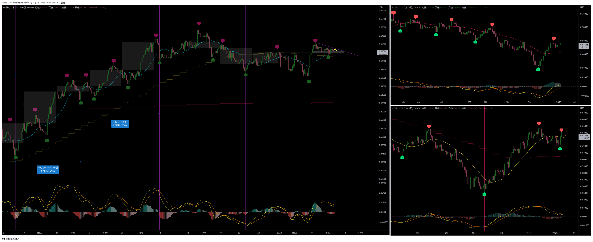
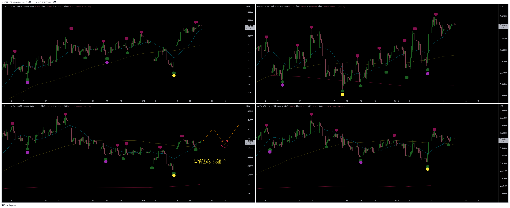

[今月の一覧](../main.md)

# 通貨 : NZDUSD
- エントリー日 : ポジション : ロット
  - 2013/01/12 : Long : 1,000
- 損切りライン : クラスタの下限
- 決済日 : ポジション : ロット
  - 2013/01/xx : 1,000 : 利確 損切 建値

# 確認事項
- 確実性重視(損切り幅大) or 積極性重視(損切り幅小)：積極性（損切り幅小）
- 突っ込みエントリー(Yes)、違う(No) : No
- MACDは中心から離れているか？      : 中心より上だが、ロング狙い
- MACDはクロスしそうか？            : No
- MACDダイバージェンス(Yes=有/No=無): No
- 高安値、切上げ下げ                : 上がれば安値切上げ
- 日足ピンバー？                    : No
- 20SMAとの位置関係
  - ４時間足：20SMAに頭を抑えられている。しかし、他のドルストは20SMAの上にローソク足がある。
- エントリーの日の経済指標 : 有[米 : CPI]

# エントリー

## 根拠
- NZDUSD以外のドルストが20SMAを実体でうわ抜いている
- NZDUSDもそれに追随して20SMAをうわ抜けて、トップに向けて上昇を開始すると想定

## 懸念点／エントリーとは逆の視点
- 

## どんな気持ちか
- サイクル途中からのエントリーだが、損切り幅が小さく、他の通貨は上昇しているので問題なし

## 反省点
- 特になし

# 決済
## 決済計画
- 

## 決済実施
- 

## どんな気持ちか
- 

## 反省点
- 

# その後

