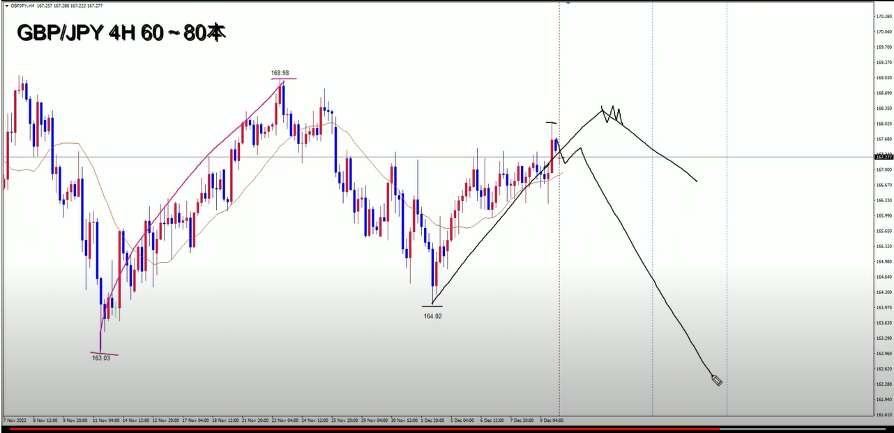
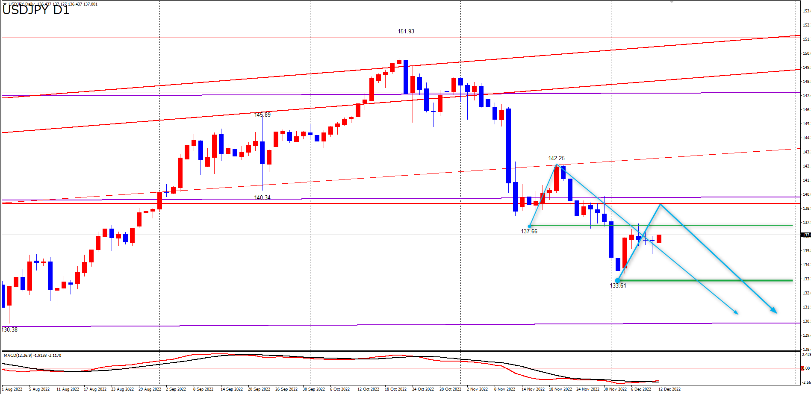

# USDJPY

---
# クロス円
## EURJPY

## GBPJPY

## AUDJPY

## NZDJPY

## CADJPY

## CHFJPY

---
# ドルストレート
## EURUSD

## GBPUSD

## AUDUSD

## NZDUSD

---
# Yuu
## EURJPY
- 上昇中なので、もう１段上げがくることを想定
- 4HCトップで上げ止まりを待ってショートを狙う：日足上昇トレンドの調整波なので、短期決済を予定
- 今から下落開始する場合は、LTを疑う

- カナダドル円の週足サイクルがレフトトランスレーションを確定させ、直近の最高値で天井を付けている状況なのでユーロ円の週足サイクルもボトムへ向けて下落中の想定

- MCはどちらを起点に取るかでシナリオが２通り。しかし、両方ともLTになる可能性が高い
- 今回、もしくは次の4HCでMCの天井を付ける可能性が高いと見ている
- トレード戦略：上げ止まりを確認したらショート

## GBPJPY
- EURJPYと同じ

- EURJPYと同じで今から上げ止まってきたらLTになる可能性

## ポジション

---
# Uきんぐ
## GBPUSD
- 4HCトップを付けている可能性があります。LT
- 日足がMCが進行しているのであれば、MCトップに向けての上昇が継続されていると考えることができるので、今回の4HCはライトトランスレーションを形成する可能性もあります。
- 現状日足はハーフプライマリーサイクルで進行している可能性があります。
  その場合は現在日足の天井時間で日足のボトムへ向けて下落していると考えることができます。
- 今回の4HCの形状は日足のシナリオを判断していく上でも重要なポイントになります。
  まだ、日足のシナリオを断定できる情報はありません。
  なので、これからの動きで判断していく他ありません。

## EURJPY
- 高値を更新しなければLT

- 第一4HCはRTの可能性が高い：RT

- クロス円全体を見て、サイクル内高値を更新してくる通貨があるかどうか注目しておく

## クロス円
- シナリオが確定するのをしっかりと待つ
  - 分かりやすくなってからトレードすれば良い

### USDJPY
- サイクル内高値を超えるかどうかでどちらのトランスレーションになるか判断する

### GBPJPY
- RT, LTどちらもあり

### NSDJPY
- もうそろそろボトム時間なのでRTの可能性が高い

### CADJPY
- サイクル内安値割れは証券会社によって違うため、様子見

## ドルスト
- ドルストもシナリオが確定するまで様子見

### EURUSD
- HPCの場合はLTの可能性が高い

## ポジション

---
# Ash
## USDJPY
- RTになりそう
- 高値更新後のポイントとしては、まずは１３９．３５、１４０．８５辺りを意識して見ていきたいと思います。

- 今回の4HCがRTになってもショート狙いには変わらず

## EURUSD
- ドルストは少しわかりにくい。クロス円の方が分かりやすい。
- ドルストはまだ上昇が強いので、ボトムからロングを狙う
- 高値更新をするようだったら、ショートを狙う
- HPCだったらショートを狙う

- HPCの可能性

