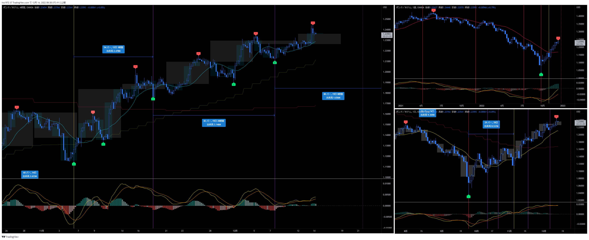
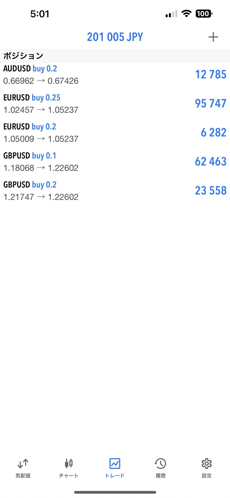
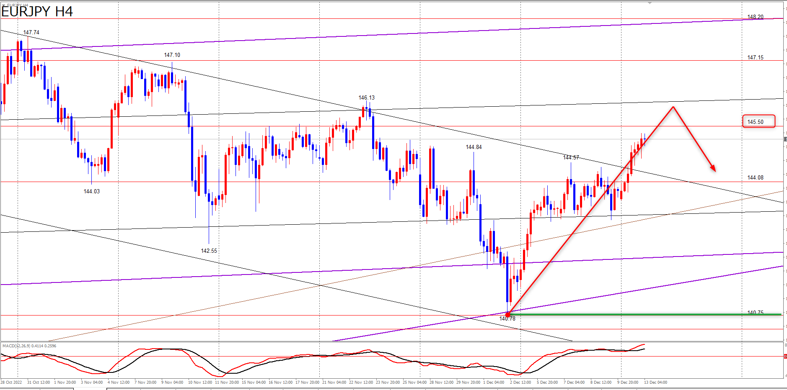

# USDJPY

---
# クロス円
## EURJPY
- 価格帯の予想は合っていた

## GBPJPY

## AUDJPY

## NZDJPY

## CADJPY

## CHFJPY

---
# ドルストレート
## EURUSD

## GBPUSD

## AUDUSD

## NZDUSD

---
# Yuu
## EURJPY

- 目先は4HCトップからのショート狙いだが、ボトムからのロングも狙う

## GBPJPY

## AUDJPY

## ポジション

---
# Uきんぐ
## AUDUSD
- 下落に入った可能性がある

## GBPJPY
- PCは高値をつけているがMCはRTを想定

## USDJPY
- PCは天井を付けている。MCはRT確定したが、狙いはショート。

## ポジション

---
# Ash
## EURJPY
- クロス円、高値更新したので、４時間サイクル自体はライトトランスレーションの可能性が高くなりました。
- ライトトランスレーションの可能性は高くなりましたが、次のトレード予定はショートなので、現在の４時間サイクル天井待ちです。
- ユーロ円の高値更新後のポイントは、まずは１４５．５０です。この辺りのポイントで４時間サイクル天井を付ける想定で見ています。
- 少し上昇が強そうなので、もう一段の高値更新があるとすれば、直近高値の１４６．１３辺りが意識されるか、さらに上の１４７．１５辺りまで上昇余地が広がるかもしれませんが、４時間サイクル天井は疑いながら見ていきたいと思います。

- 日足はLTを想定
- 上昇トレンド継続が考えられなくもないが、それを決定づける情報が無い
- 週足も直近高値がPCトップと想定している

## AUDJPY
- 週足が２本目で天井はかなり早い

- 直近の高値を更新する可能性もある

## GBPJPY

- 日足はLTの可能性が高いと見ている

