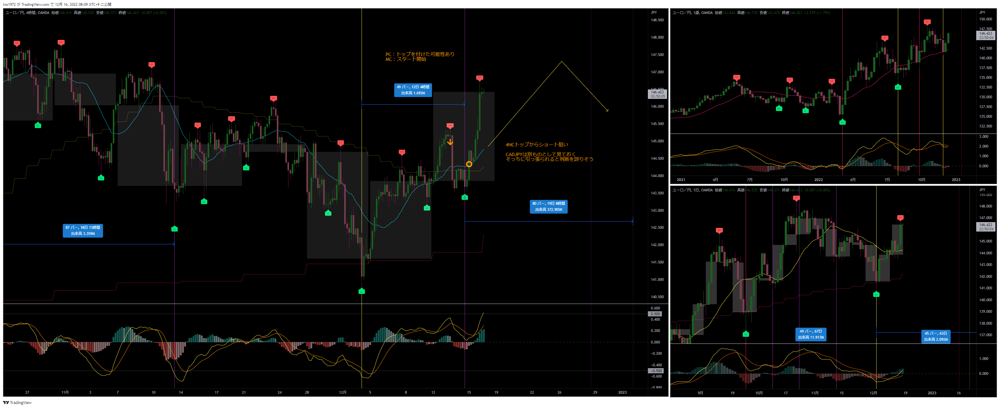

# USDJPY

---
# クロス円
## EURJPY

## GBPJPY

## AUDJPY

## NZDJPY

## CADJPY

## CHFJPY

---
# ドルストレート
## EURUSD

## GBPUSD

## AUDUSD

## NZDUSD

---
# 12/16分
# Uきんぐ

# アッシュ

## サロン

---
# 12/15日分
# Uきんぐ
## USDJPY
- シナリオ１：高値を右半分で付け、イレギュラーで起点割れ
- シナリオ２：起点を割らないようにするため、短縮でボトム
- 前回の日足がレフトトランスレーションを形成していて、週足の天井を付けていると考えております。
  なので、今回のMCもレフトトランスレーションを形成していく可能性が高いと考えています。
  MCがレフトトランスレーションを形成するという事は、日足的にはいつ天井を付けてもおかしくないので、常にショートエントリー狙いで相場を見ております。

## EURUSD
- 4HC：トランスレーションはどちらも有り得る

- 通常のサイクル

- HPC

## クロス円
- 上がってきたらショートを狙う

## ポジション

---
# Ash
## AUDJPY
- ドル円・クロス円に関しては昨日の安値がボトムになっている可能性を疑っています。
- サイクル短縮でボトムを付けている可能性の方が高い
- メジャーサイクルでレフトトランスレーションを形成する想定は変わらないので、本命のトレードはショートを狙っていきます。

## ポジション

## サロン

---
# Yuu
## USDJPY
- トレード戦略
  - 桃のライン付近での押し目 or 安値更新後の底からロング狙いです。
  - このまま上昇していくのであればパターン②として天井（上げ止まり）からショート狙いです。

## AUDJPY
- RT想定

## GBPJPY、EURJPY
- 黒のラインを割って底を付ける

## NZDJPY
- 次のサイクルに入っている可能性あり
- 他のクロス円も底をつけている可能性がある

- NZDJPYが他の通貨に合わせる可能性もある

## クロス円トレード戦略

## ポジション

