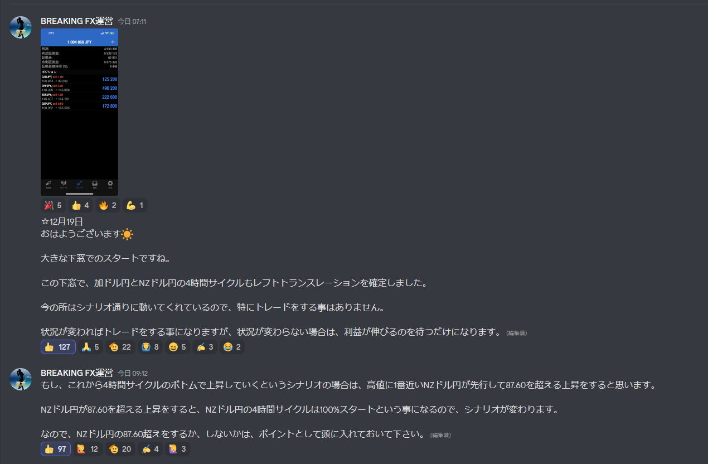

# Uきんぐ
## EURUSD
- 週足や月足のアップトレンドの最中という想定に変わりはありません。
  なので、トレード自体はロングエントリー狙いです。
  ただ、現状日足のシナリオもはっきりしないのでエントリーは難しいです。
  なので今は変わらずシナリオ確定までは様子見をする方針です。
  今は無理に手を出すべき相場ではないので、シナリオ確定して分かりやすくなるまでは落ち着いて待っていきましょうね♪

## USDJPY
- メインシナリオの場合、日足も天井を付けている可能性が高い
- 狙いはショート

## クロス円
- MC天井を付けた想定なので、戻りをショート狙い

## ドルスト
- ４時間足はRT、LTどちらになるか分からないが、RTの可能性の方が高そう
- HPCにせよ通常のMCにせよ、4HCボトムに向けて下落するのではないか
- 日足はトランスレーションを確定させる情報が無い。どちらも有り得る。

## ポジション

---
# Ash
## AUDJPY
- シナリオが２つあるが、4HCはLT確定した

- MCもLT確定

- PCもLT想定

## ポジション

## サロン

---
# Yuu
## EURJPY
- シナリオは２つあるが、MC天井を付けて下落中

- 週足でも天井を付けて下落中の想定

## GBPJPY
- シナリオは２つあるが、両方ともショート狙い

## ポジション

