# 想定
[一覧](../../index.md)

---
# クロス円
## 週足
- 【下降トレンド】PCトップ確定、ボトムに向け下落中２月末まで下落しつづけることも有り得る
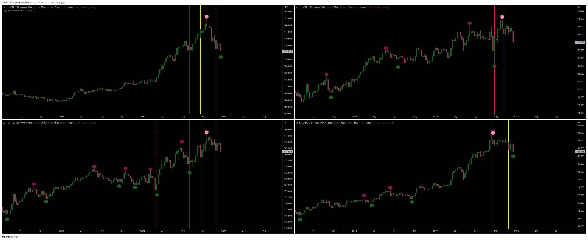
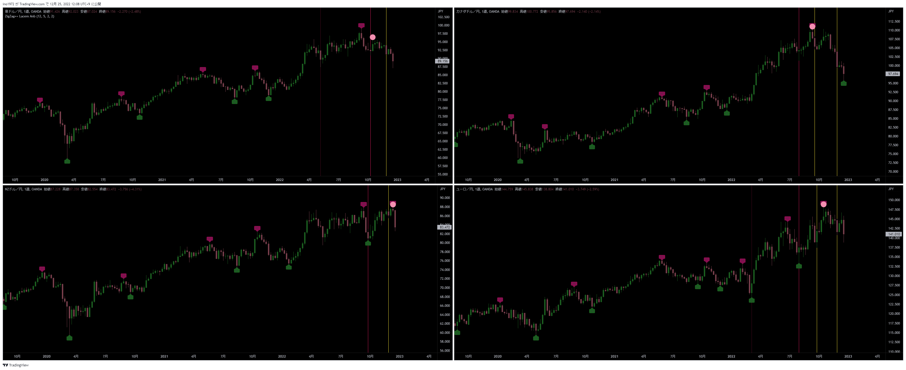

## 日足
- 【下降トレンド】MCトップ確定
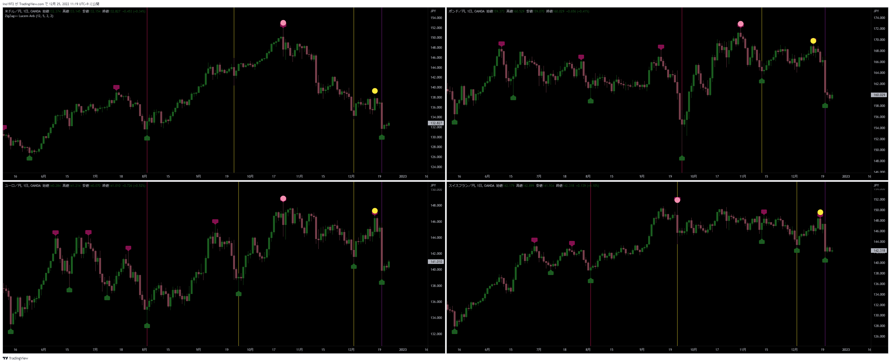
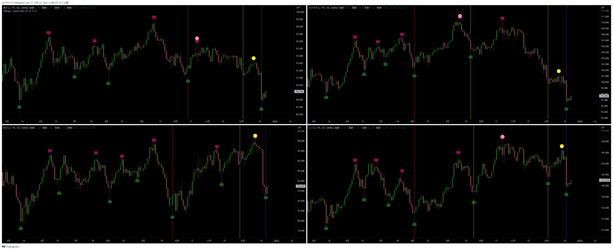

## ４時間足
- 【下降トレンド】MCトップ確定に伴い、今回の4HCはLT
- 【戦略】4HCトップからショート
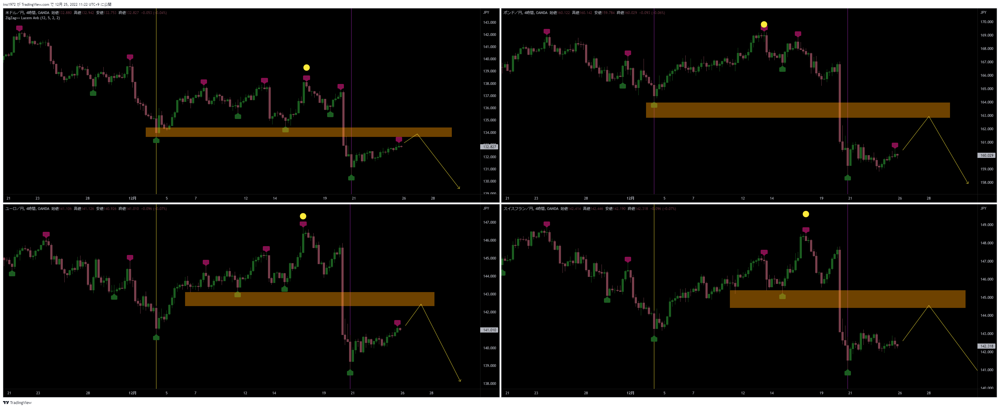
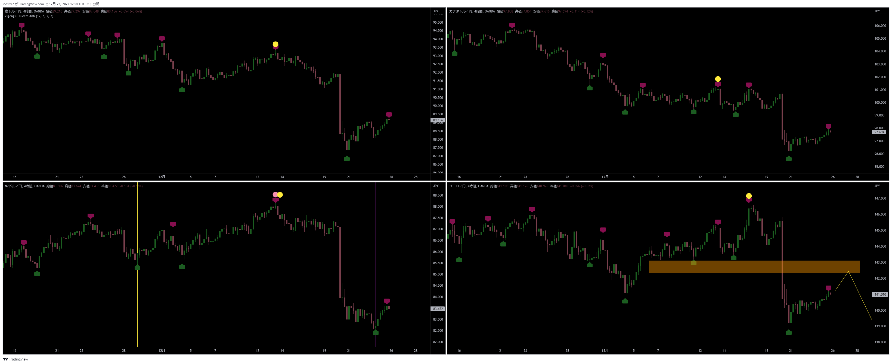

## NZDJPY
- NZDJPYを参考にすると、4HCトップは付けた可能性がある
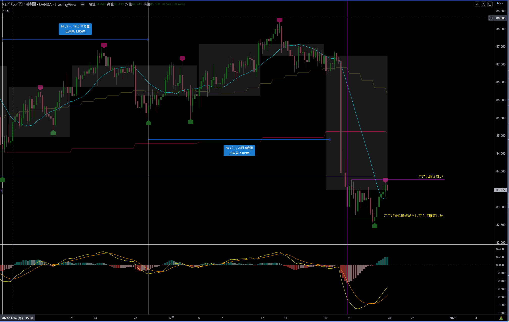

---
# ドルストレート
- 月足、週足が開始したばかりなので、長期的には上昇トレンド中
## 週足
- 【上昇トレンド】PCトップに向けて上昇中
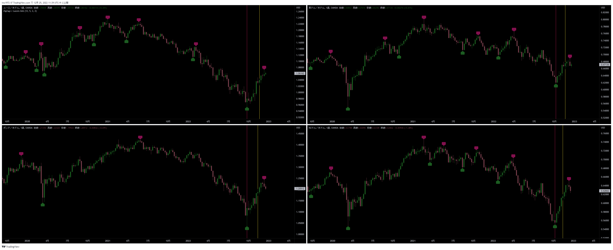

## 日足
- 【下落トレンド】MCボトムに向けて下落中
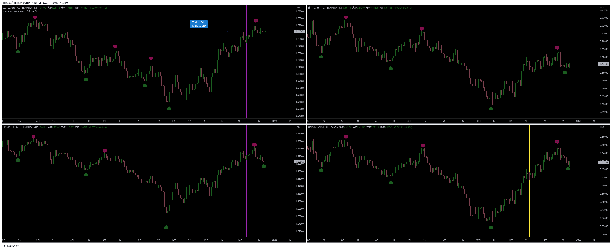

## ４時間足
- 【下落トレンド狙い】4HCトップに向けて上昇中
  - 4HCでLTを確定していないのはEURUSDだけ
- 【戦略】
  - 【短期】4HCトップからのショート
  - 【本命】ボトム（MCボトムになる）からのロング
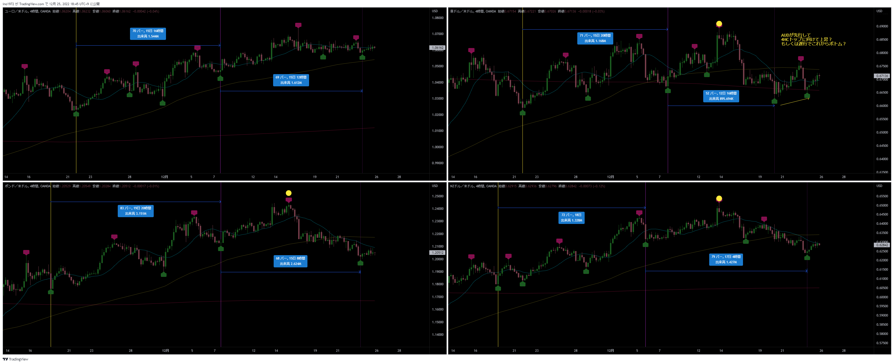

---
# Uきんぐ
## GBPJPY
- 赤のライン：このまま続落
- 青のライン：4HC内高値を更新するかもしれない。高値を付けて続落
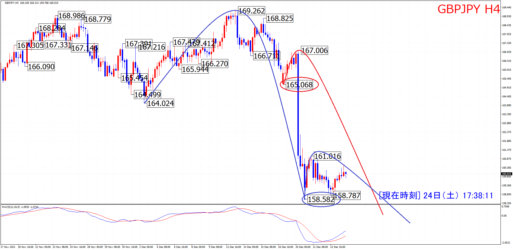

## EURJPY
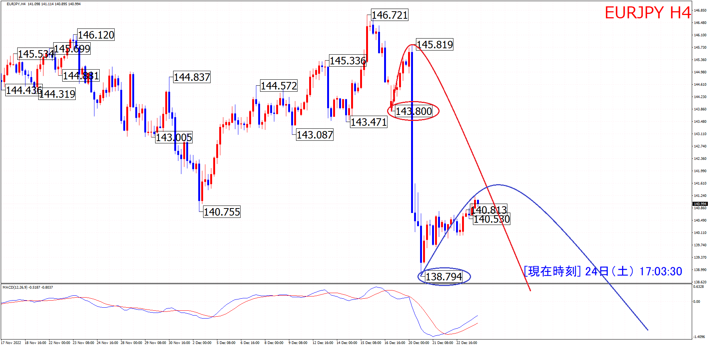

## GBPUSD
- 4HC：ボトム時間帯なのでボトムに警戒。次のサイクルでMCボトムに向けて下落の想定
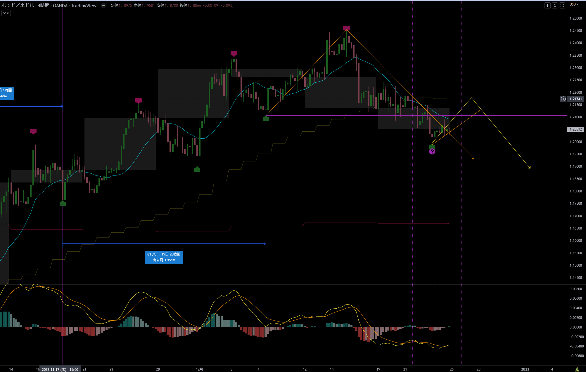
- MC：4HCがLT確定したので、天井が確定
- 通常のMCとHPCの可能性があるが、まだ続落想定。AUDUSDがHPCの場合50本程度なのでまだ続落の余地がある。
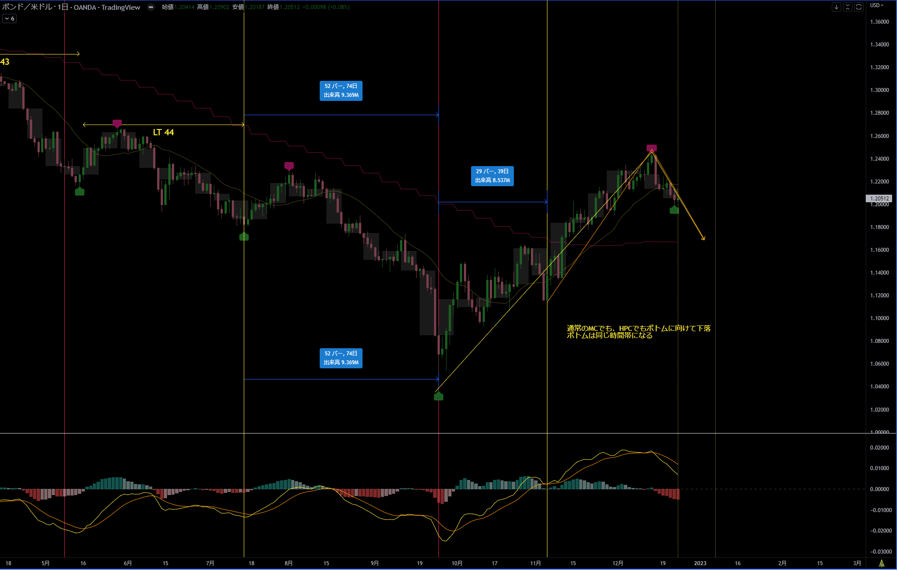

## AUDUSD
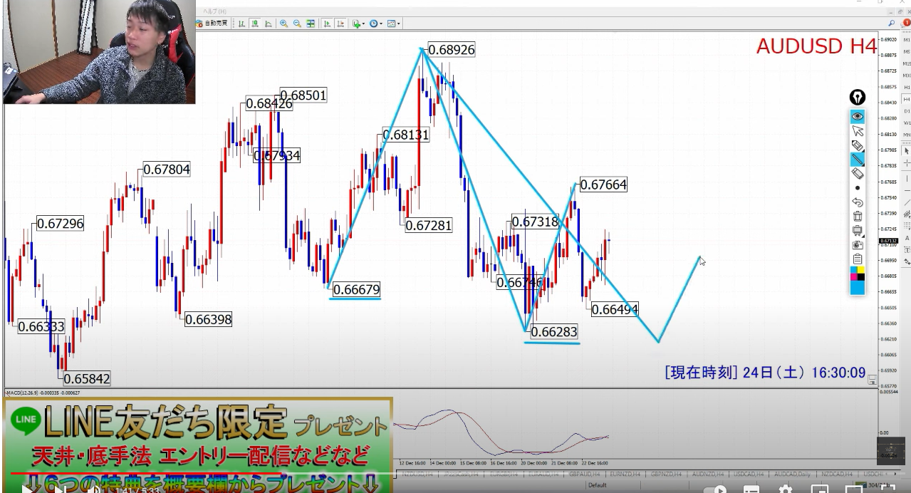

## ポジション
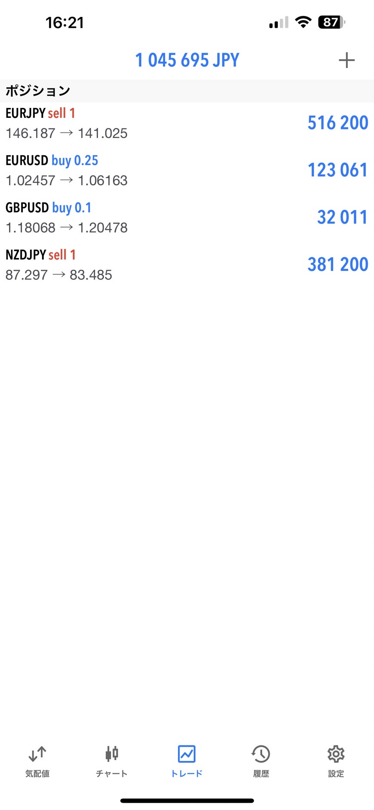

