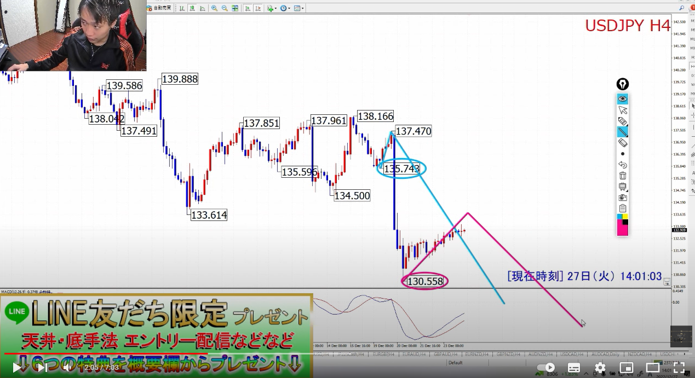
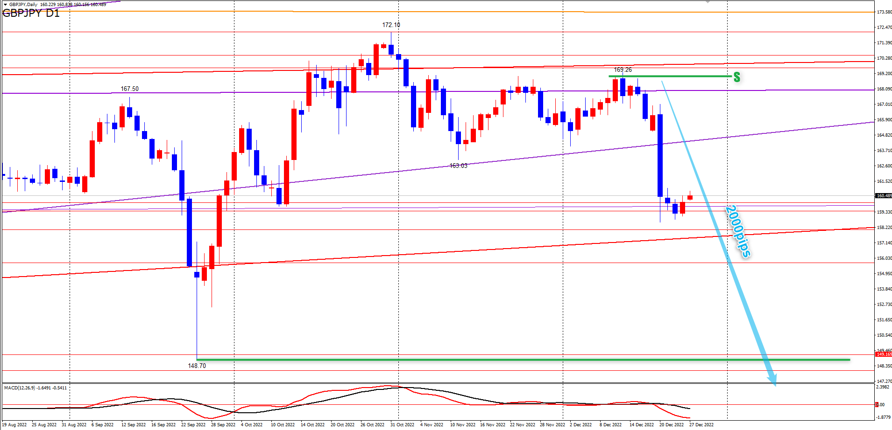
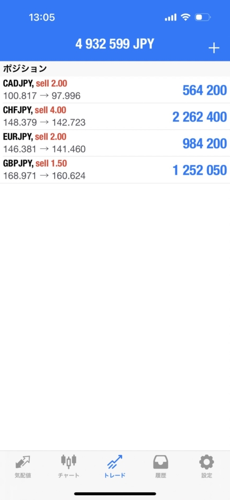

# 想定
[一覧](../../index.md)

---
# クロス円

---
# ドルストレート
## ４時間足
- 【LT想定】
- 【戦略】今回の4HCボトムがMCボトムになる想定。ボトムからロングを狙う。

---
# Uきんぐ
## EURUSD
- 今回の4HCボトムからロングを狙う

## USDJPY
- 4HCは２つのシナリオ。どちらもボトムに向けて下落中。
- 青のラインの可能性が高いと考えているので、赤のラインを根拠にエントリーしても、決済は青の時間帯で行う
  - 青のラインの可能性が高いと考えている根拠はNZDJPY。赤のラインだと100本を超える。

## ポジション

---
# Ash
## GBPJPY

## ポジション

## サロン

---
# Yuu
## GBPJPY
- ポンド円とNZドル円以外のクロス円の日足サイクルは本数的に少し遅れていて現在１７本程度という状況なので、
  それら遅れている通貨の下落に合わせて、ポンド円の今回の日足サイクル底へ向けての下落の波はしつこく継続する可能性を頭に入れておいてください😌
- 【戦略】４時間足の上げ止まりからショート狙いです。

## ポジション

---
# みなみ
## USDJPY
- オレンジ線までの戻しはあるかも

- 大きな流れで言えば下落トレンド継続です！！！
  ただ青色のラインで反発なので、このタイミングでオレンジ色のラインを上抜けてくればトレンドも切り替わるかも！？

