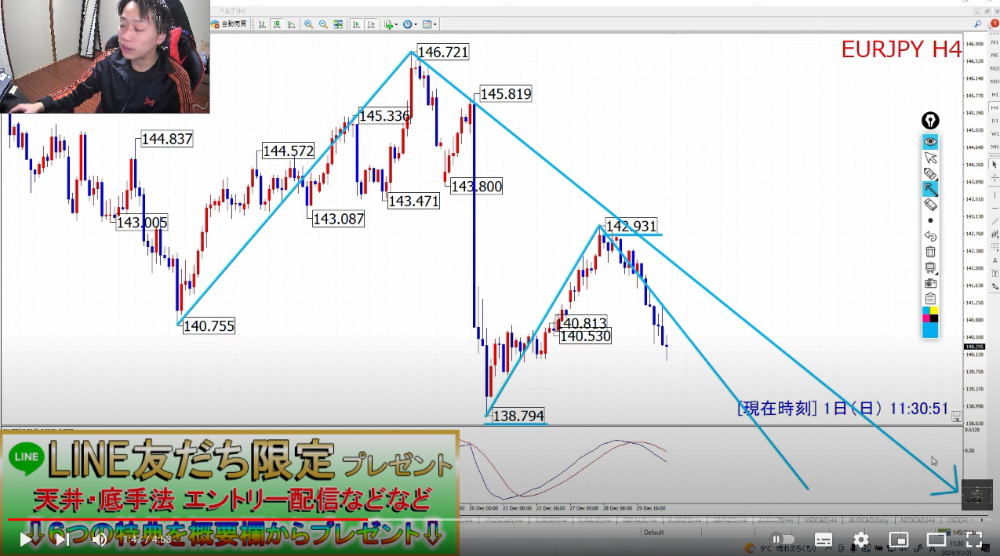
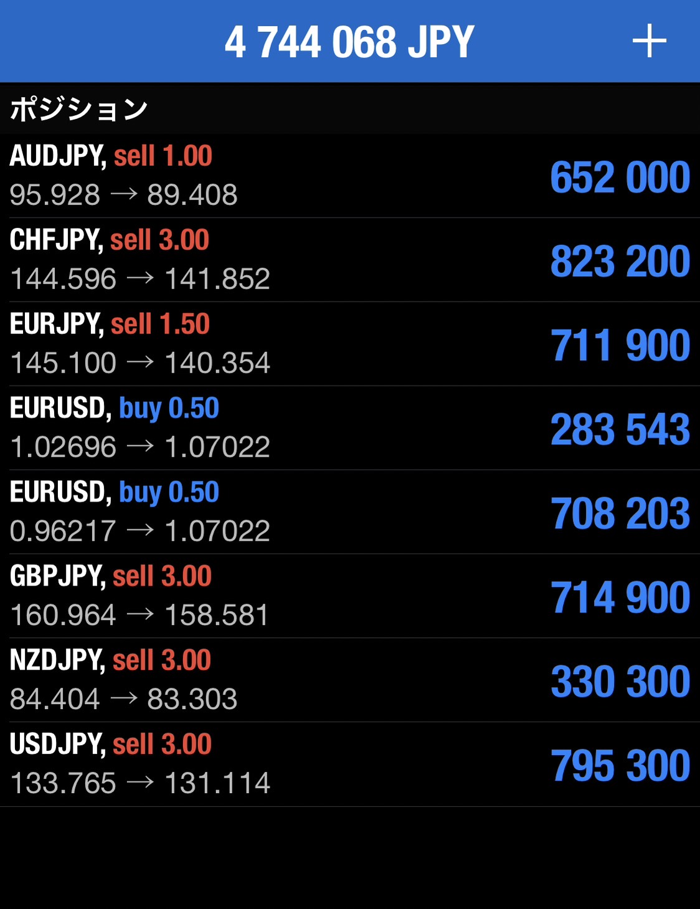

# 想定
[一覧](../../index.md)

---
# クロス円メジャー
## 週足
- 【下降トレンド】
- ドル円はLT確定。他の通貨もLT想定

## 日足
- 【下降トレンド】全通貨LT確定

## ４時間足
- 【下降トレンド】

# クロス円資源国
## 週足
- 【下降トレンド】NZDJPY以外LT確定

## 日足
- 【下降トレンド】全通貨LT確定

## ４時間足
- 【下降トレンド】LT想定

---
# ドルストレート
## 週足
- 【上昇トレンド】

## 日足
- 【上昇トレンド】RT想定

## ４時間足
- 【下降トレンド】
- 【戦略】今回4HCボトム＝MCボトム想定。4HCボトムからロング

---
# Uきんぐ
## USDJPY
- 今回4HCが
  - RT：MCスタート
  - LT：MC継続。今回の4HCボトムがMCボトムになる可能性あり
- 戦略：4HCボトムからロング狙い

## EURUSD
- 今回4HCボトムからロング狙い
- 理由
  - RT：PC、MC上昇トレンド中の第二4HC開始
  - LT：MCボトム

## GBPUSD
- 4HC開始地点がMC開始の可能性もある。
  - MC開始：RT
  - 今回がMC内最後の4HC：LT

## EURJPY
- PCボトムに向けて下落中

---
# Ash
## USDJPY

- サブシナリオ：もうそろそろ4HCのボトム
  - 4HCのボトムを付けても、戻り待ちのショート狙い
  - 理由：MCがまだボトムの時間帯ではない。

## EURJPY

- まだMCがボトムの時間帯ではないので、次の4HCもLT想定

- PC : まだまだボトムまで時間的な余裕がある。最大10週間くらい

## GBPJPY
- 現在３つ目の4HCだが、４つ目が有り得る想定
  - 理由：PCがまだ時間的余裕があるため

## AUDJPY

---
# Yuu
## GBPJPY

## EURJPY

## AUDJPY

## USDJPY

## ポジション

---
# みなみ
## EURJPY

## USDJPY
- 戦略：起点割れでLT確定したら、戻し売り狙い

