# 想定
[一覧](../../index.md)

---
# クロス円メジャー
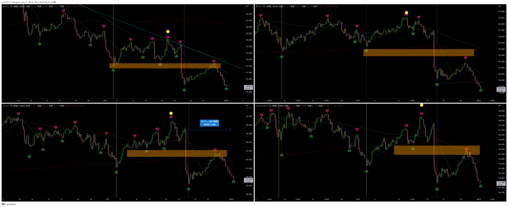

# クロス円資源国
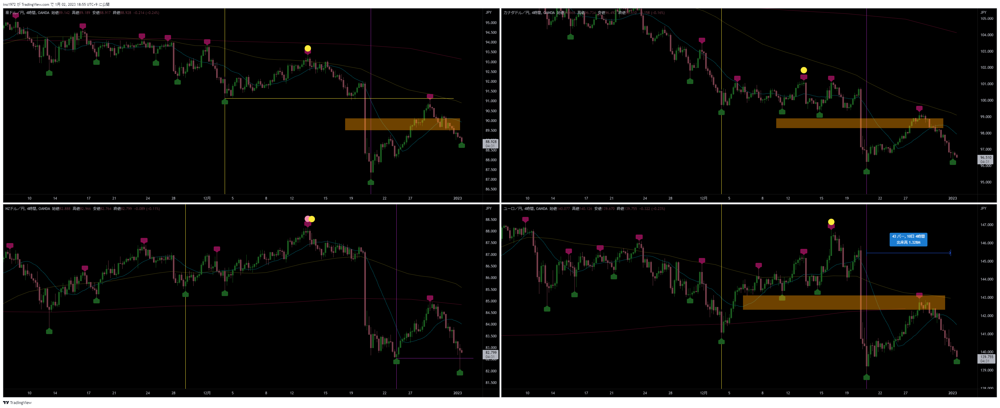

---
# ドルストレート
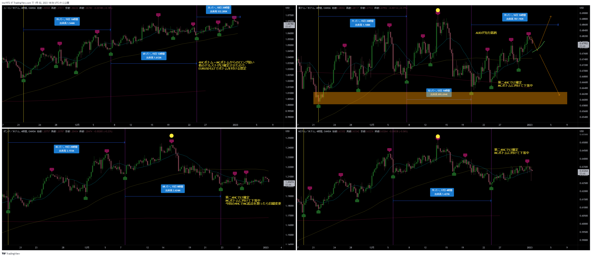

---
# Uきんぐ
## GBPJPY
- 日足は既にボトムの時間帯に突入していますが、他銘柄がまだ日足のボトム時間に入っていないので、ポンド円はどちらかと言えばまだ他銘柄の下落に付き合う形になる可能性が高いと考えています。
- 週足も現在ダウントレンドに位置しているので、短期も中期も売り目線で相場を見ています。
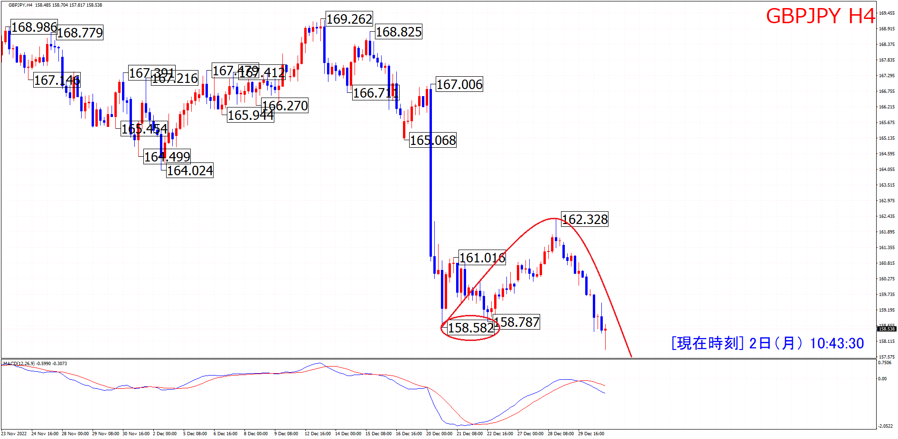

## AUDUSD
- 4HCがRTになりそう→今回の4HCでMCスタートしている
- 他の通貨ペアに合わせてLTになる可能性もある

## ポジション
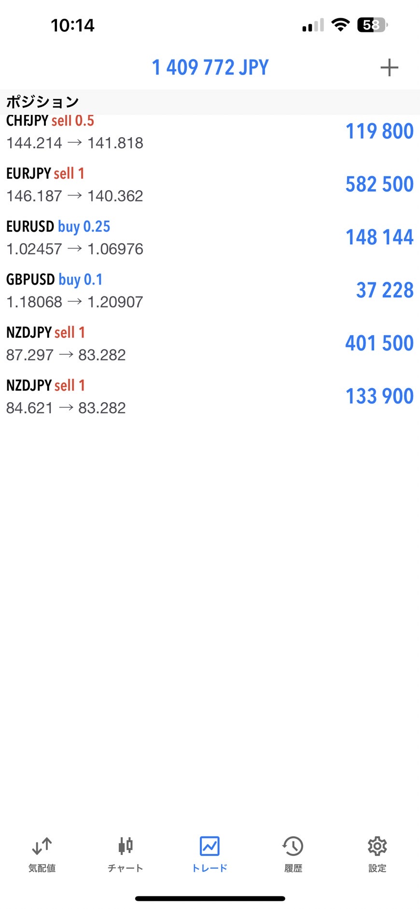

---
# Ash
## USDJPY
- ４時間サイクルが１３５.７４が起点のサイクルだと現在４時間サイクル５９本目になるので、安値更新する場合は４時間サイクルボトムの事も頭には入れて見ていきます
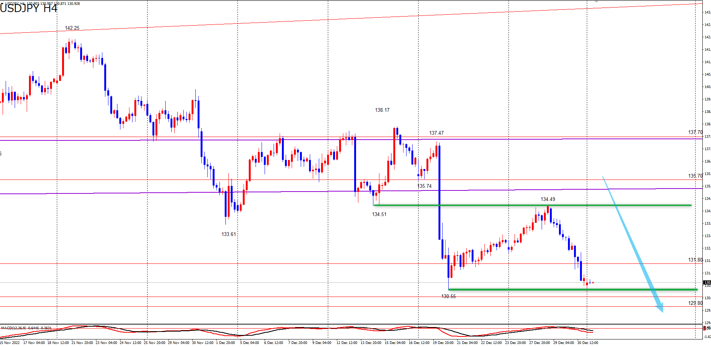

## ポジション
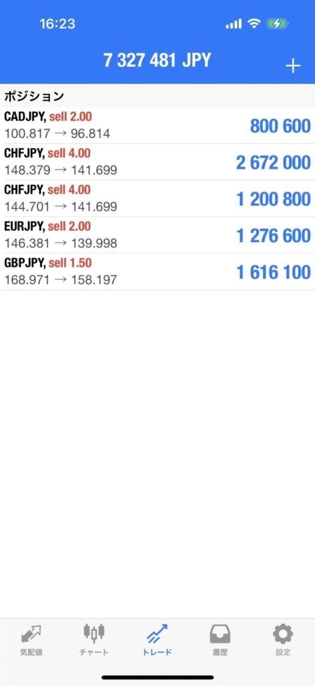

## サロン
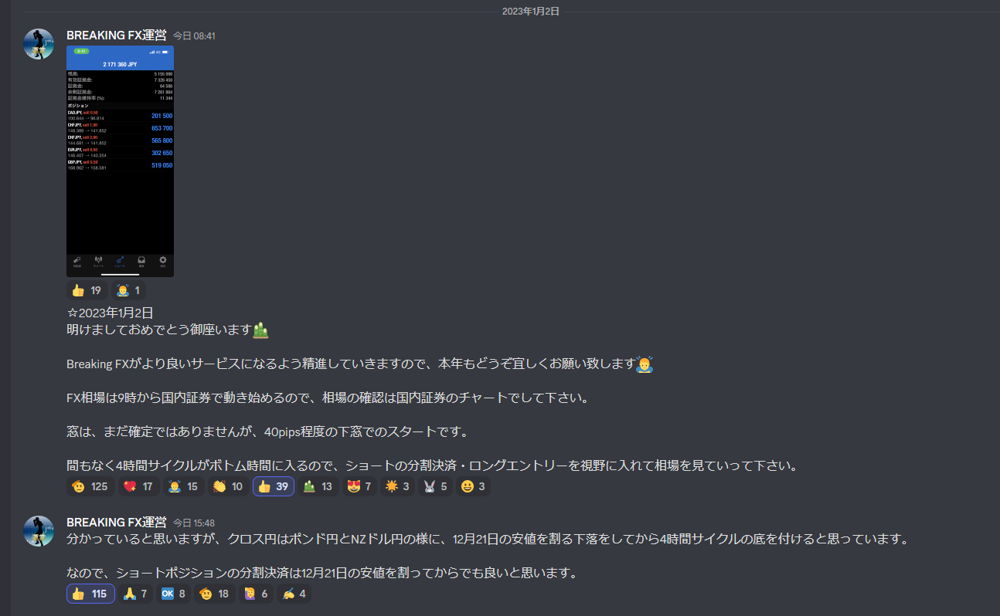
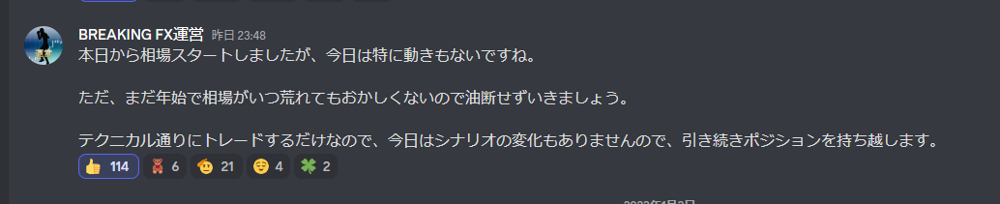

---
# Yuu
## USDJPY
- 天井赤のラインからサイクル底へ向けて下落の波、方向感：下方向　という認識です。
- ４日には底の時間帯・本数に入ってくるので、４日からは４時間サイクル底出現を警戒し、反転上昇には注意していきます⚠
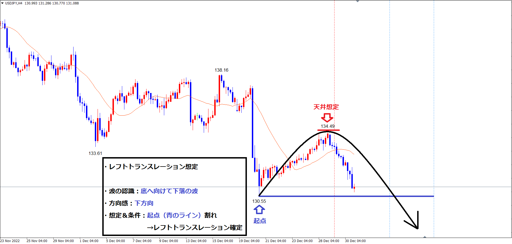
- 本数的には現在２０本目という事で、本数的下落余地もまだまだあり、日足サイクルも、今後も変わらず底の時間帯・本数まで下落の波が継続していく想定です✔️
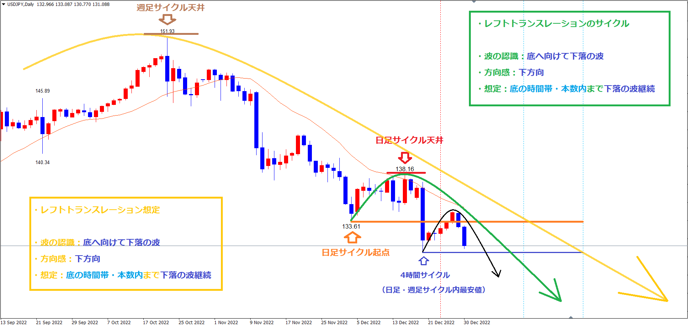

## ポジション

---
# みなみ
## AUDJPY
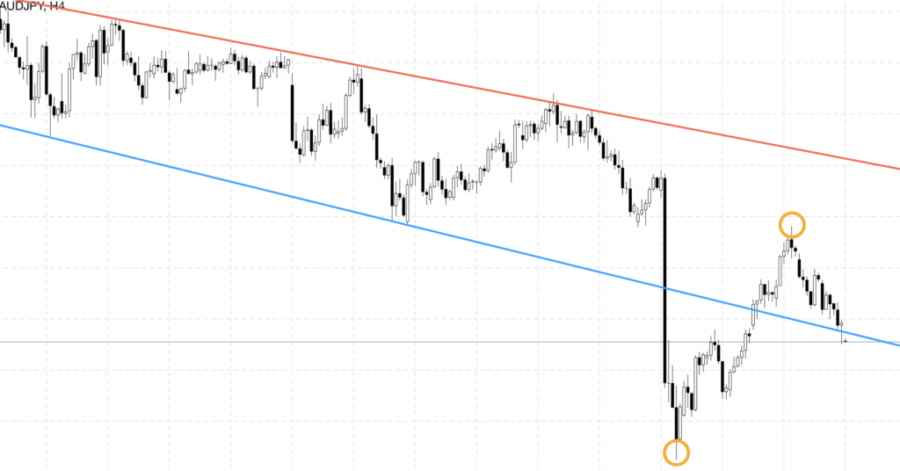
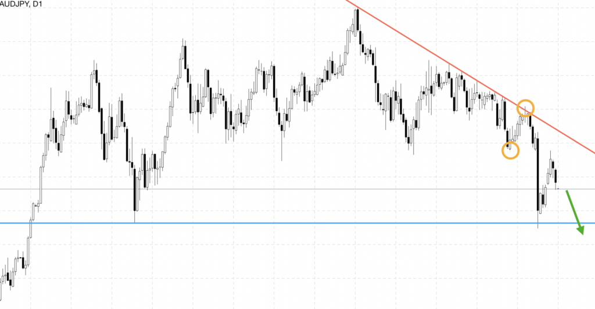

## ポジション
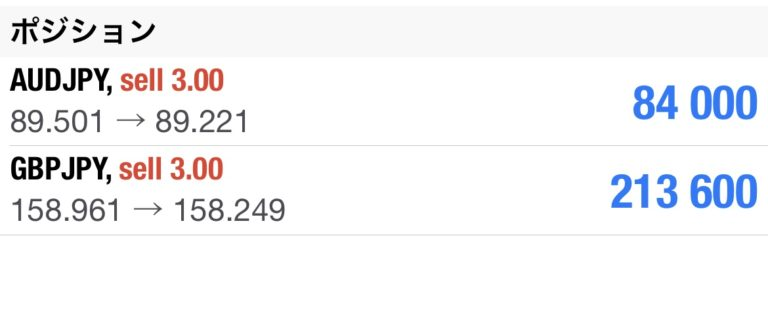

