# 想定
[一覧](../../index.md)

---
# クロス円メジャー

# クロス円資源国
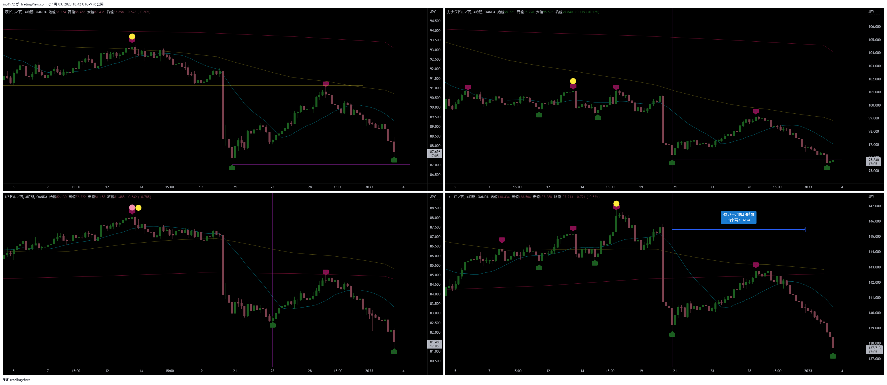

---
# ドルストレート
- ようやく下落した
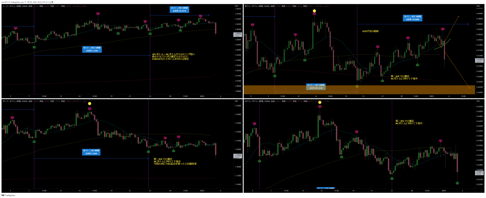

---
# Uきんぐ
## AUDJPY
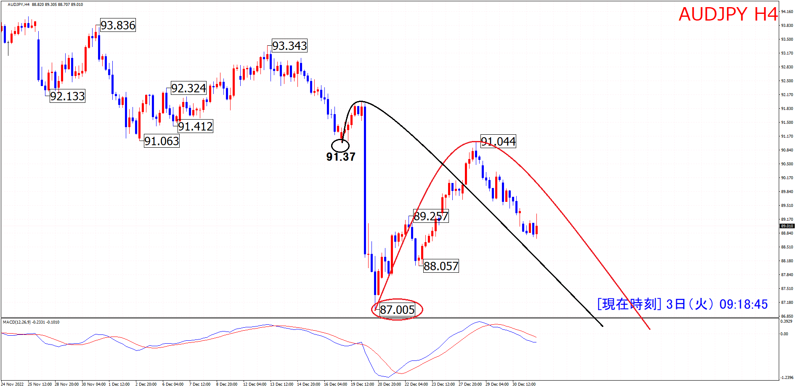

## ポジション
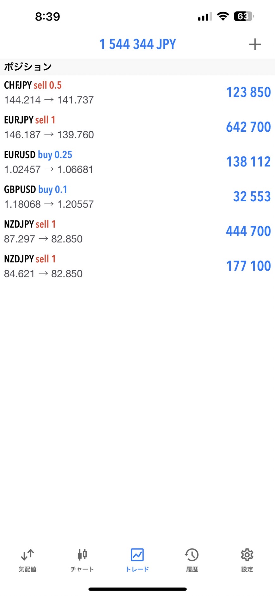

## NZDUSD
- 4HCはLT想定。今回のボトムがHPCのボトムになり、上昇する想定
- トップがどちらにもなり得る本数。
- RTになる場合は、直近の高値を更新してくる想定
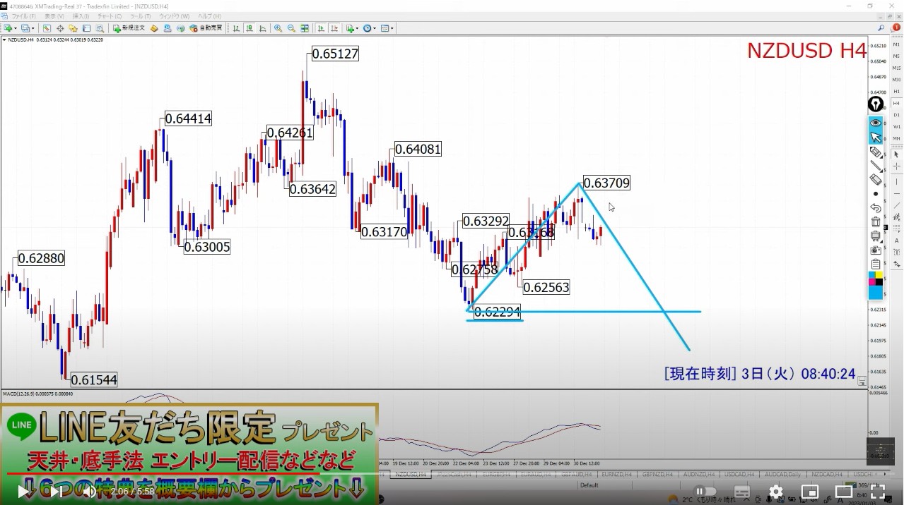

---
# Ash
## EURJPY
- もうそろそろ4HCボトムの時間
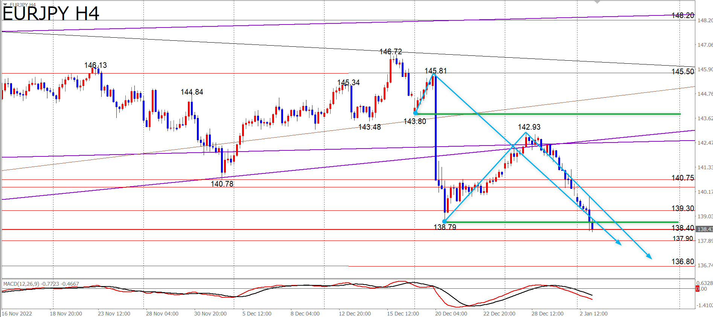
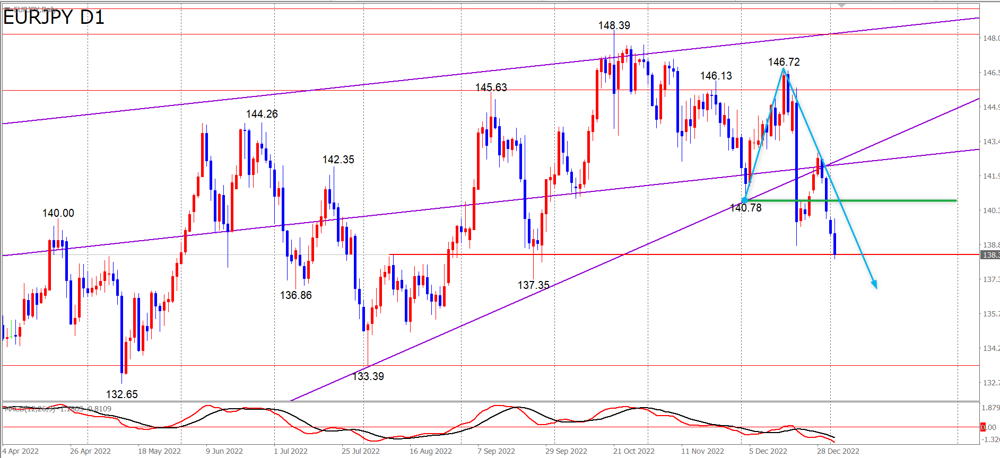
- 次の4HCもLT想定
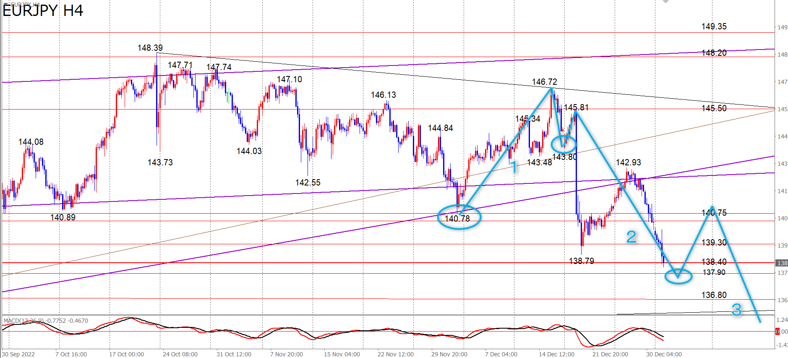

## ポジション
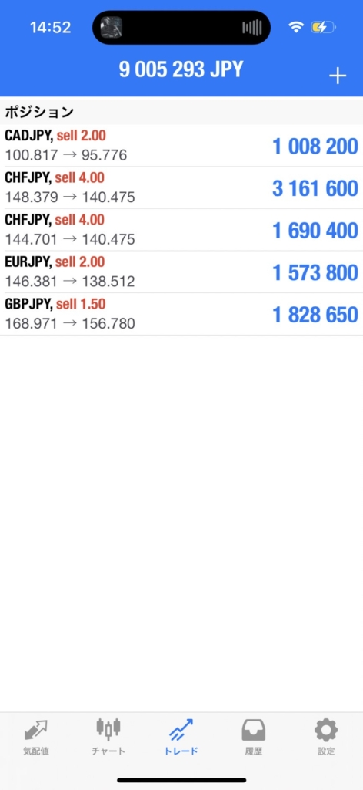

## サロン
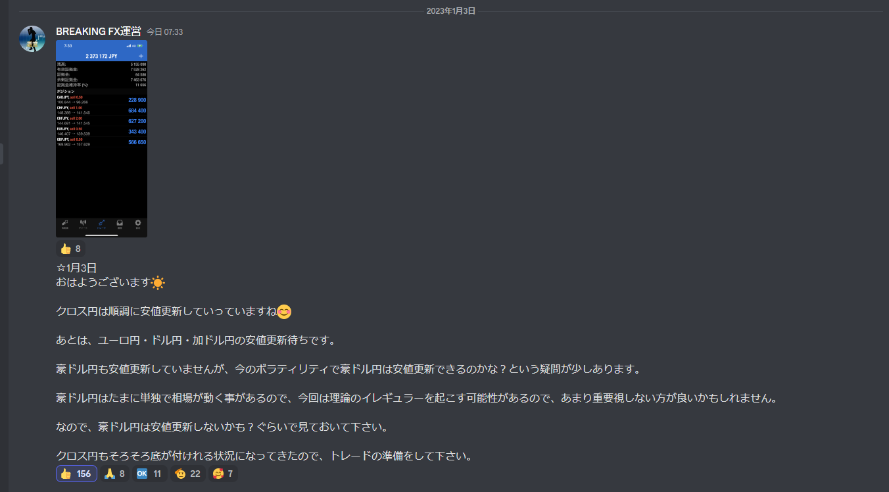
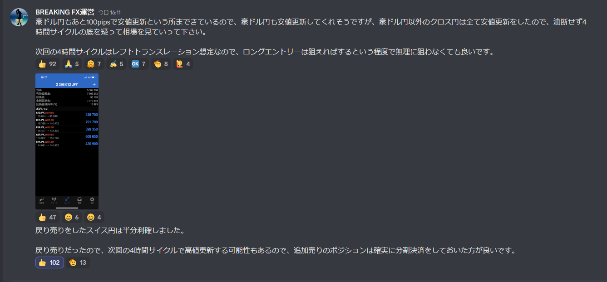

---
# Yuu
## EURJPY
- 戦略：次は４時間サイクル底の時間帯・本数まで待って逆張りロングのタイミングまで待ちです。
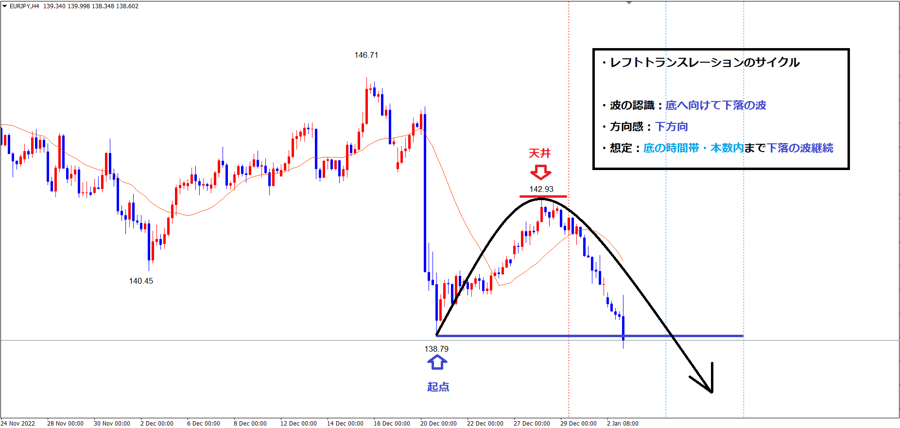
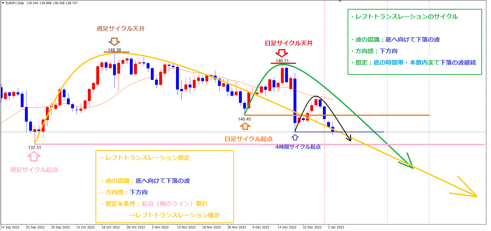

## ポジション
- 基本的には週足サイクル底まで、まだまだ利益を拡大していくイメージです👌
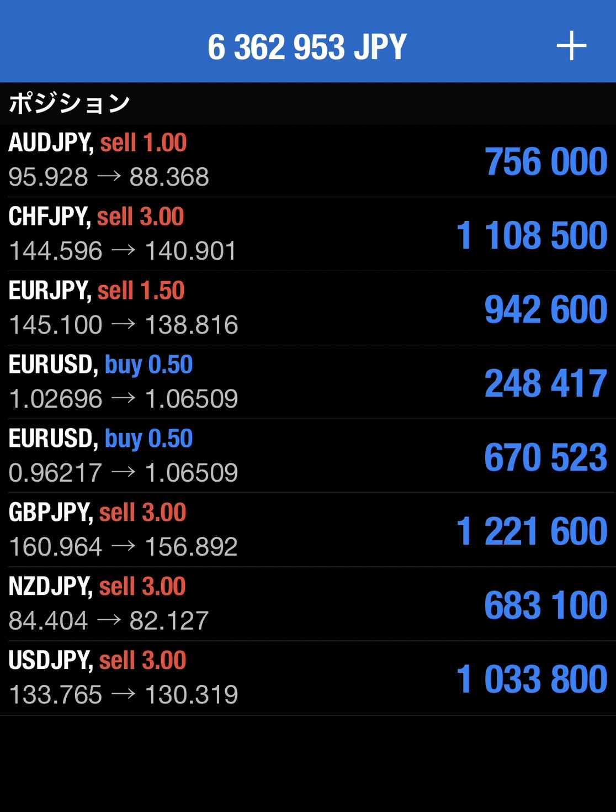

---
# みなみ
## GBPJPY
- 今回の4HCでMCボトム。最後のサイクルはイレギュラーが起きやすいので注意
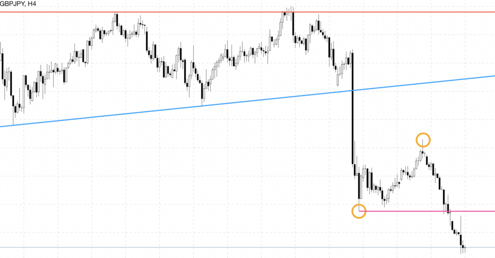
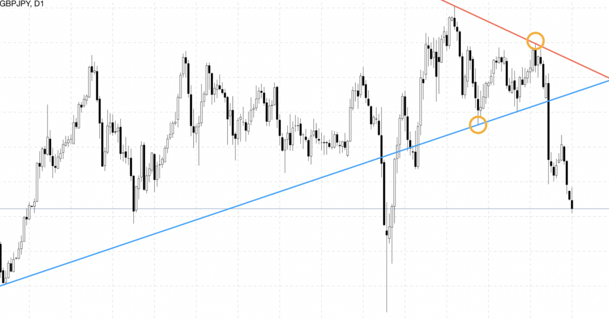

## ポジション
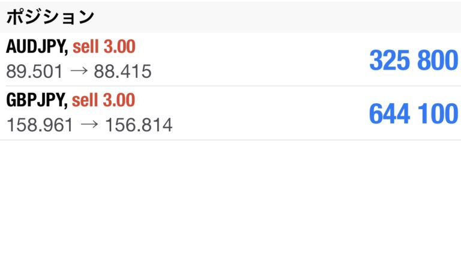
