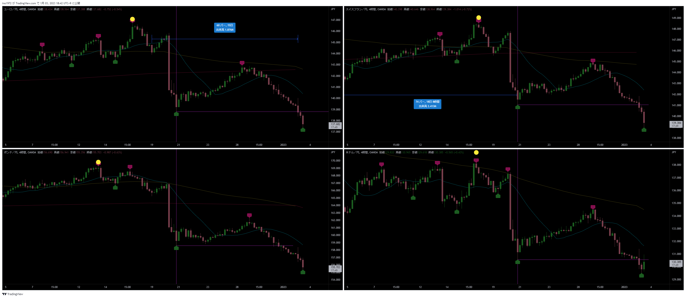

# 想定
[一覧](../../index.md)

---
# クロス円メジャー

# クロス円資源国

---
# ドルストレート
- ようやく下落した

---
# Uきんぐ
## AUDJPY

## ポジション

## NZDUSD
- 4HCはLT想定。今回のボトムがHPCのボトムになり、上昇する想定
- トップがどちらにもなり得る本数。
- RTになる場合は、直近の高値を更新してくる想定

---
# Ash
## EURJPY
- もうそろそろ4HCボトムの時間

- 次の4HCもLT想定

## ポジション

## サロン

---
# Yuu
## EURJPY
- 戦略：次は４時間サイクル底の時間帯・本数まで待って逆張りロングのタイミングまで待ちです。

## ポジション
- 基本的には週足サイクル底まで、まだまだ利益を拡大していくイメージです👌

---
# みなみ
## GBPJPY
- 今回の4HCでMCボトム。最後のサイクルはイレギュラーが起きやすいので注意

## ポジション

