# 想定
[今日の想定日付一覧に戻る](../../index.md)

---
# クロス円メジャー
## 週足
- USDJPYがPC起点を割り、LT確定
- ドル円以外の通貨もPCボトムに向けて下落中。LT想定
- 長い下ヒゲが気になる。PCボトムを付けたシナリオも視野に入れておく。
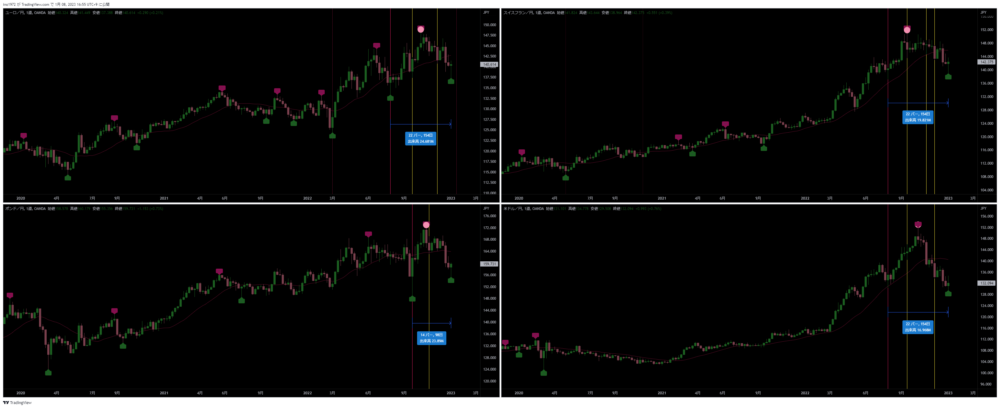

## 日足
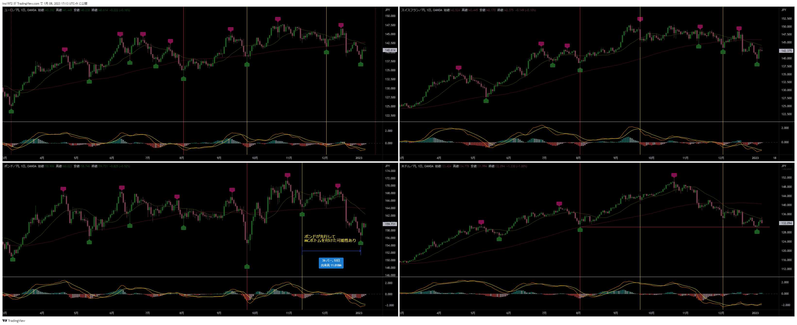

## ４時間足
- MCボトムに向けて下落中。LT想定
- 戦略：20SMAを参考にショート
  - 20SMAにタッチして１回バウンドするかもしれない。もう１波上げてから20SMA抜けでショートが固い。
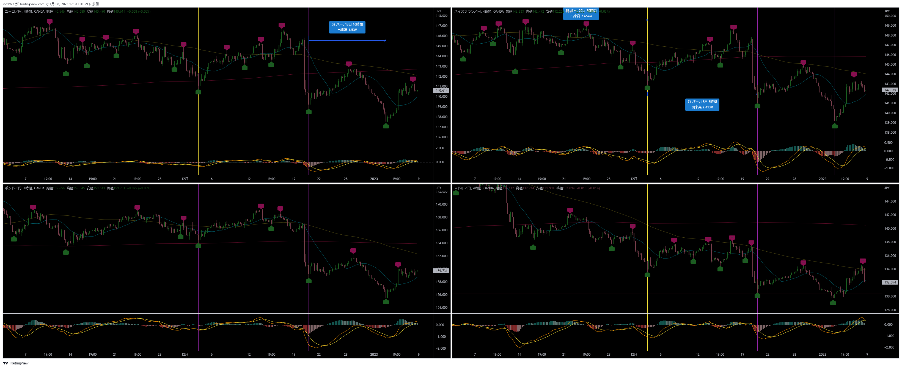

# クロス円資源国
## 週足
- オージー、カナダがLT確定。ニュージーもそれに続きLT想定
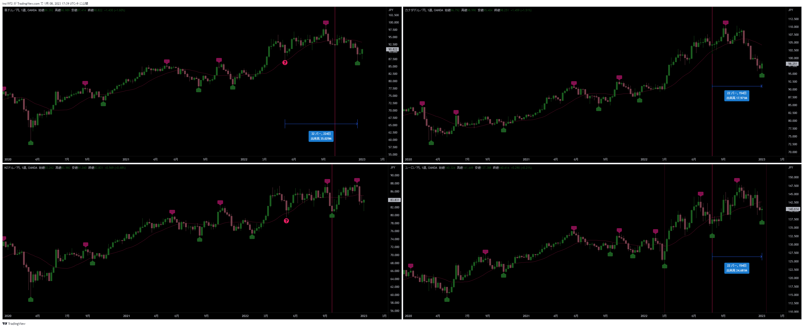

## 日足
- オージー、ニュージーはMCがあと１．５個形成されるので、まだしばらく下落想定
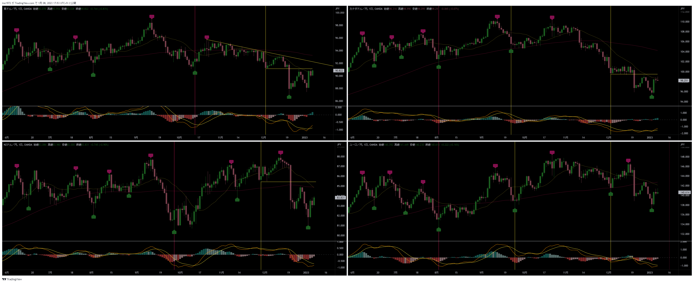

## ４時間足
- 今回の4HCがLTでMCボトム想定
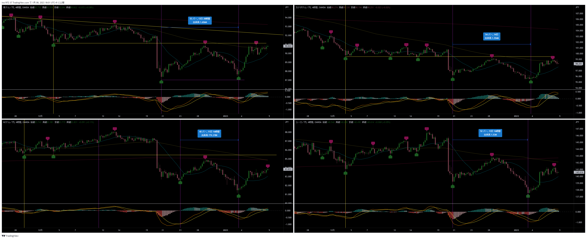

---
# ドルストレート
## 週足
- 上昇トレンド
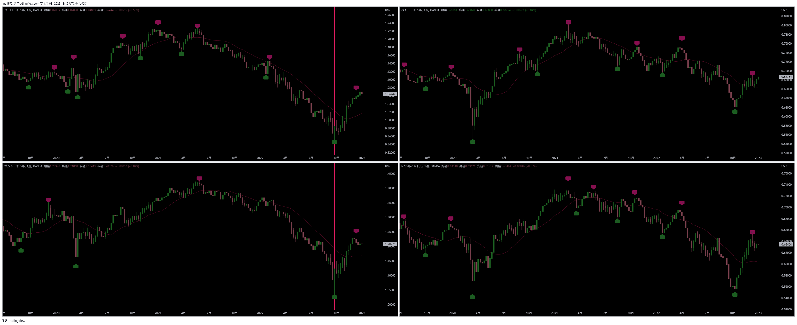

## 日足
- AUDの4HCが足並み揃っていないので、上下どちらも考えられる
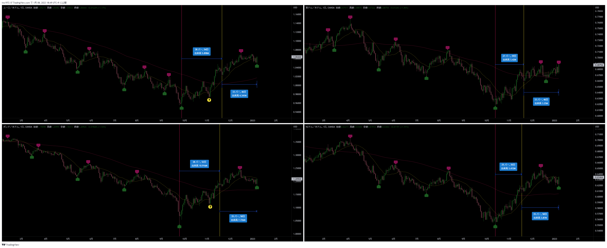

## ４時間足
- AUDが変な動きをしている。今回の4HCでLTを形成してくれると分かりやすい。
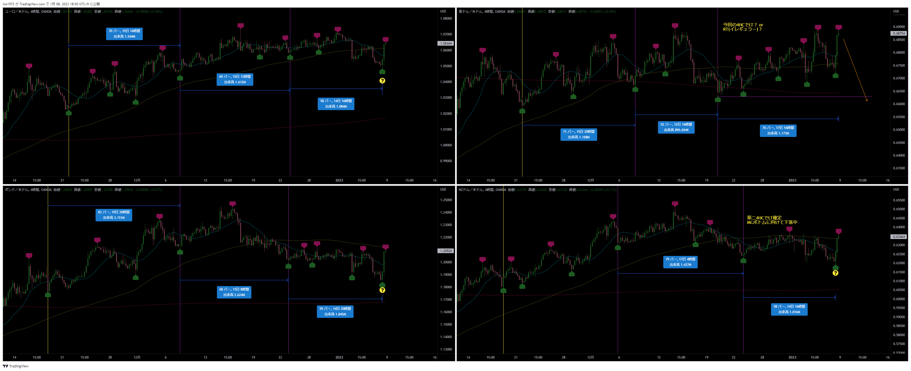

---
# Uきんぐ
## NZDUSD
- 4HC、MCサイクルスタート開始
- 戦略：ロング狙い
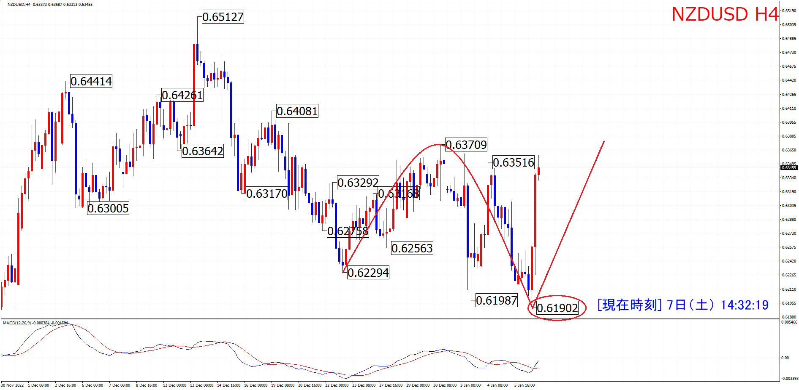

## クロス円
- 今回の4HCボトムがMCボトムの想定
- 戦略
  - 今回の4HCでショート
  - 次の4HCでロング

## ドルスト
- MCスタート、次の4HCからロング狙い
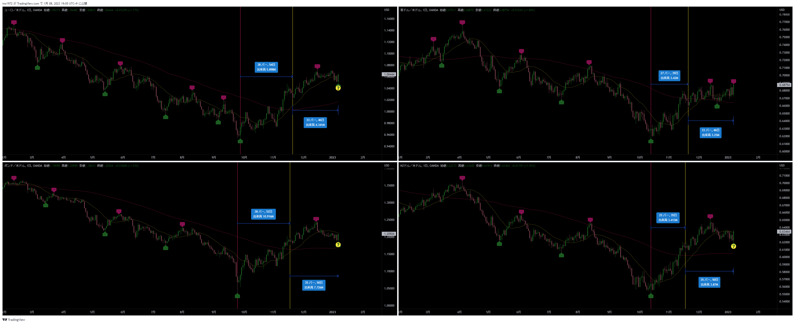

## ポジション
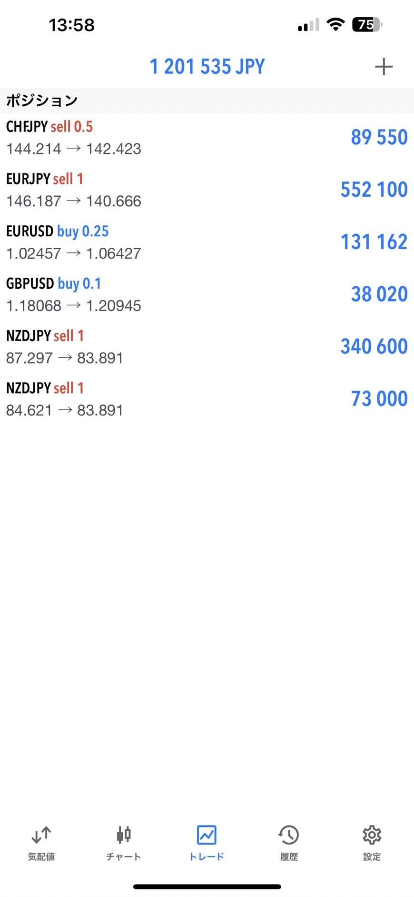

---
# みなみ
## GBPJPY
- MC開始している可能性あり。
- 現在は方向性がはっきりしないので、様子見

