# 想定
[今日の想定日付一覧に戻る](../../index.md)

---
# クロス円メジャー
- 4HCトップからの20SMA割れでショート狙い
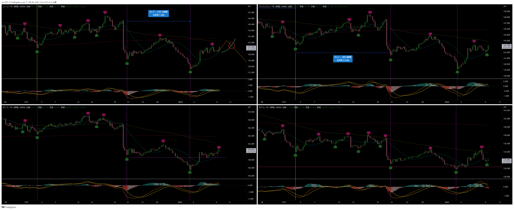

# クロス円資源国
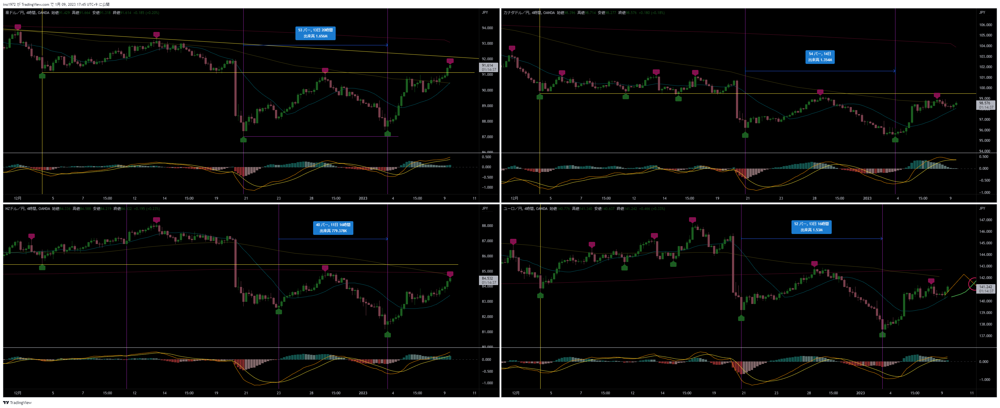

---
# ドルストレート
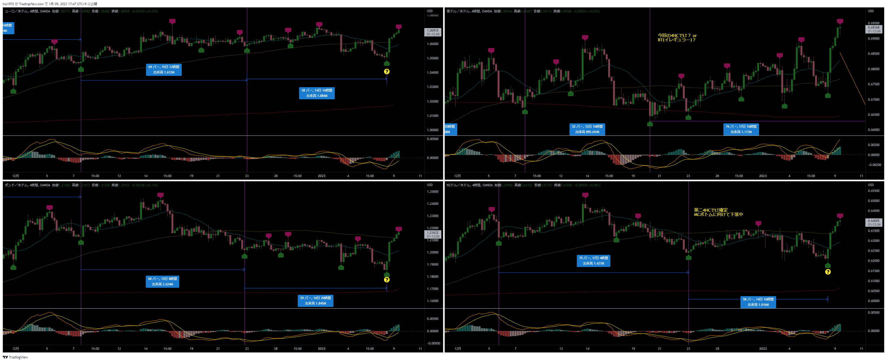

---
# Uきんぐ
## EURJPY
- LT想定。ショート狙い
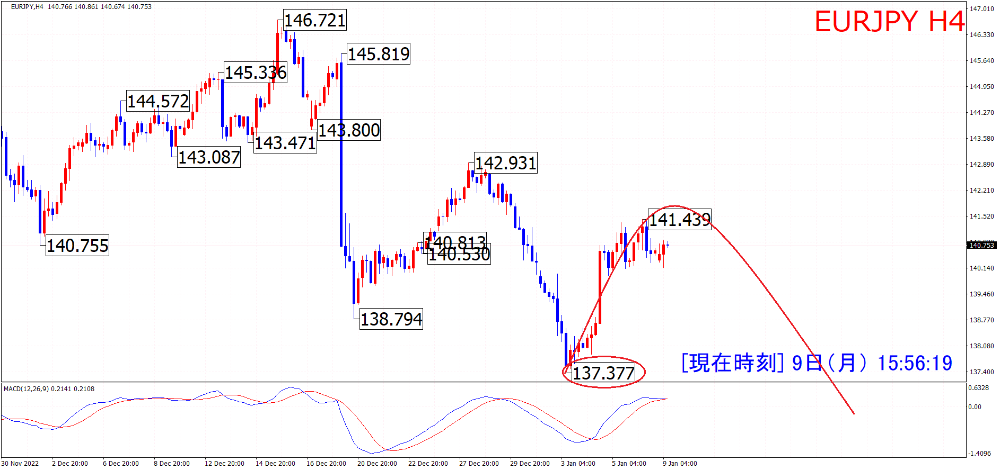

## ポジション
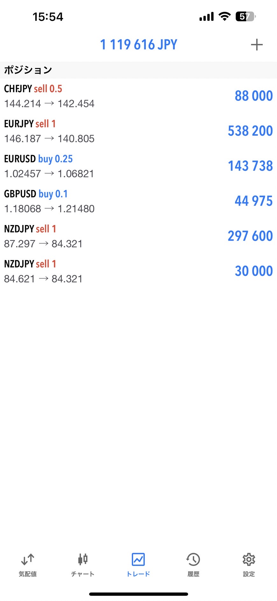

---
# Ash
## EURJPY
- 4HCは今のところLT想定。
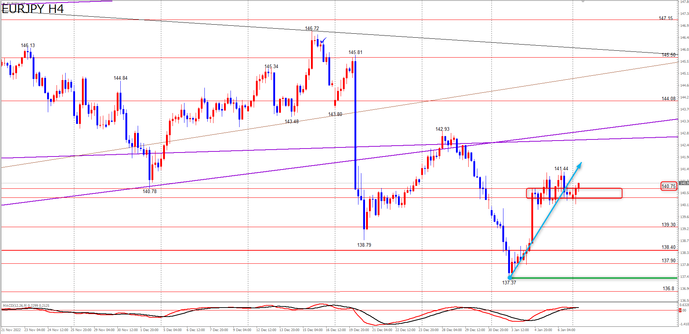
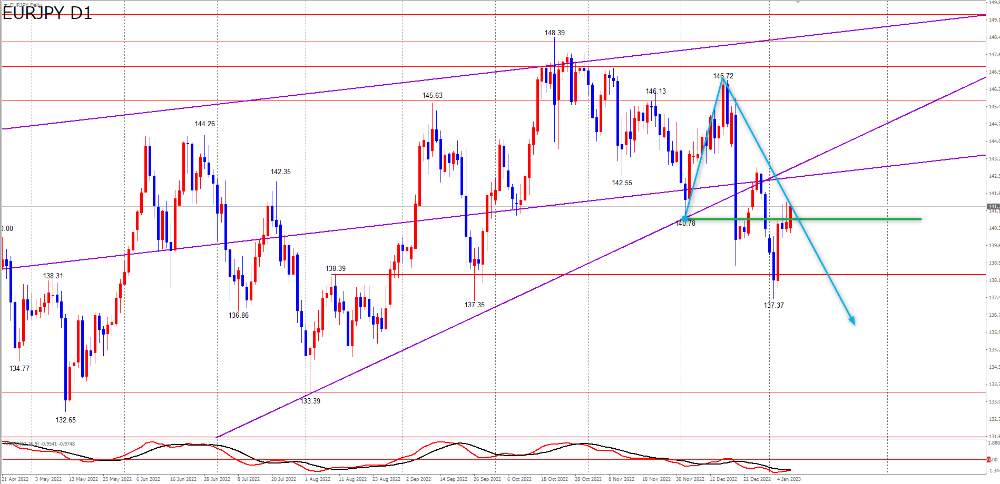
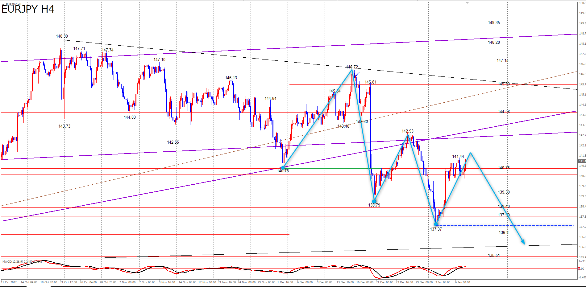

## ポジション
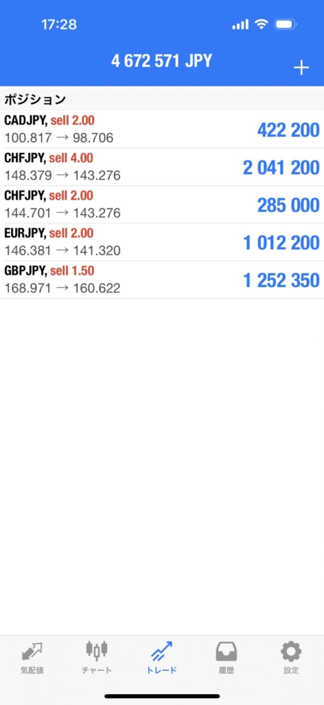

## サロン
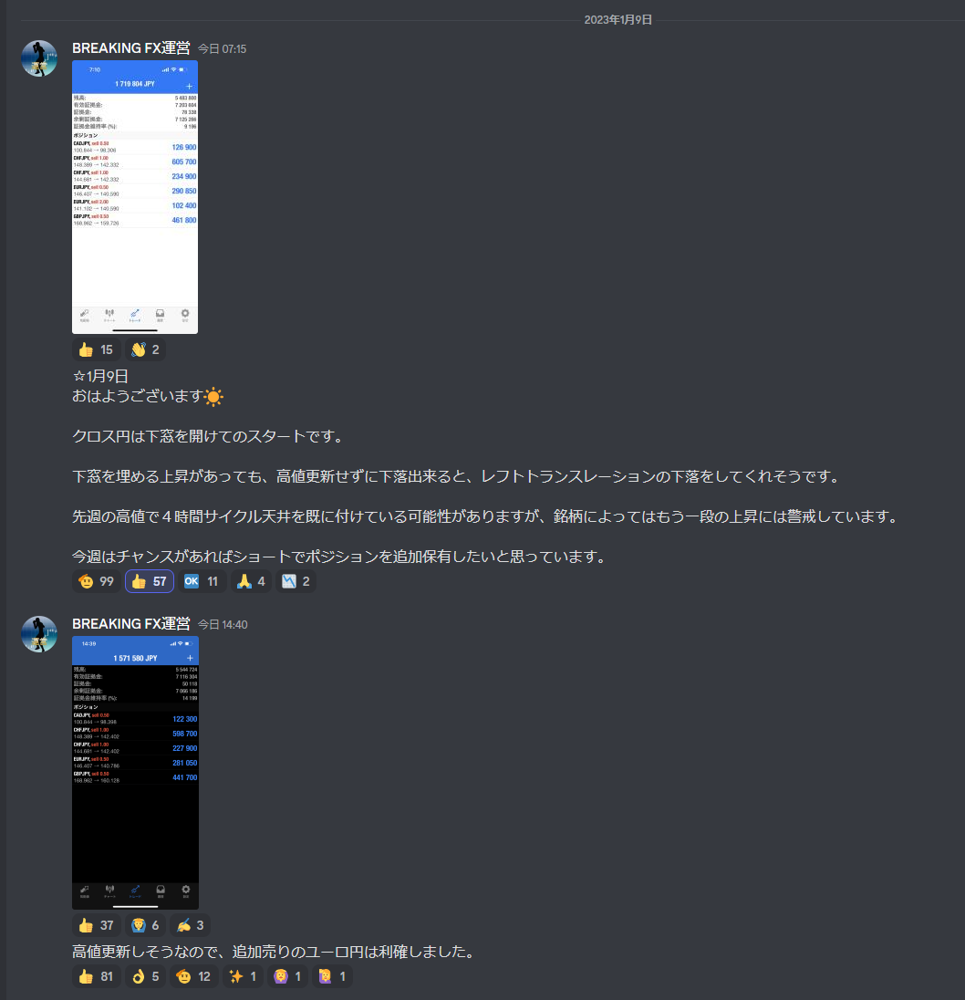
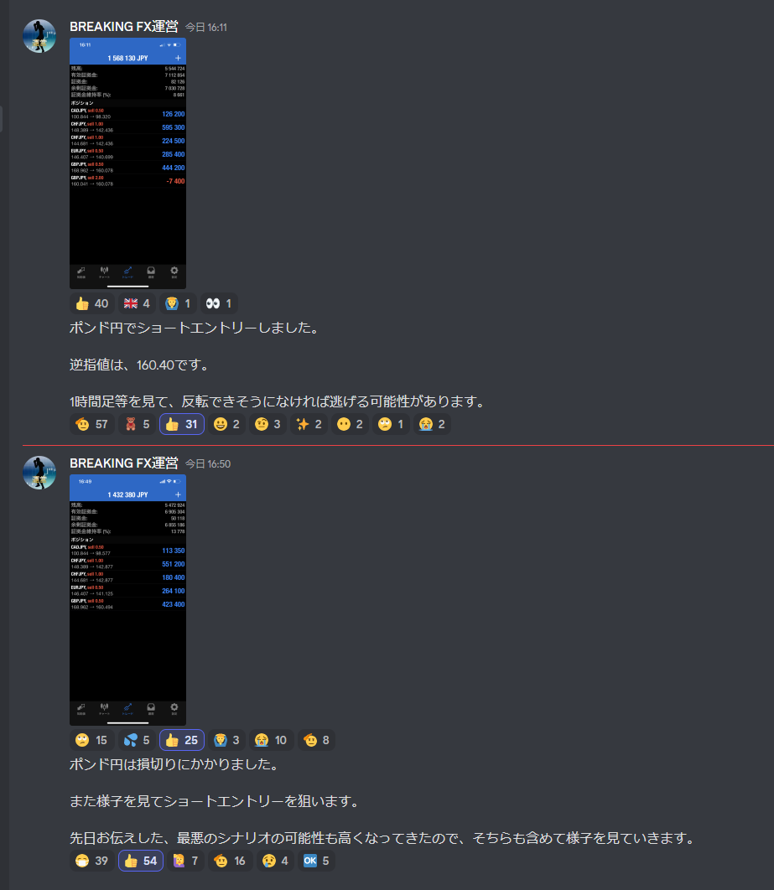

---
# Yuu
## AUDJPY
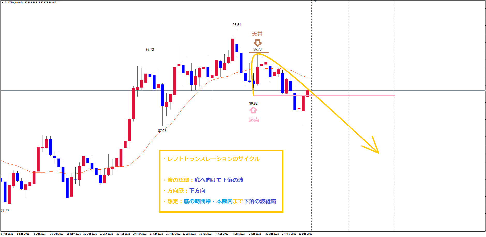
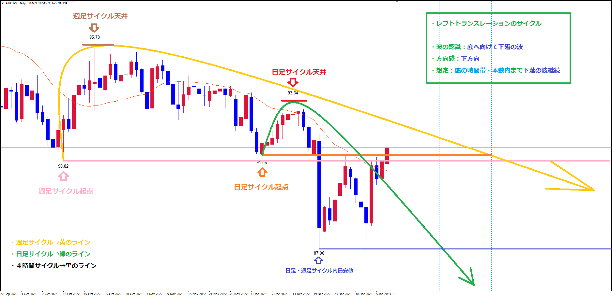

## ポジション
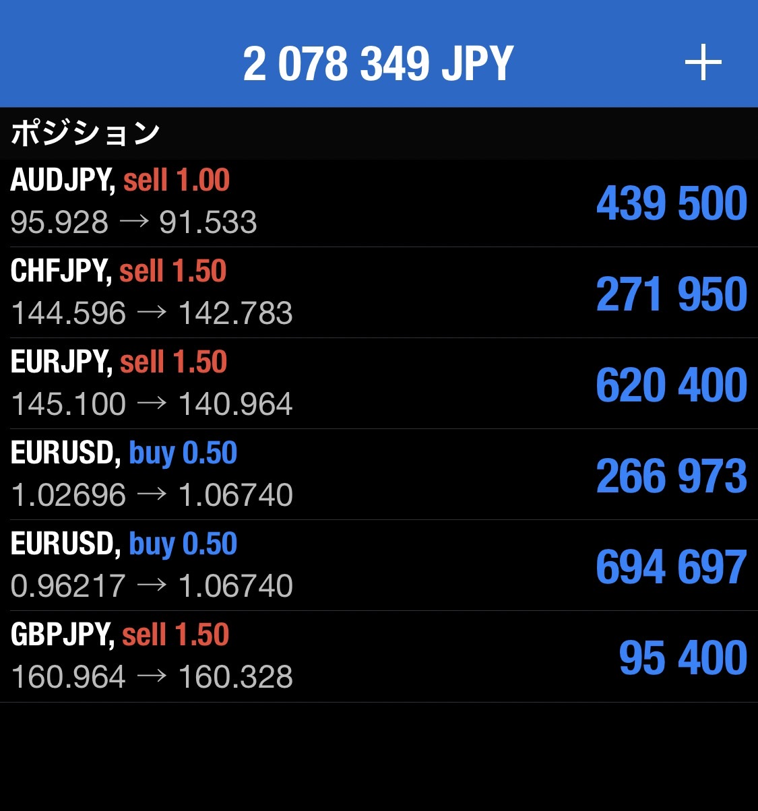

---
# みなみ
## USDJPY
- 日足チャートでは直近安値でボトムをつけている可能性もあります！
  サイクルの見極め方法としては、これからオレンジ色のラインを抜けていくのか
  青色のラインを下抜けていくのかです！
  上抜けなら新しいサイクルに入っていることになりますし、青色のラインを下抜けていくのであれば
  サイクル継続です！
  そこがはっきりするまではドル円はエントリーしません！
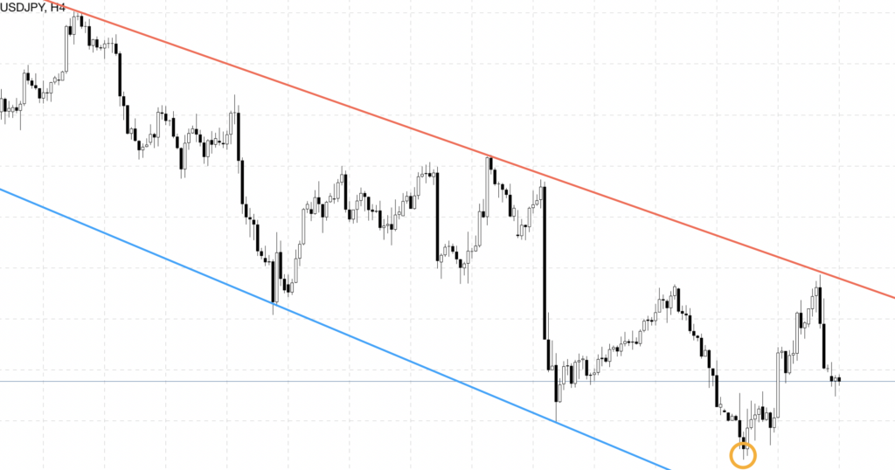
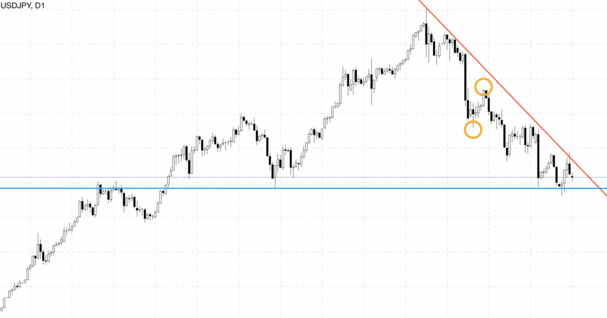

