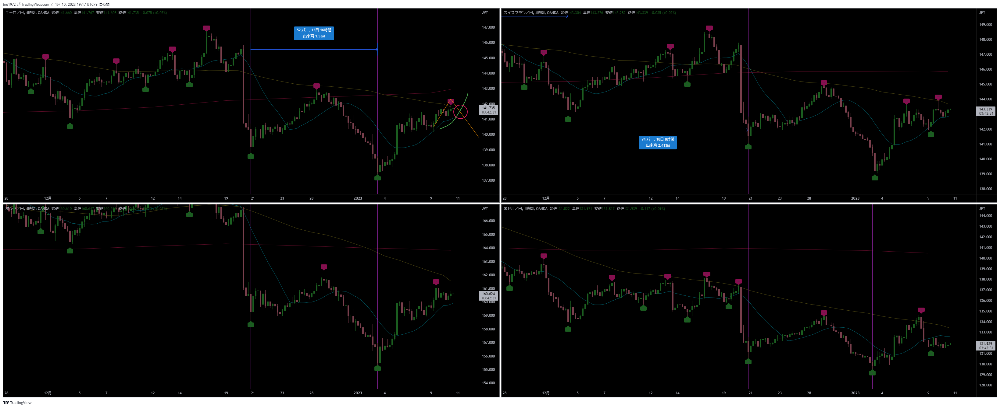
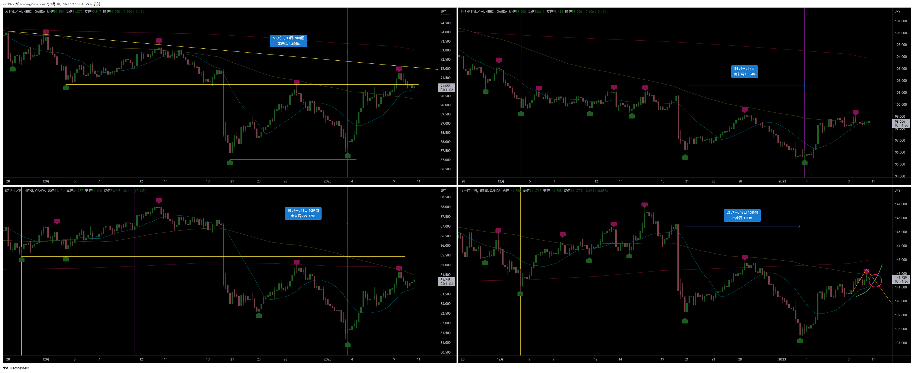
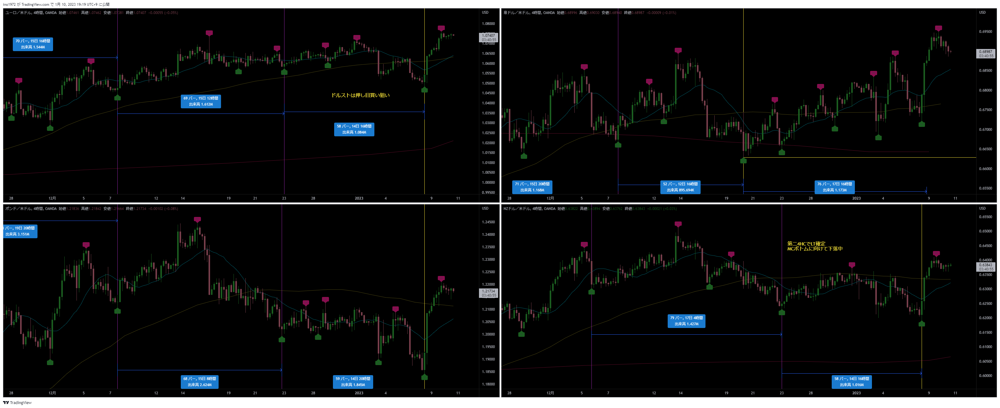
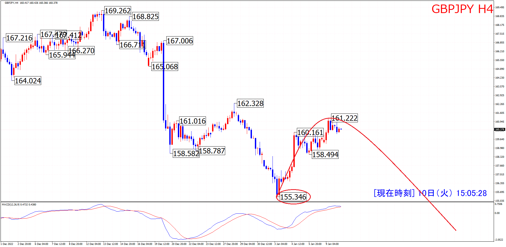
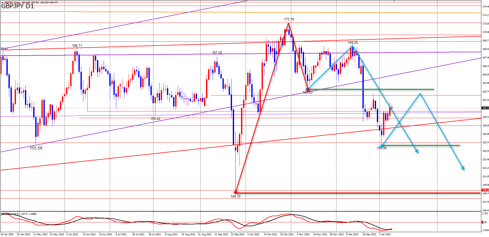
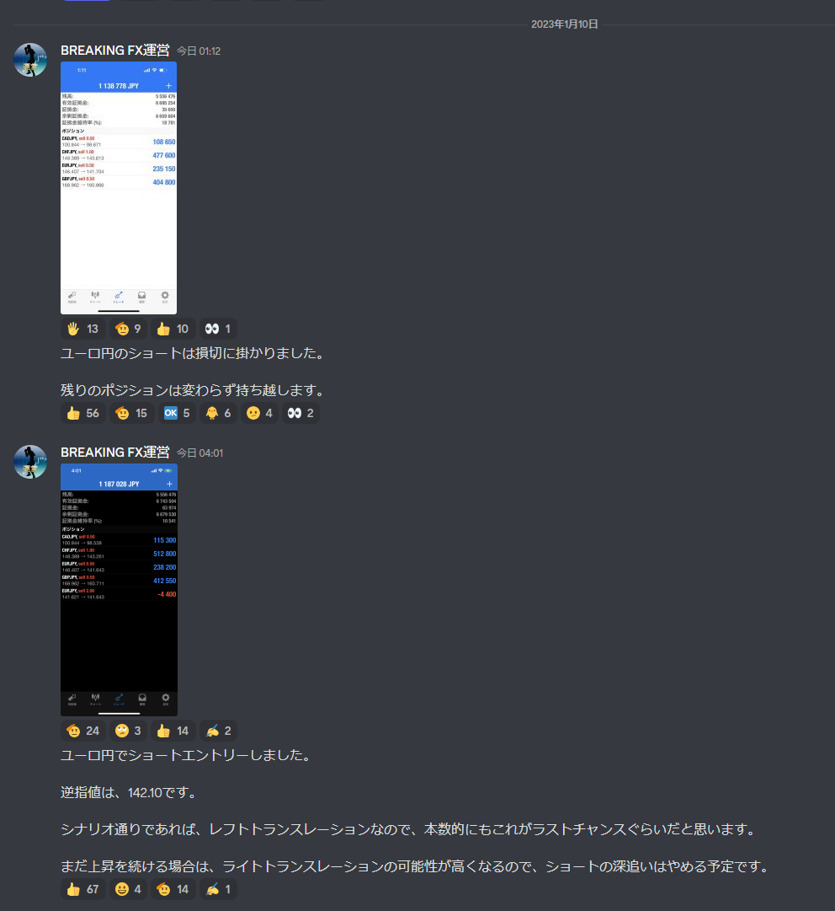
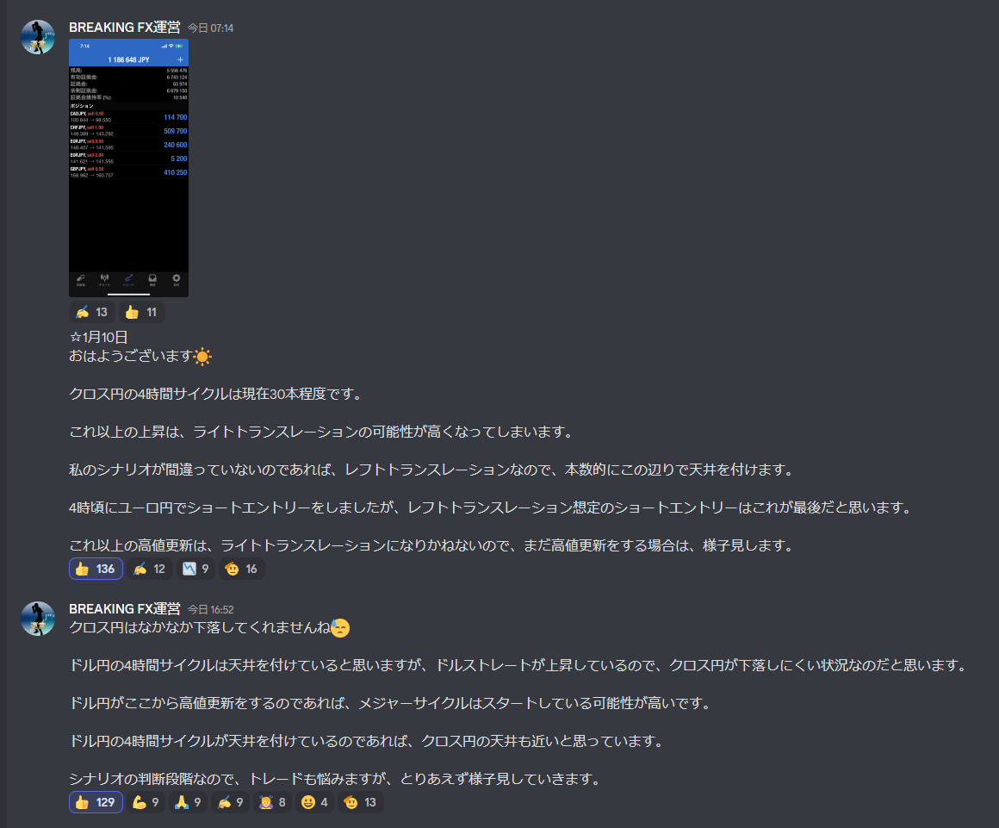
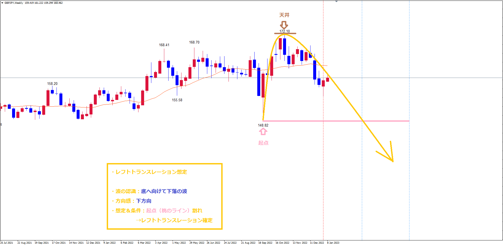
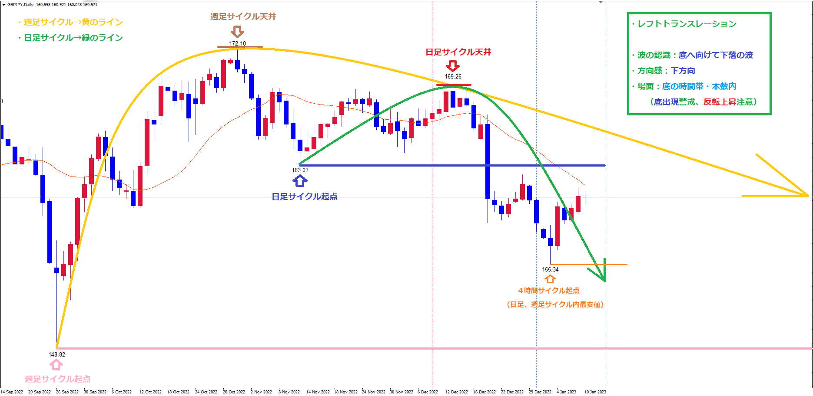
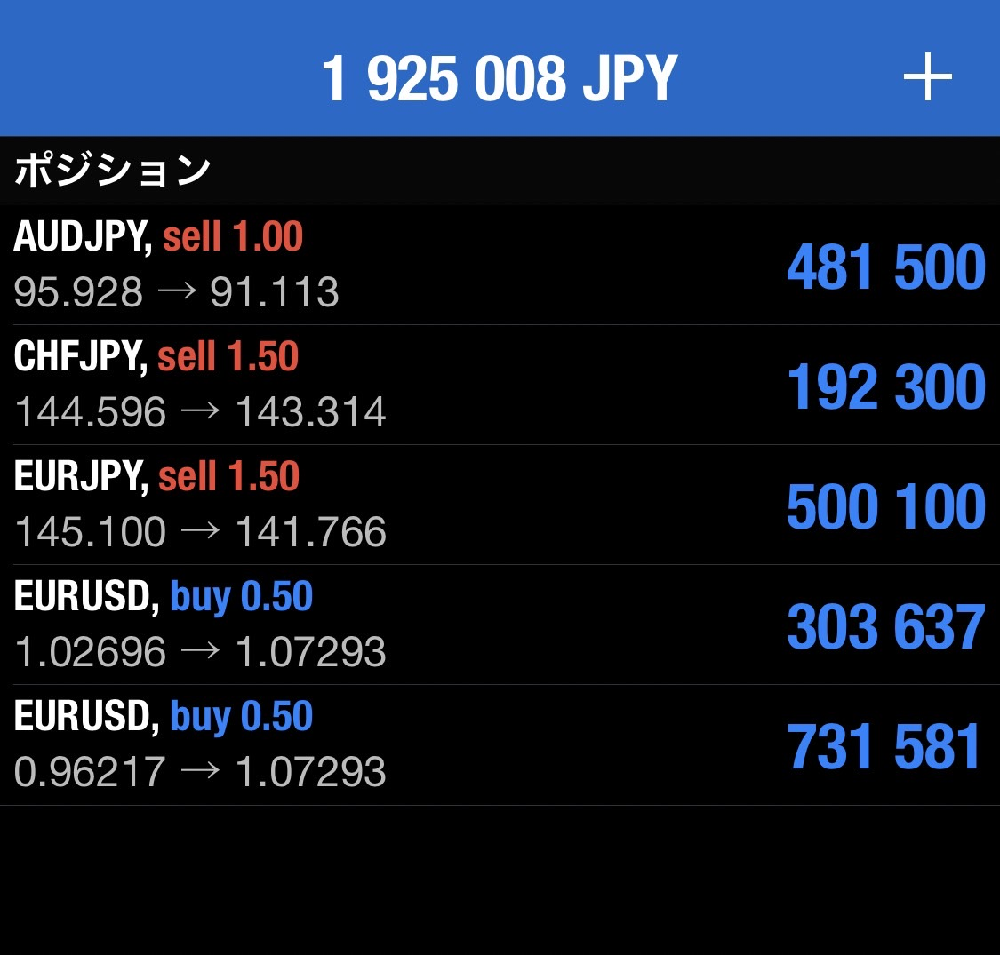

# 想定
[今日の想定日付一覧に戻る](../../index.md)

---
# クロス円メジャー
- 4HC：LT想定

# クロス円資源国
- 4HC：LT想定

---
# ドルストレート
- 4HC：RT想定
- 押し目買い狙い

---
# Uきんぐ
## GBPJPY
- 今回4HCはLT想定

## AUDUSD
- 押し目を待ってロング狙い

## クロス円
- LT想定だが、もうそろそろ天井を付けないとRTになりそう。
- 今回の4HCがRTになったら、日足のシナリオも見直しが必要になる。
- 今回の4HCボトムでMCスタートになってもおかしくない

## ポジション

---
# Ash
## GBPJPY
- もうそろそろ下落しないとRTになる。
- その場合、MCが既にスタートしていることになる
- ただ、狙いはショートに変わりは無い

## ポジション

## サロン

---
# Yuu
## GBPJPY
- ポンド円とNZドル円以外のクロス円の日足サイクルは本数的に少し遅れていて現在２６本程度という状況なので、
  それら遅れている通貨の日足サイクルの下落に合わせて、ポンド円の今回の日足サイクル底へ向けての下落の波はしつこく継続する可能性を頭に入れておいてください😌
- 戦略
  週足レベルで下落中という事でショートの期待値が高い状況にあり、
  今回の４時間サイクル天井が日足サイクル下落の波の戻し高値となるので、今回の４時間サイクル天井（上げ止まり）からショート狙い

## ポジション

---
# みなみ
## 
- 

