# 想定
[今日の想定日付一覧に戻る](../../index.md)

---
# クロス円メジャー
- シナリオ１：PCスタートした可能性あり→上昇トレンド
- シナリオ２：GBPJPYが短すぎる。まだPC継続→下落トレンド
- GBPJPY=15本、その他=23本
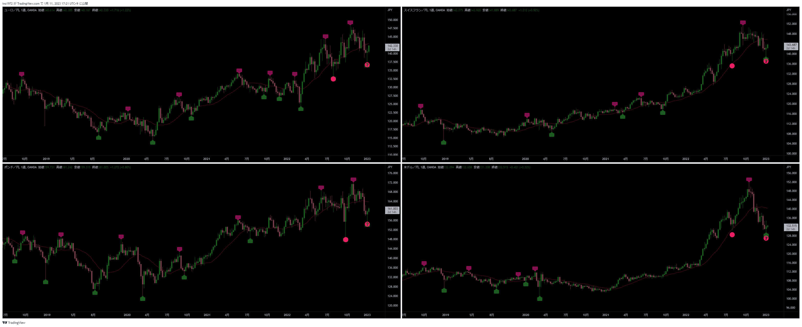
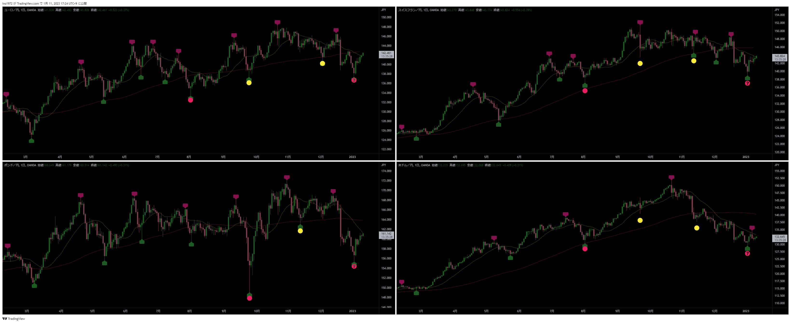
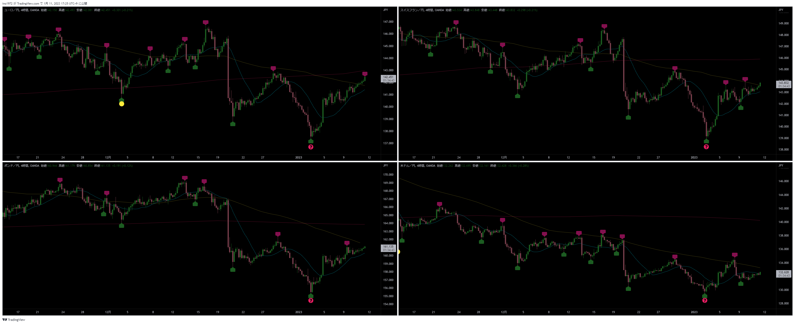

# クロス円資源国
- クロス円メジャーと同じ
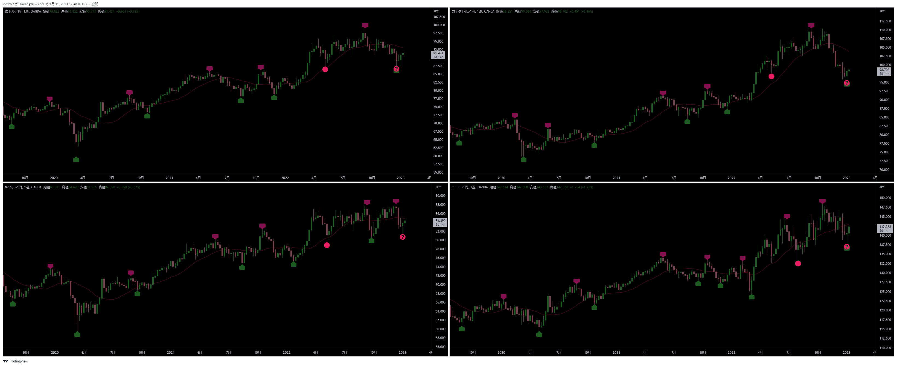
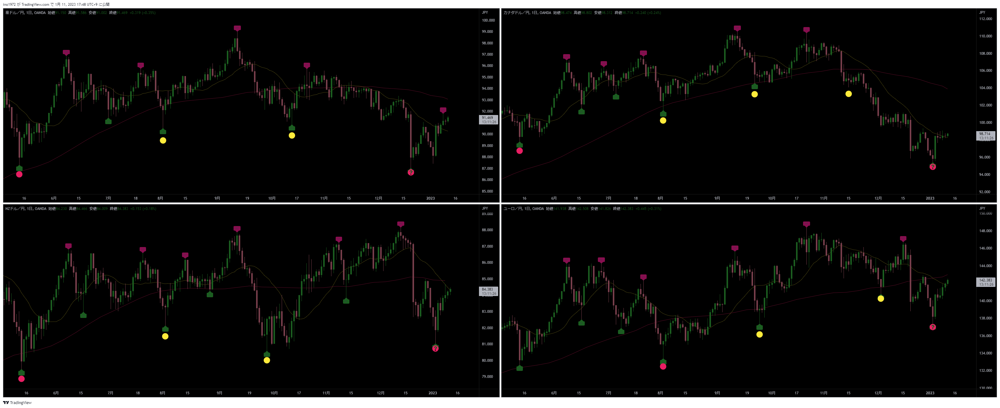
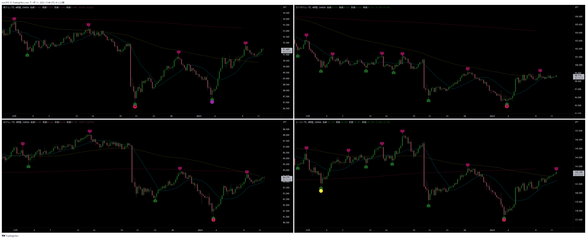

---
# ドルストレート
- AUDUSDが先行
- 今後、足並みを揃えるためにどう動いてくるか？
- 戦略：押し目からロング
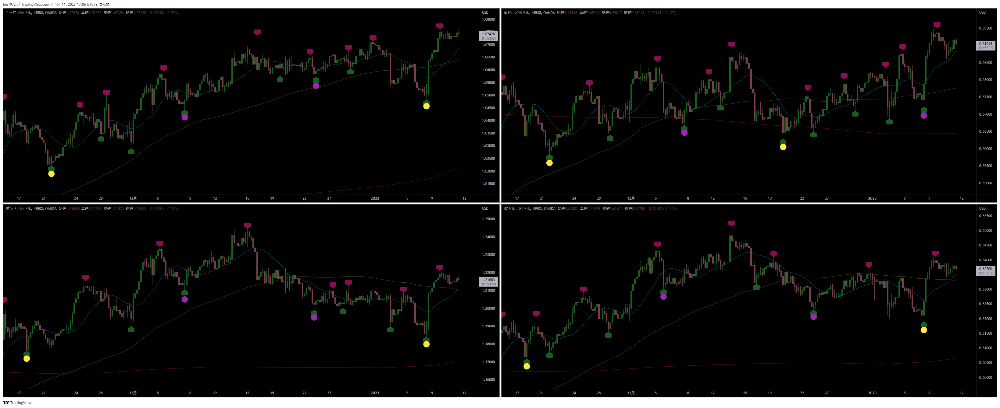

---
# Uきんぐ
## AUDJPY
- メインシナリオ：今回の4HCがLT
- サブシナリオ：MC開始→このまま上昇しRT
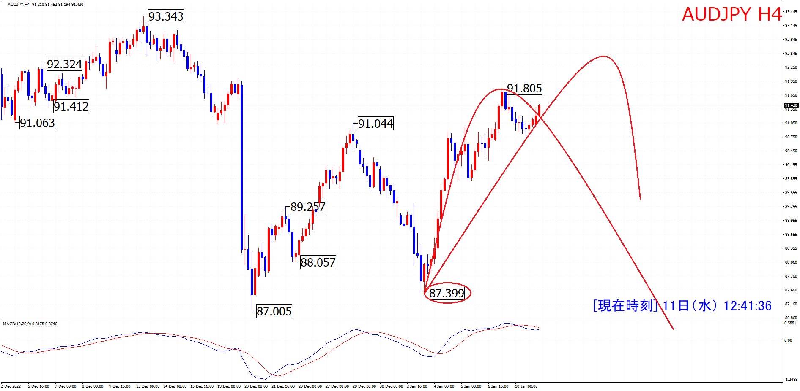

## NZDUSD
- HPCでボトムを付けて、直近安値でMC開始
- 今回の4HCはRT想定
- 戦略：PC、MCが上昇トレンドなので、4HCボトムからロング狙い

## EURJPY
- 直近安値でMC開始。前回はHPCの可能性もあり。

## ポジション

---
# Ash
## GBPJPY
- 35本を超えて、下落する気配なし：シナリオ変更LT→RT
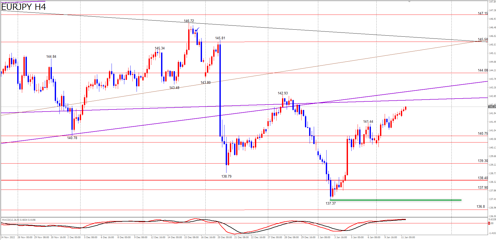
- メジャーサイクルでは１４０．７８が起点として見ていましたが、
  今回の４時間サイクルがライトトランスレーションになるということは、
  メジャーサイクルがスタートしている可能性があります。
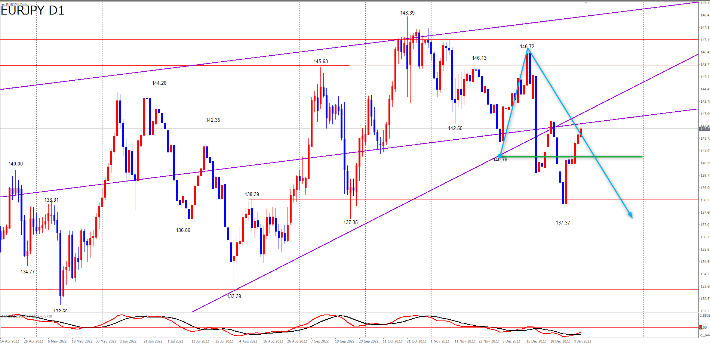
- メジャーサイクルがスタートしているということは、
  １３７．３５～１３７．３７のメジャーサイクル（ハーフプライマリーサイクル）だったということになります。
  この場合は７２本でサイクル終了したことになるので、ハーフプライマリーサイクルですね。
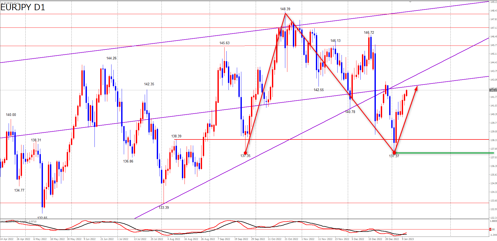
- 戦略：4HCボトムからロング

## ポジション
- ノーポジ

## サロン

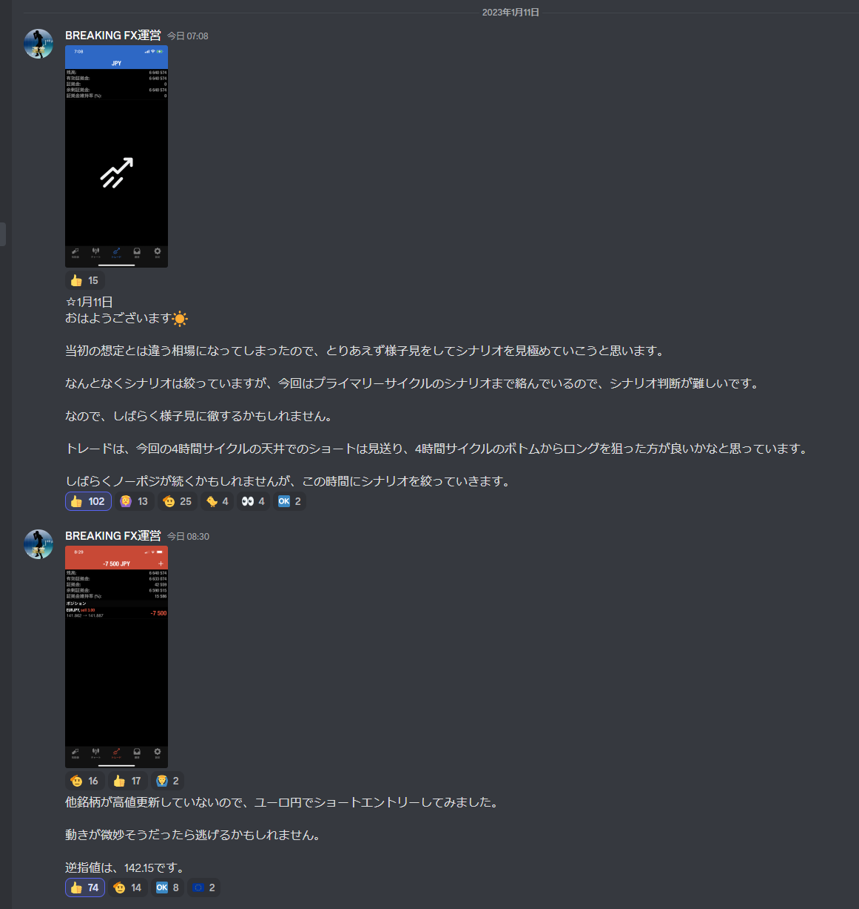

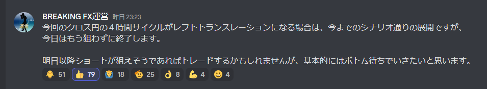

---
# Yuu
## EURJPY
- PC：起点割れを目指して下落中
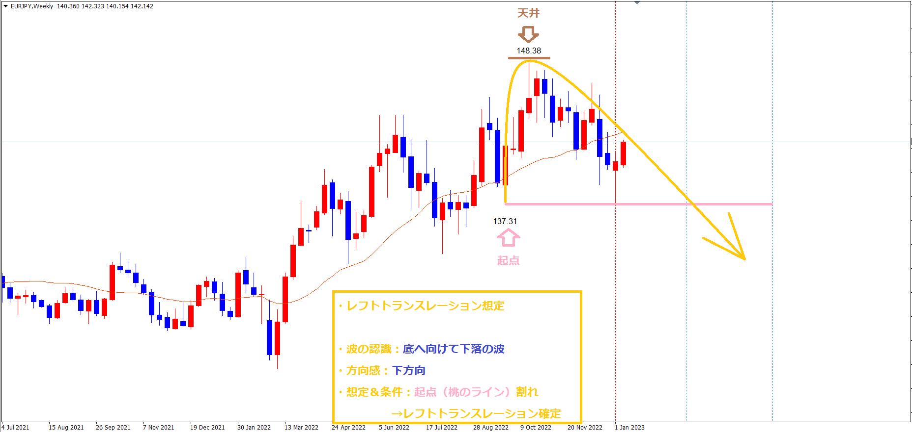
- MC：今回の4HCがRTになりそうなので、MCがスタートした可能性あり
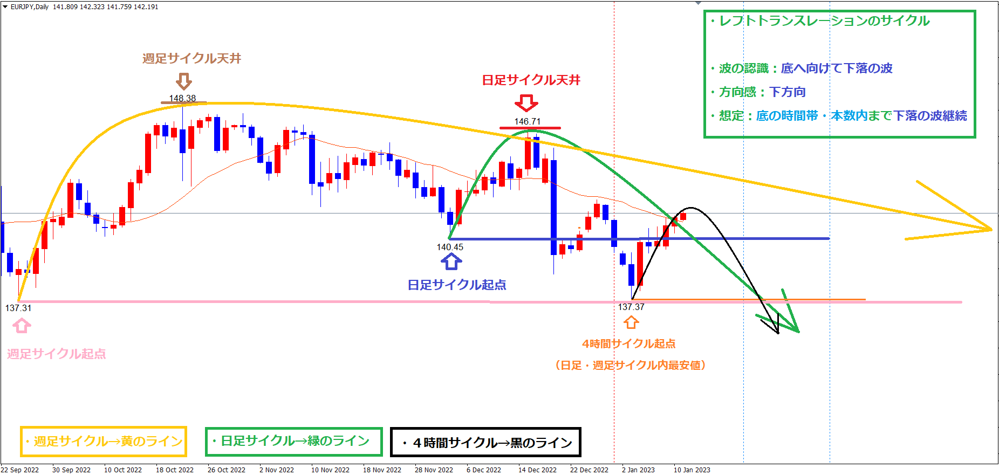
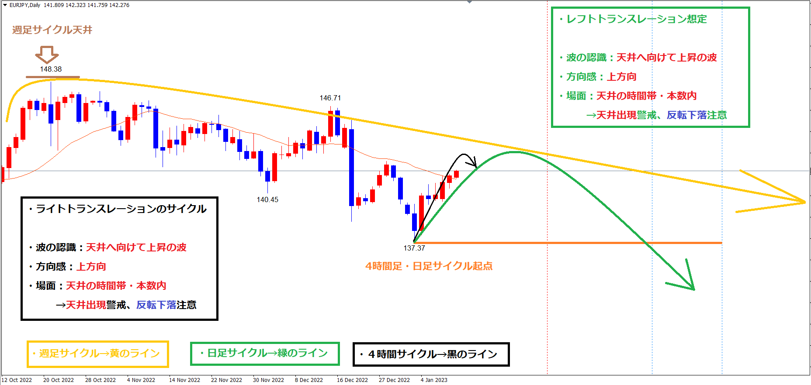
- 戦略：次の4HCトップからショート狙い

## ポジション
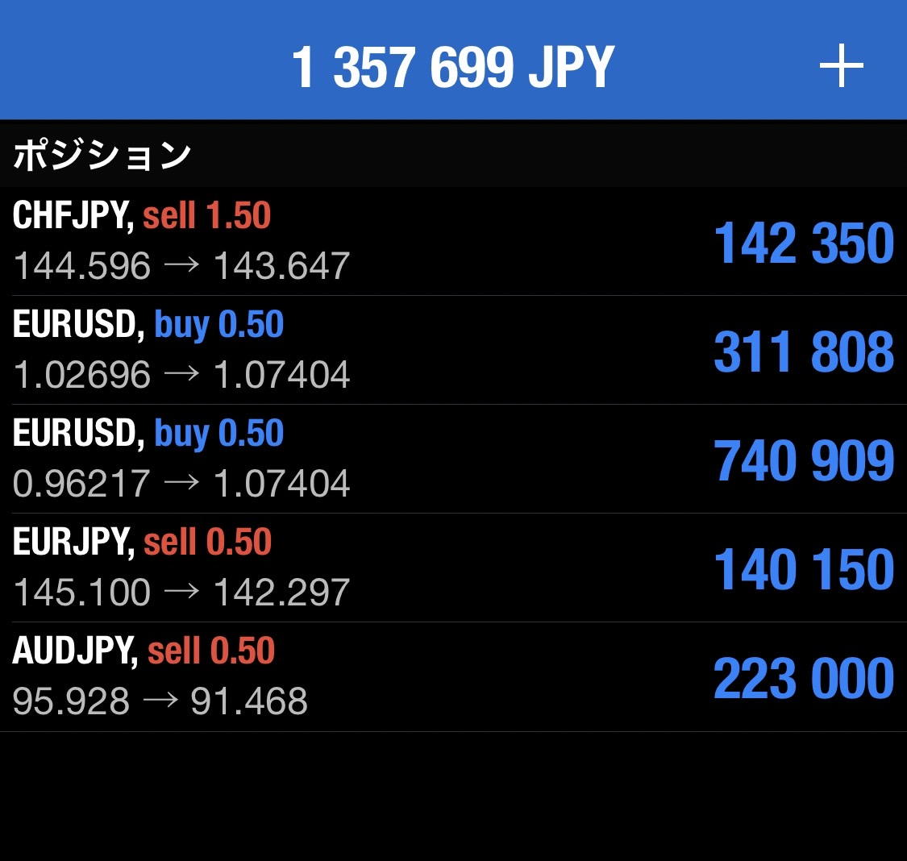

---
# みなみ
## AUDJPY
- 方向感がでるまで様子見
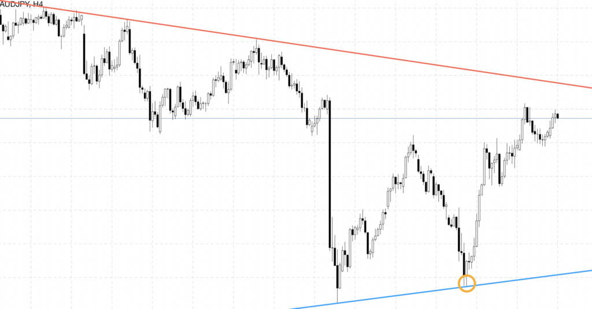
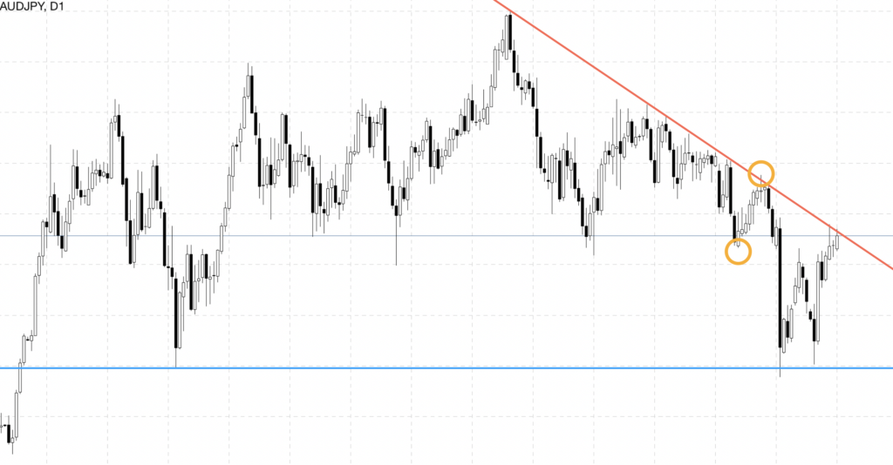

