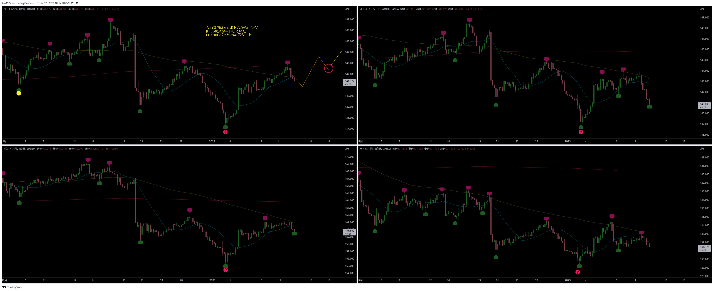
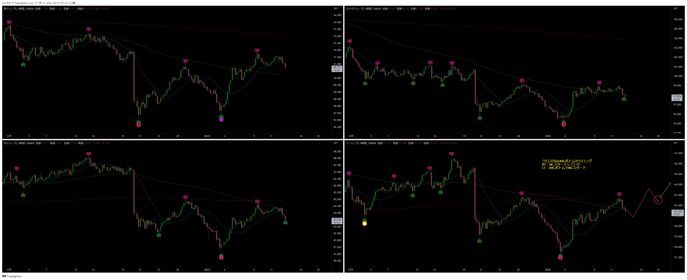
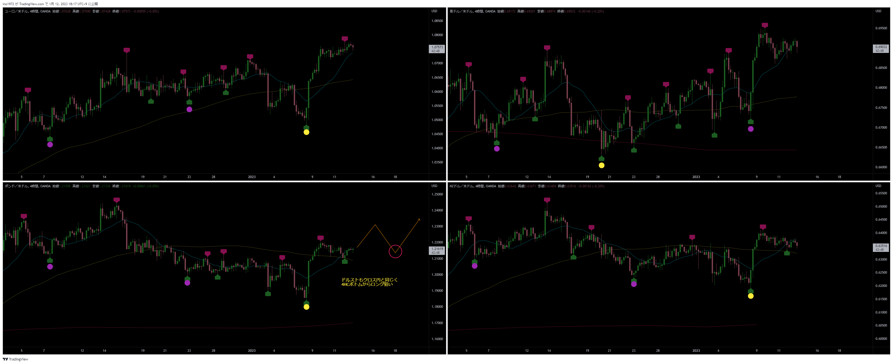
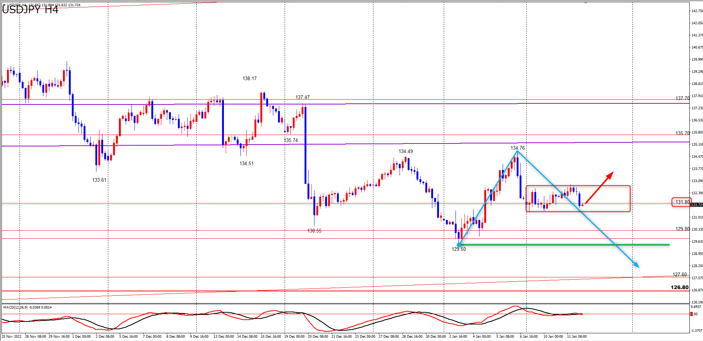
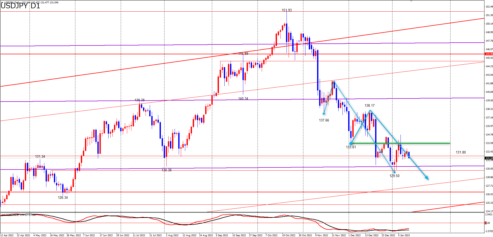
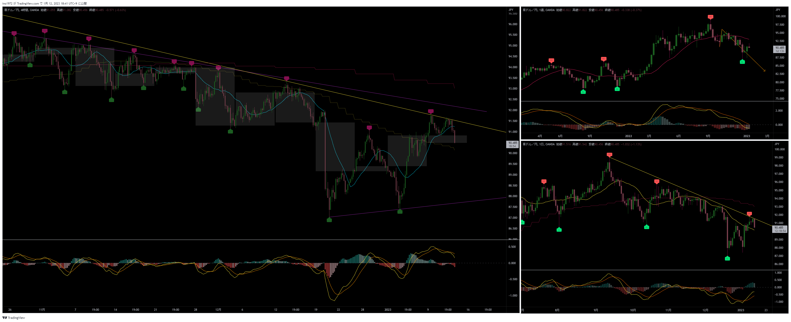
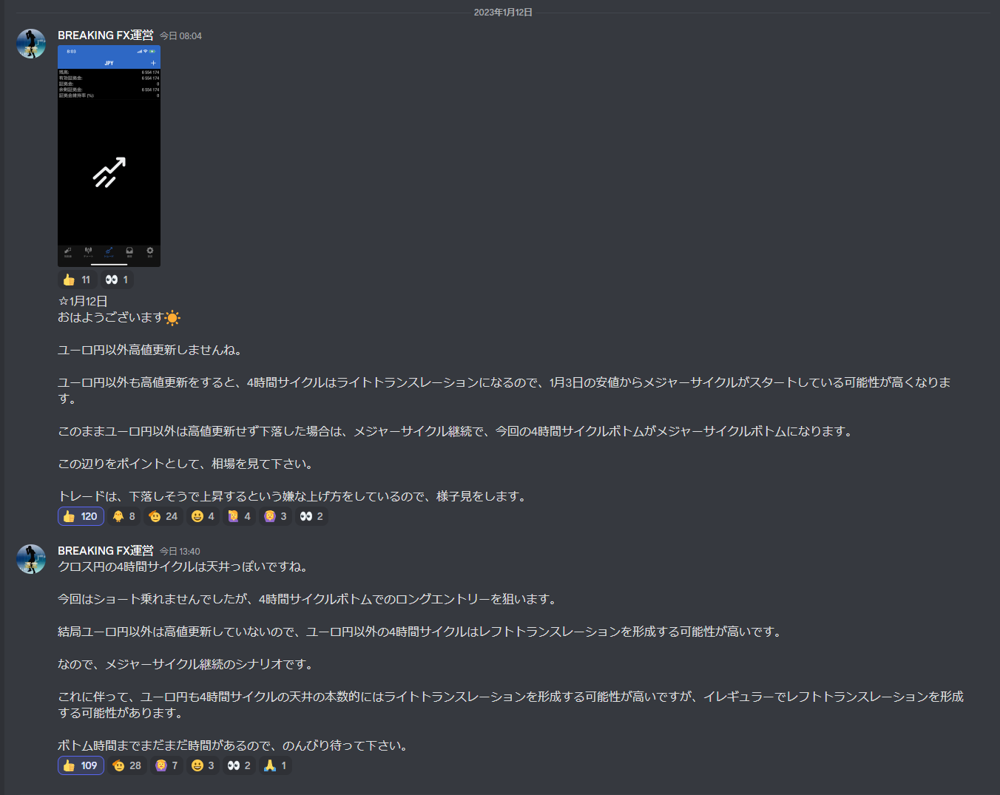
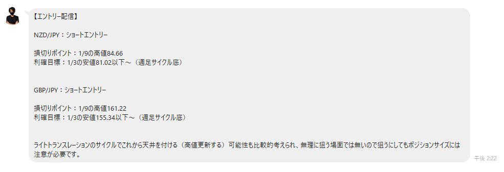

# 想定
[今日の想定日付一覧に戻る](../../index.md)

---
# クロス円メジャー

# クロス円資源国

---
# ドルストレート

---
# Uきんぐ
## USDJPY
- メインシナリオ：4HCボトムにむけて下落し、LT
- サブシナリオ：PCがスタートしている可能性あり
- 今回の4HCの形状が、上記どちらのシナリオになるかの判断材料になる

## ポジション

---
# Ash
## USDJPY
- 今回の4HCはLT想定

- メインシナリオ：MCボトムに向けて下落中
- サブシナリオ：MCが既にスタートしている
- 今回の4HCの形状でシナリオが明らかになる
- 戦略：4HCボトムからロング

# AUDJPY
- メインシナリオ：PCがLT確定しているのでボトムにむけて下落中
- サブシナリオ：週足直近安値でPCが開始している

## ポジション
ノーポジ

## サロン

---
# Yuu
## ポジション

---
# みなみ
## 
- 

