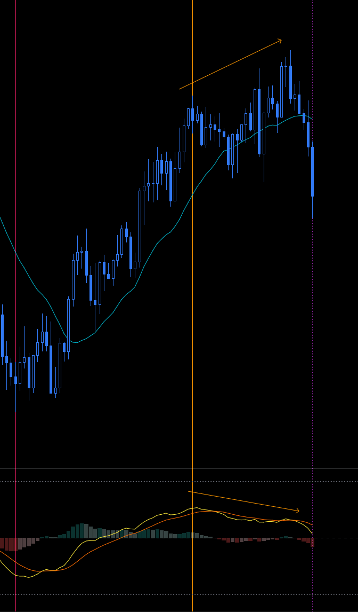
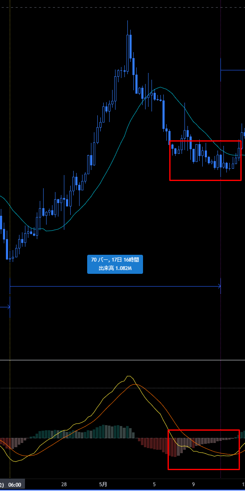

# MACD
[一覧に戻る](../index.md)

---
## メモ
- MACDはMAとの距離を表したものなので、慣れればMAを見ればMACDの形は想像できるはず
- MACDはエントリーのタイミングを測る時に使う
  - MACDがこの辺だからもうそろそろ上に行くかな、などの使い方はしないこと。それは値ごろ感トレードと同じ。
- 4時間足の戻りが単なる押しか、下落開始か判断つかないときは、日足のMACDを見てみる。
- 細かいタイミングを測る場合は、上位足から下位足のMACDを見て行く
- エントリーは複数通貨で実施する：クロス円、ドルストレートは同じような動きをするが、イレギュラーな動きをする通貨もあるため。リスクヘッジとして。
- サイクル理論を信じて、感情を殺す

# ダイバージェンス
## 天井のよくあるパターン
- MACDがデッドクロスした後、ダイバージェンスしながらもう一段 or 二段高値を更新する

## ボトムからのエントリー：硬い方法

# ボトムにありがちな動き：ローソクとMACDが横に動く

