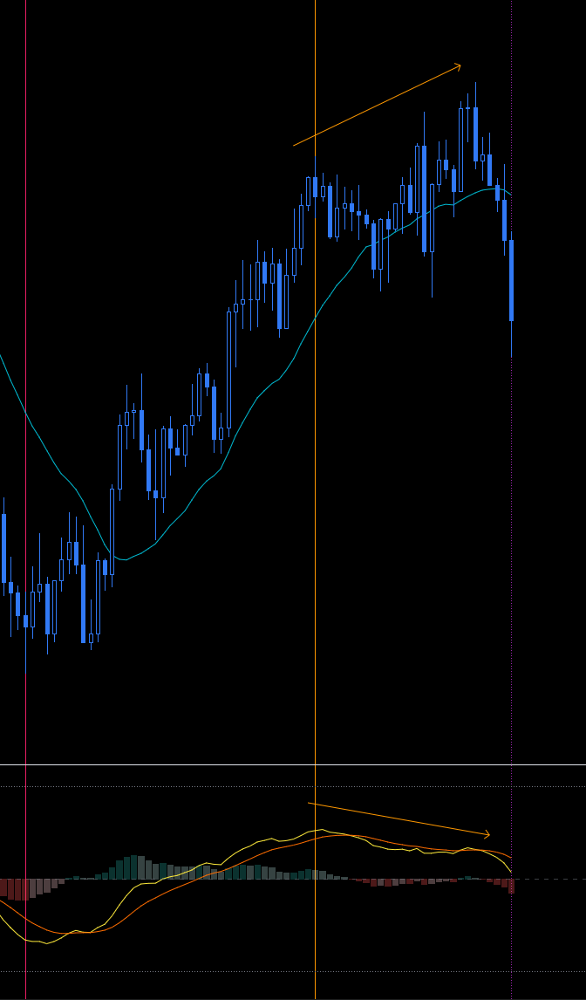
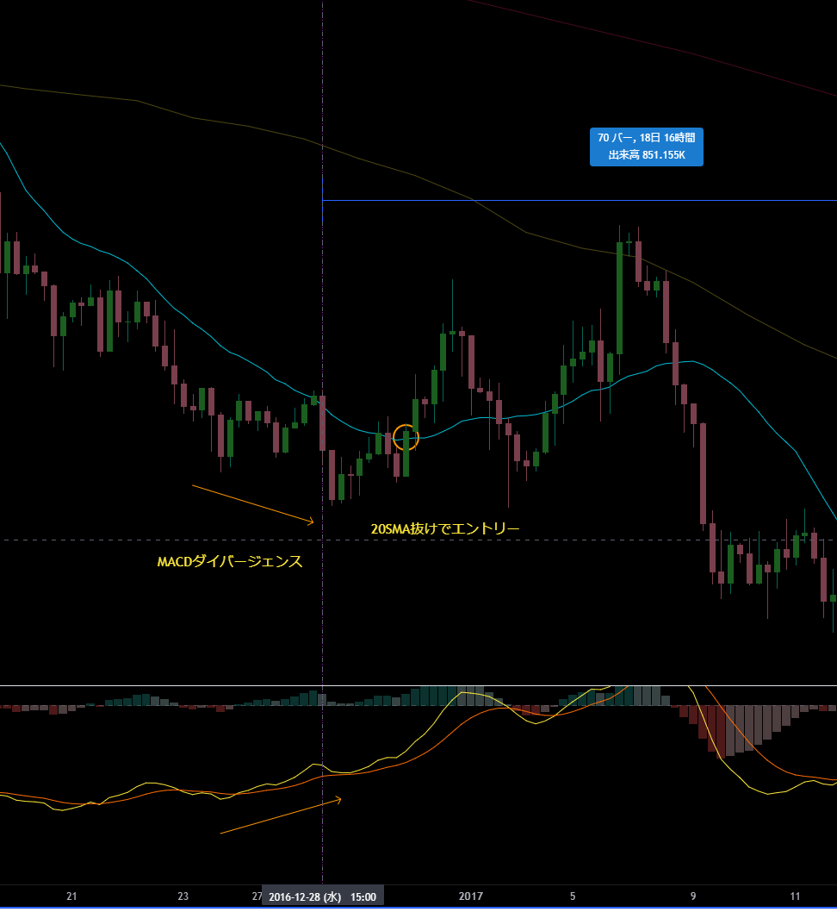
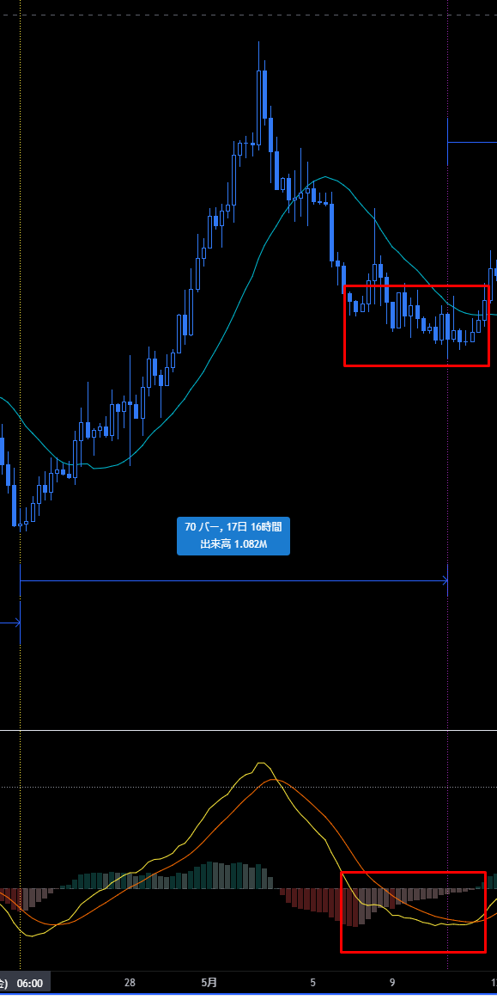

# MACD
[一覧に戻る](../index.md)

## メモ
- MACDはMAとの距離を表したものなので、慣れればMAを見ればMACDの形は想像できるはず
- MACDはエントリーのタイミングを測る時に使う
  - MACDがこの辺だからもうそろそろ上に行くかな、などの使い方はしないこと。それは値ごろ感トレードと同じ。
- 4時間足の戻りが単なる押しか、下落開始か判断つかないときは、日足のMACDを見てみる。

# ダイバージェンス
## 天井のよくあるパターン
- MACDがデッドクロスした後、ダイバージェンスしながらもう一段 or 二段高値を更新する

## ボトムからのエントリー：硬い方法

# ボトムにありがちな動き：ローソクとMACDが横に動く

