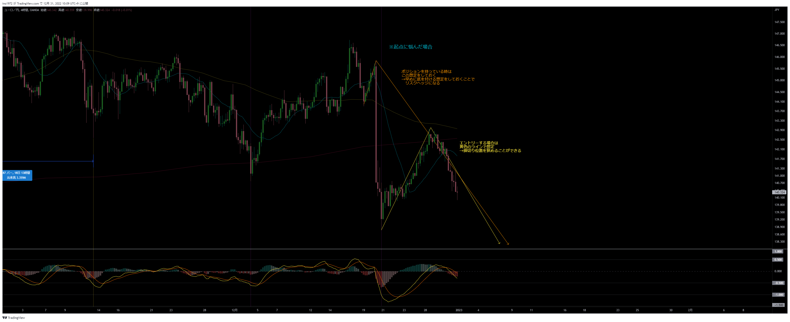
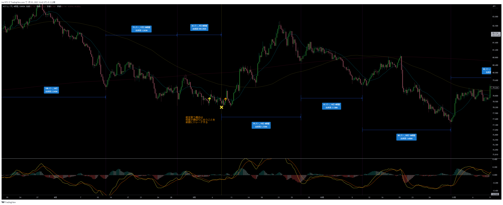
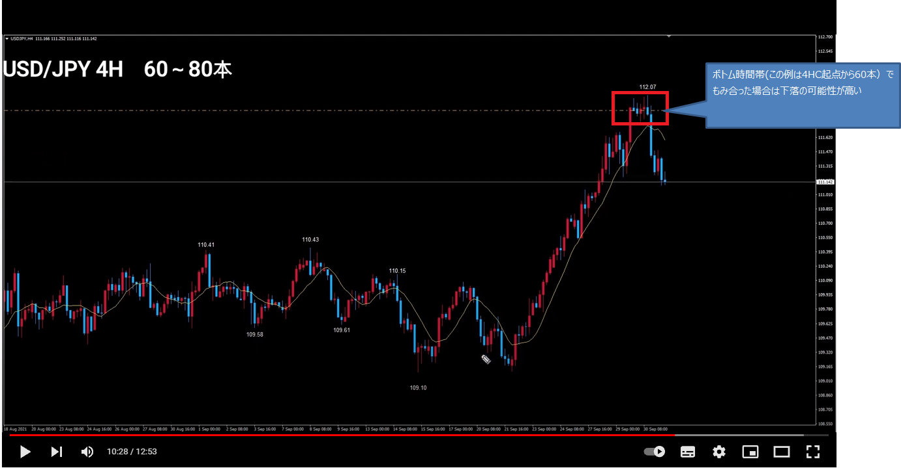

# サイクル
[手法メインに戻る](../index.md)  
[サイクル理論資料](./資料/main.md)  

---
## 多銘柄監視
- クロス円同士、ドルストレート同士、同じような動きをするので、他銘柄を監視する。
- 先にトランスレーションを確定した通貨があれば、遅れて他の通貨もそのトランスレーションを確定することが多い
  - 各通貨がバラバラな動きをしている時は、動きが揃うまで様子見した方が良い
- 他の通貨の動きがヒントに出来るので、トレードがし易い
- エントリーは複数通貨で実施する：クロス円、ドルストレートは同じような動きをするが、イレギュラーな動きをする通貨もあるため。リスクヘッジとして。

## 通貨の特徴
- 通貨の値動きのクセは年々変わっていく

### USDJPY
- ドルと円の影響を受けるため、他の銘柄と異なる動きをすることがある
  - サイクル理論では、積極的に取引しない銘柄

### AUDJPY
- ノイズが多く波が荒い。レンジのような動きが多く、トレンドがでない。
  - 4時間足の20SMAは参考にならない
  - 4時間足を見ながら、日足の20SMAを見たほうが参考になる

### NZDJPY
- サイクルが分かりにくい。イレギュラー多い

### CHFJPY
- ユーロと同じ動きだったが、最近は独自の動きをすることが多い

### ポンド
- ここ数年は遅行しやすい

### 資源国：AUD、NZD、CAD
- 主要国と資源国は一時的に逆に動くことがある
- 資源国が先行銘柄になる事が多い

## 月足サイクル
- 10.5～12ヶ月：分かりにくい
- ３年もしくは４年
- それ以外にも色々あるが、トレードに関係ない

## サイクル理論について
- サイクル理論のエントリーは２，３回損切りになる前提でする
  - 完璧主義ではなく、ざっくりやる。損切りを悪と思わない。
- ドル円はクロス円、ドルストの両方の影響を受けるので、積極的にトレードしなくてよい
- シナリオが確定した時だけトレードすれば良い。ズルく賢く儲ける。
  - 分かりにくい時は、複数シナリオを立て、シナリオが確定するのを待つ

## トップとトップの間の本数も数えてみる
- FXは通貨間の取引なので、ひっくり返してもサイクルのカウントは有効なはず

## 逆張りについて
- 例えば、MCがRTの時の最後の4HCがLT想定であればショートしても良いが、RT想定の4HCサイクルのトップからショートを狙うのは止めたほうが良い
- 理由：あまり下落しないことが多い

---
# 起点に悩んだ場合
- エントリーしやすい方をエントリーの起点とする
- 利確が早くなる方を、イグジットの起点とする

# 天底を狙う場合は、何度か損切りに合うことを前提でトレードする
- NZDJPY : 2017/09

# 天底では上位足に目立つヒゲが出ることが多い

# 両建て

# １つのサイクルで上位足のトップとボトムをつけることは少ない

# 4Hサイクルが早々にトップを付けた場合、エリオットのランニングパターンになる可能性がある

# 4HCサイクルの中に、細かいサイクルが２～４つ（まれに５つ）形成される。MACDも参考になる。
- 最後の波は急騰→急落する場合がよくある

- 4HCがRTでも、その中の小さい波は最後はLTになることが多い

- 波は20SMAを基準にすると認識しやすい
 

# サイクル最後 or 最初の最後っ屁
- サイクルの最後に直近の安値を少し割る小さい波が形成される
- もしくは、サイクルの最初にボトム付近まで押す波
- 最後っ屁の後は、素直に反発し易い。MACDのダイバージェンスなど待つ必要は無い。

- サイクル最後に出現

- サイクル先頭に出現

# サイクル内サイクルでショートエントリーのタイミングを測る

# よくある波のパターン
- 大きな２つの波の中に小さな波がそれぞれ２つ入る
- 大きな波のボトムは20SMAを実体で割る。２回目割ったら、決済。
 

# LT想定でもサイクル開始後は３波の戻しを視野にいれておく

# サイクル理論を信じる

# RTの時、ボトム時間帯での高値もみ合い
- ボトムの時間帯に入っているのに、高値圏にいる時はショートを狙っても良い
- RTなので、短期勝負にはなる

