# サイクル
[一覧に戻る](../index.md)

## 通貨の特徴
- NZDJPY : サイクルが分かりにくい。イレギュラー多い
- CHFJPY : 昔は素直だったが、最近は独自の動きをすることが多い

---
# 天底では上位足に目立つヒゲが出ることが多い
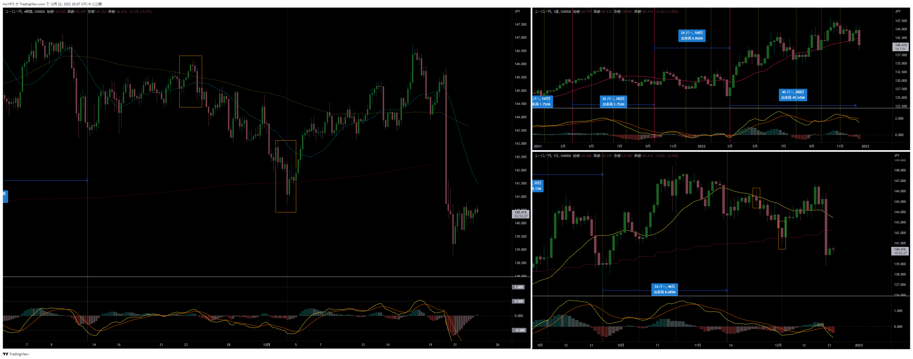

# 両建て
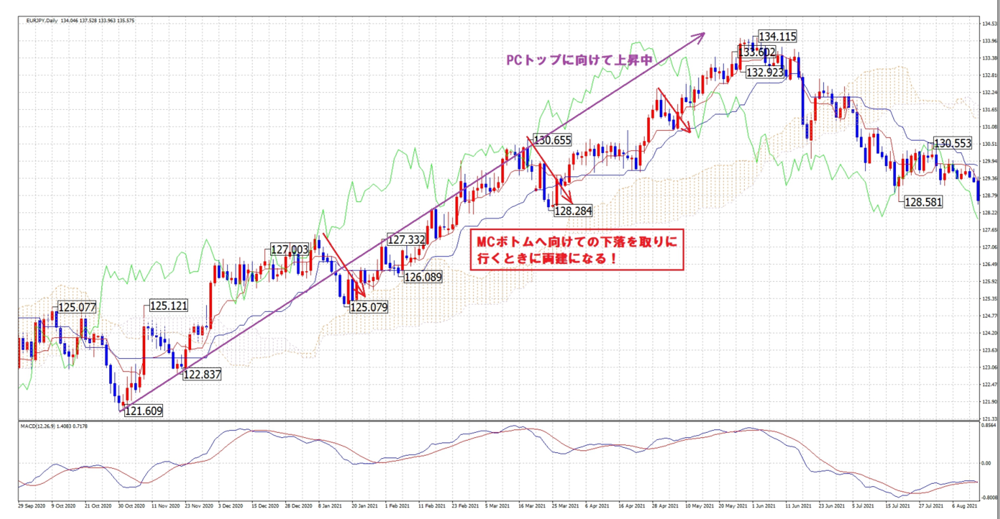

# １つのサイクルで上位足のトップとボトムをつけることは少ない
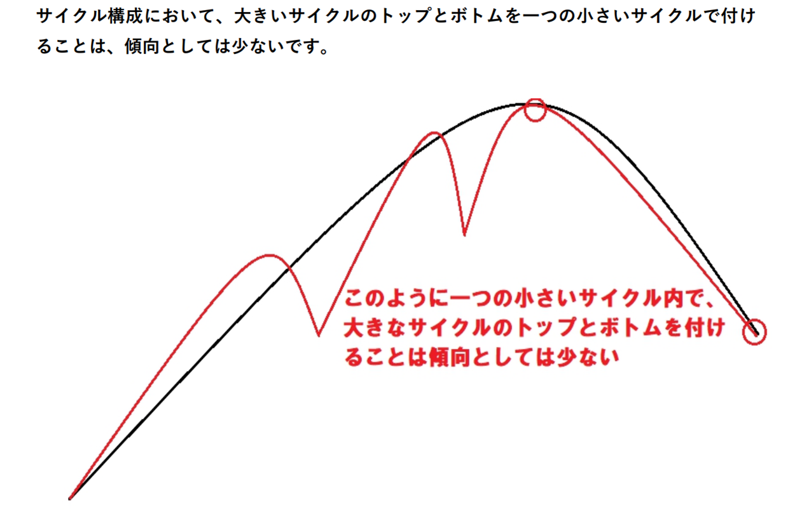

# 4Hサイクルが早々にトップを付けた場合、エリオットのランニングパターンになる可能性がある
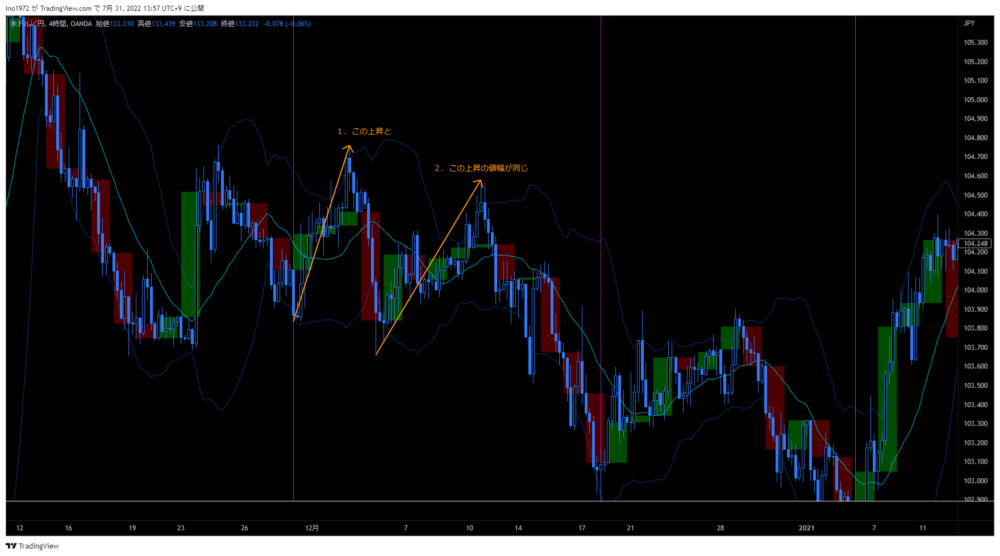
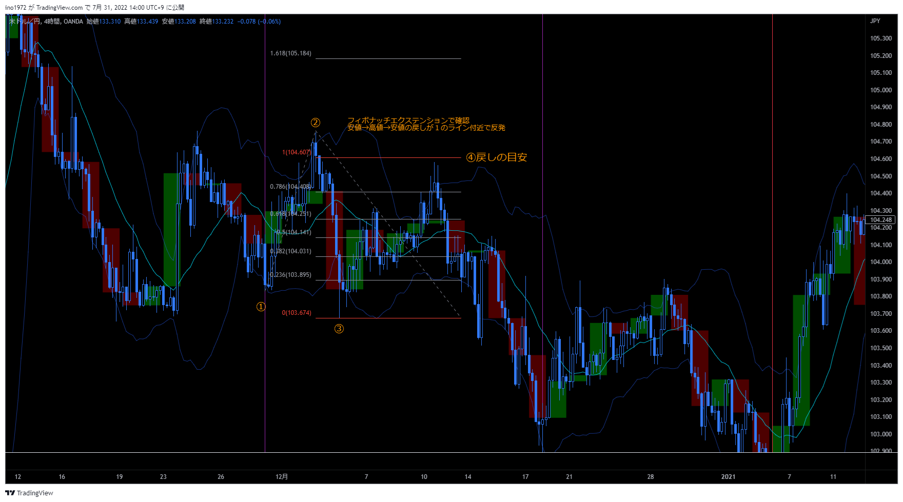

# 4HCサイクルの中に、細かいサイクルが２～４つ（まれに５つ）形成される。MACDも参考になる。
- 最後の波は急騰→急落する場合がよくある
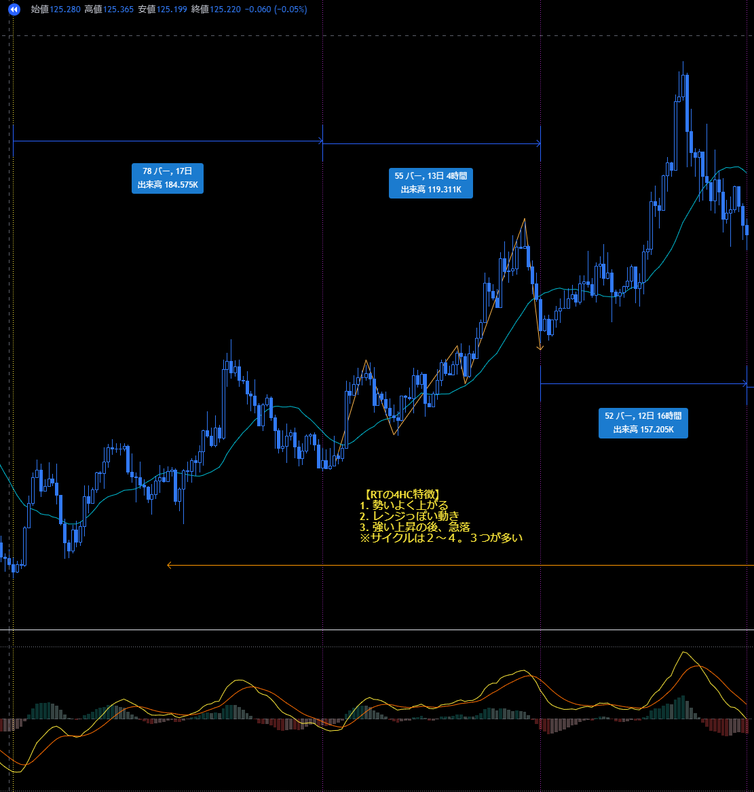

- 4HCがRTでも、その中の小さい波は最後はLTになることが多い
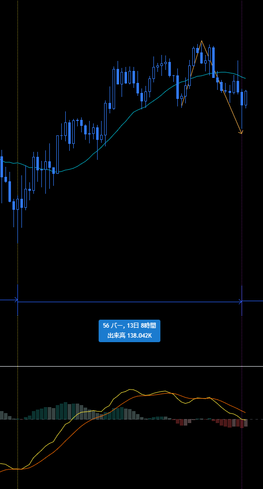

- 波は20SMAを基準にすると認識しやすい
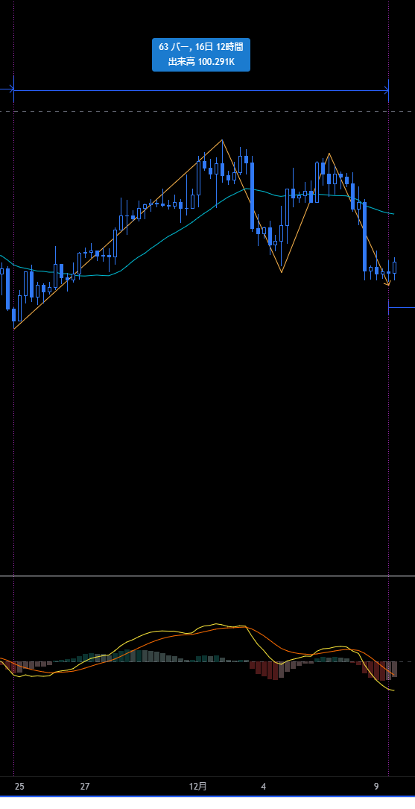 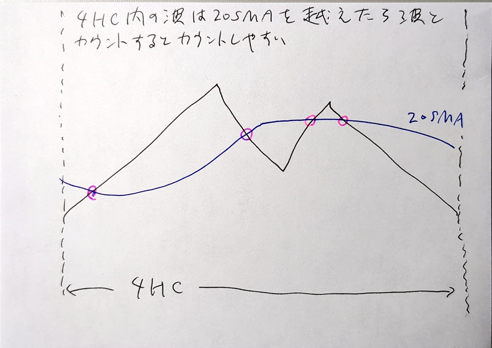

# サイクル最後 or 最初の最後っ屁
- サイクルの最後に直近の安値を少し割る小さい波が形成される
- もしくは、サイクルの最初にボトム付近まで押す波
- 最後っ屁の後は、素直に反発し易い。MACDのダイバージェンスなど待つ必要は無い。

- サイクル最後に出現
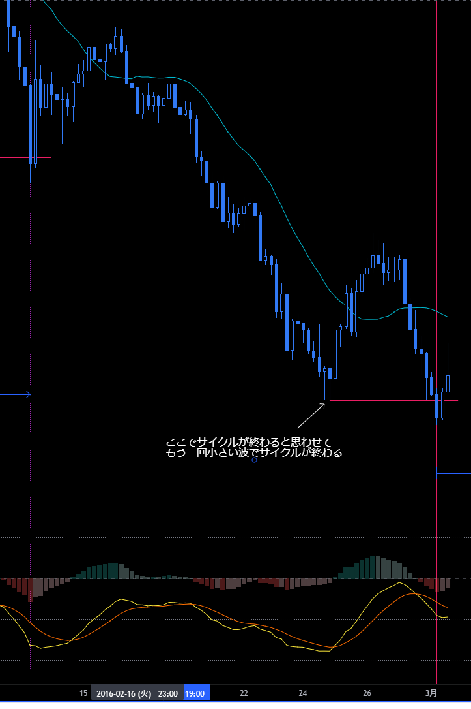
- サイクル先頭に出現
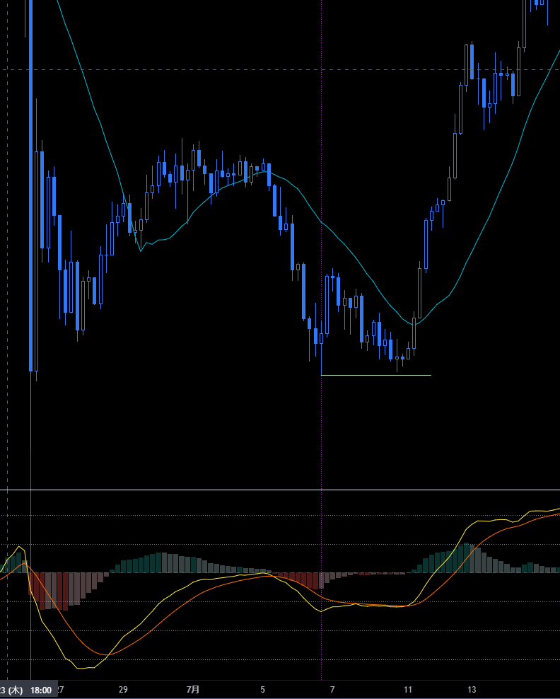

# サイクル内サイクルでショートエントリーのタイミングを測る

# よくある波のパターン
- 大きな２つの波の中に小さな波がそれぞれ２つ入る
- 大きな波のボトムは20SMAを実体で割る。２回目割ったら、決済。
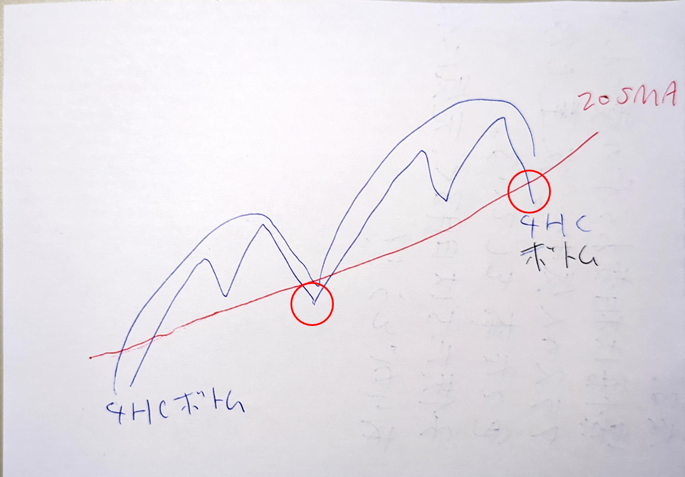 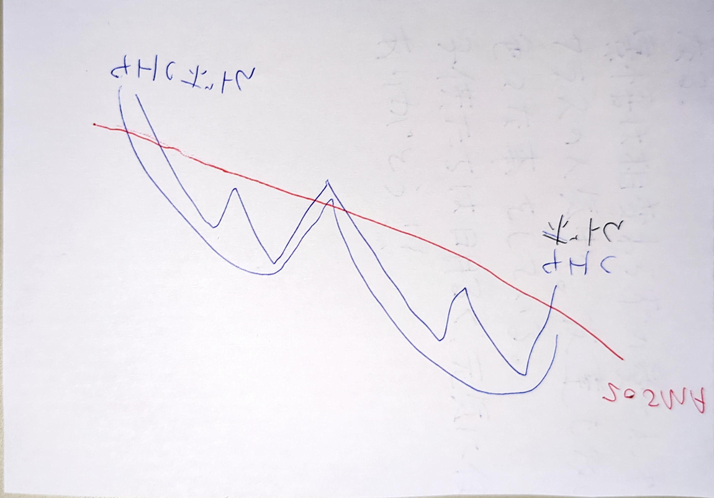

# LT想定でもサイクル開始後は３波の戻しを視野にいれておく
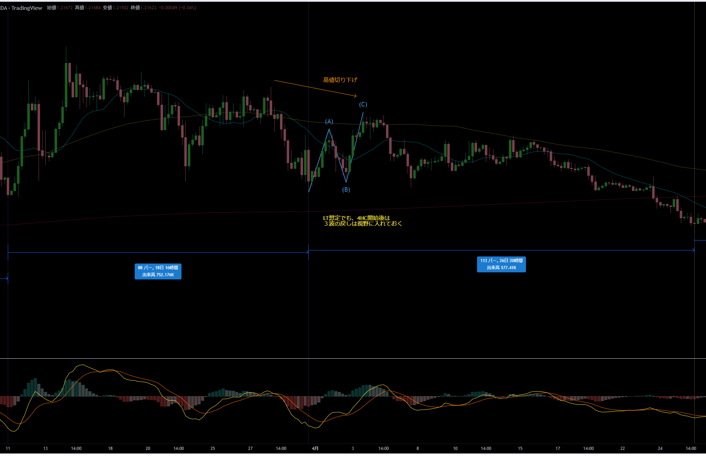

# サイクル理論を信じる
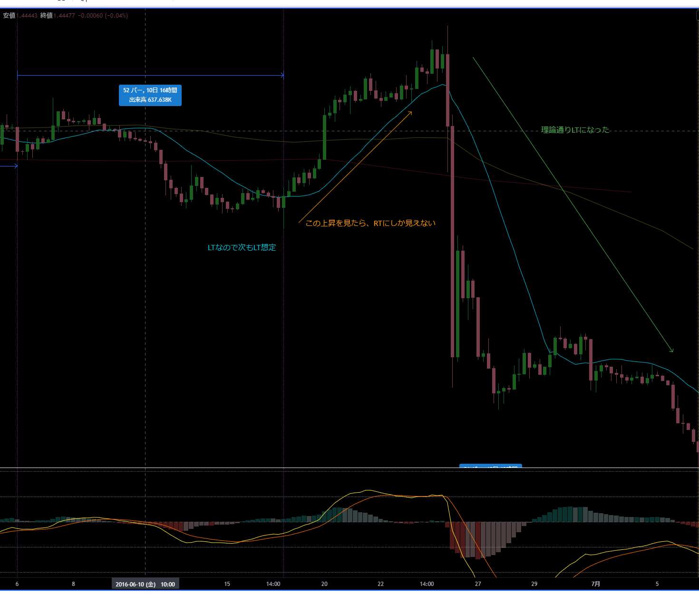

