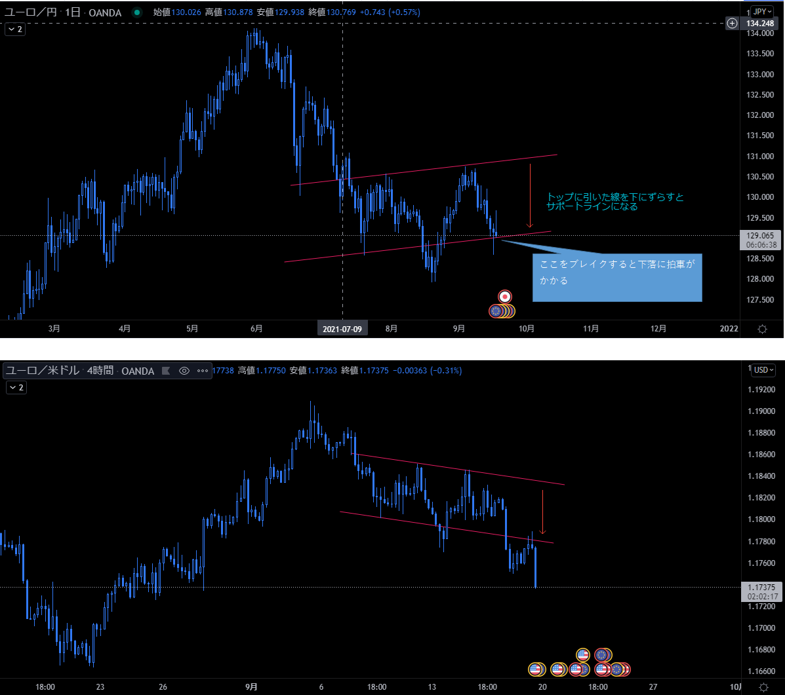

# チャートパターン
[手法メインに戻る](../index.md)

---
# メモ
- 月曜日の上窓は埋まりやすい。下窓は埋まりにくい。

# 上昇途中の三角持ち合い

# 上も下もあり得る。決めつけないこと

- 押しを下落と間違える
  

# FXは通貨の強弱関係なので、上下反転させても有効になるはず。
- であれば、高値が切り下がったら、その安値はLTになると想定出来る。
- ↑どういう意味が自分でも分からない

# 裏ネックライン

# 上げ渋り／下げ渋り
- 天底狙いのクラスタはMACDと組み合わせると狙いやすい

