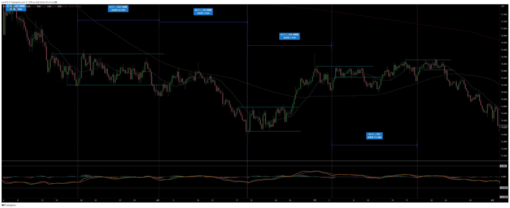
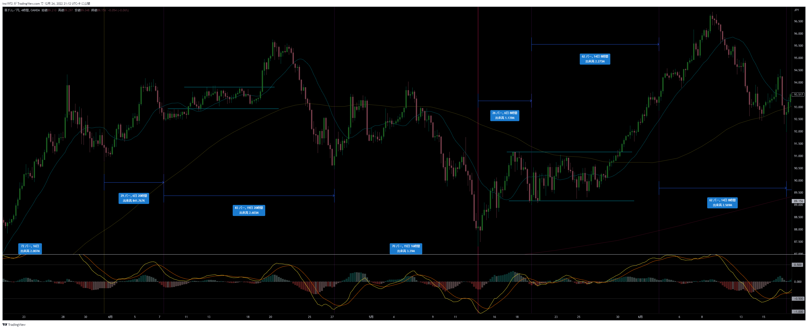

# AUDJPY
[一覧に戻る](../index.md)  

---
# タイトル
- 期間：

# 【仮説】エントリー戦略：切上げ／切り下げライン
- AUDJPYはノイズが多く、4時間足20SMAを当てにできない
- レフトトランスレーションの可能性が高い、最後のサイクル内の上昇トレンドに切上げラインを引き、実体でブレイクしたらエントリー
- 決済は20SMAを実体で超えたら
- 期間：2020/09

- 期間：2020/11

# レンジ
## 期間：2016/02~03

## 期間：2016/05~06

## 期間：2016/09

## 期間：2016/10

## 期間：2017/01~02

## 期間：2018/01~02

## 期間：2018/03~05

## 期間：2018/06~08

## 期間：2018/07~09

## 期間：2018/11~12

## 期間：2019/01~04

## 期間：2019/05~07

## 期間：2019/08~10

## 期間：2019/11

## 期間：2020/02

## 期間：2020/10~12

## 期間：2021/01~03

## 期間：2021/04~06

## 期間：2021/09

## 期間：2021/11~12

## 期間：2022/01~02

## 期間：2022/04~05

## 期間：2022/06~08

## 期間：2022/10~11

