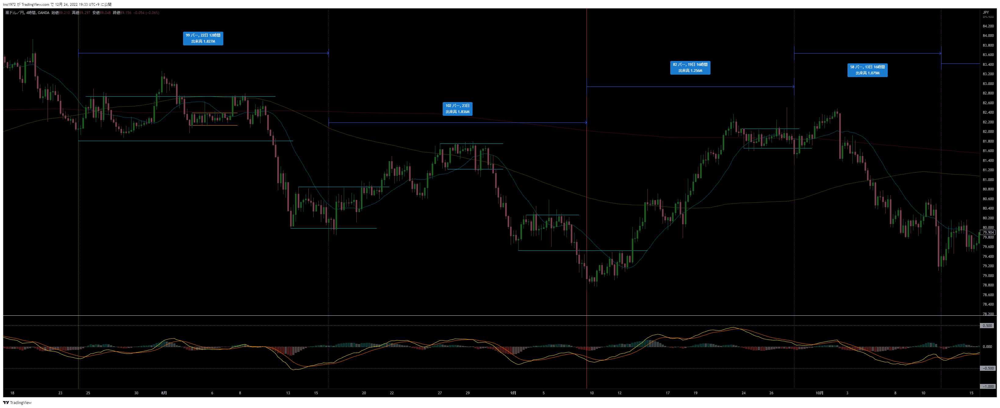
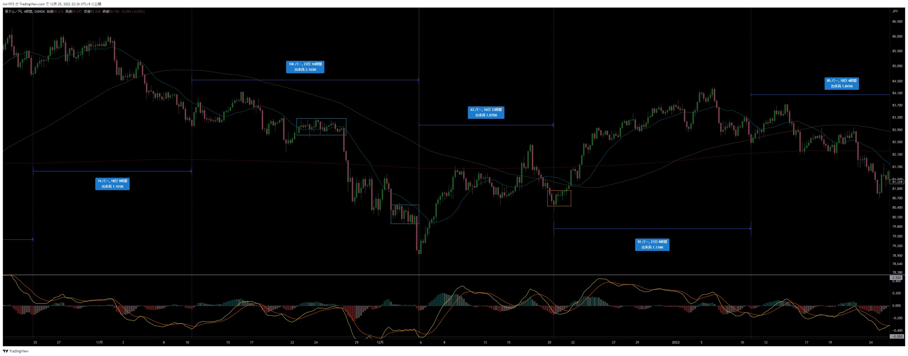

# AUDJPY
[検証メモ通貨一覧に戻る](../index.md)  

---
# 【仮説】エントリー戦略：切上げ／切り下げライン
- AUDJPYはノイズが多く、4時間足20SMAを当てにできない
- レフトトランスレーションの可能性が高い、最後のサイクル内の上昇トレンドに切上げラインを引き、実体でブレイクしたらエントリー
- 決済は20SMAを実体で超えたら
- 期間：2020/09

- 期間：2020/11

# レンジ
## 期間：2016/02~03

## 期間：2016/05~06

## 期間：2016/09

## 期間：2016/10

## 期間：2017/01~02

## 期間：2018/01~02

## 期間：2018/03~05

## 期間：2018/06~08

## 期間：2018/07~09

## 期間：2018/11~12

## 期間：2019/01~04

## 期間：2019/05~07

## 期間：2019/08~10

## 期間：2019/11

## 期間：2020/02

## 期間：2020/10~12

## 期間：2021/01~03

## 期間：2021/04~06

## 期間：2021/09

## 期間：2021/11~12

## 期間：2022/01~02

## 期間：2022/04~05

## 期間：2022/06~08

## 期間：2022/10~11

# 上げ止まり／下げ止まり
- ボトムの時間なのに、天井圏にいてクラスタ形成
- ボトムの時間にボトムでクラスタ形成
- 反発の後、クラスタ形成し、反発した方向に進む
## 期間：2016/02

## 期間：2016/04~06

## 期間：2016/06~08

## 期間：2016/09~11

## 期間：2016/11~2017/01

## 期間：2017/02~03

## 期間：2017/04~06

## 期間：2017/06~09

## 期間：2017/10~11

## 期間：2017/12~2018/02

## 期間：2018/02~05

## 期間：2018/05~07

## 期間：2018/08~09

## 期間：2018/10~12

## 期間：2019/01~02

## 期間：2019/03~04

## 期間：2019/06~07

## 期間：2019/08~10

## 期間：2019/12~2020/02

## 期間：2020/02~03

## 期間：2020/03~04

## 期間：2020/05~07

## 期間：2020/08~10

## 期間：2020/10~12

## 期間：2020/12~2021/02

## 期間：2021/02~04

## 期間：2021/04~06

## 期間：2021/07~09

## 期間：2021/09~11

## 期間：2021/11~12

## 期間：2022/03

## 期間：2022/04~06

## 期間：2022/06~08

## 期間：2022/08~09

## 期間：2022/10~12

